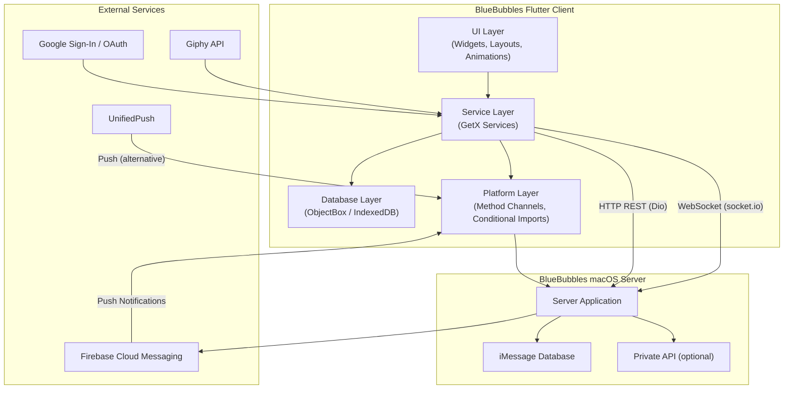
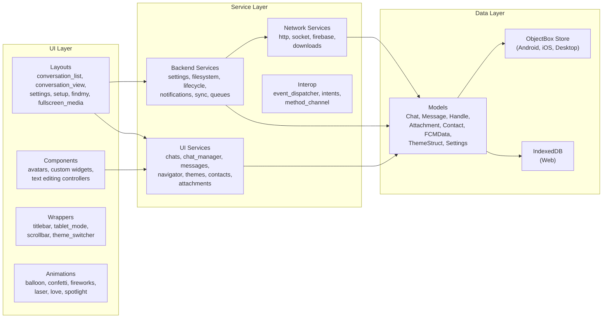
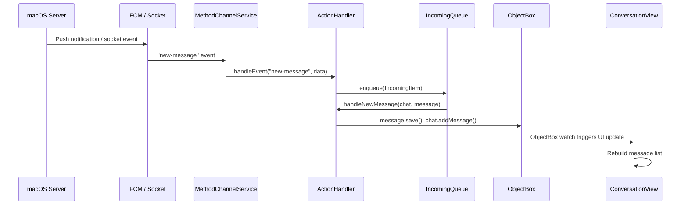
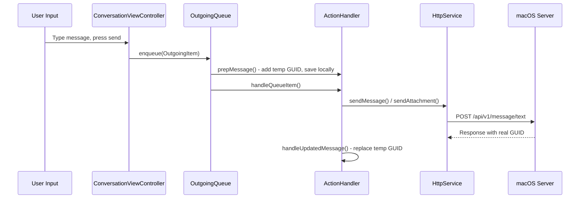
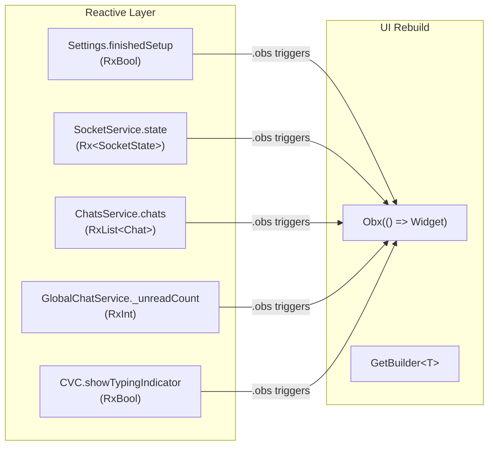
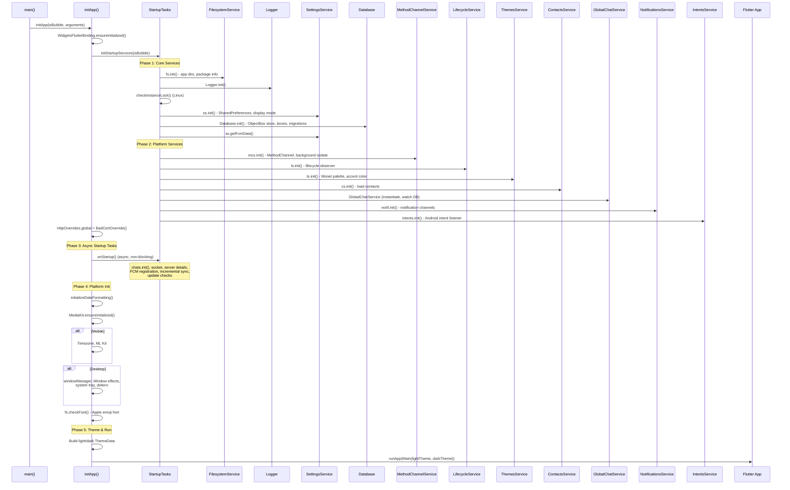
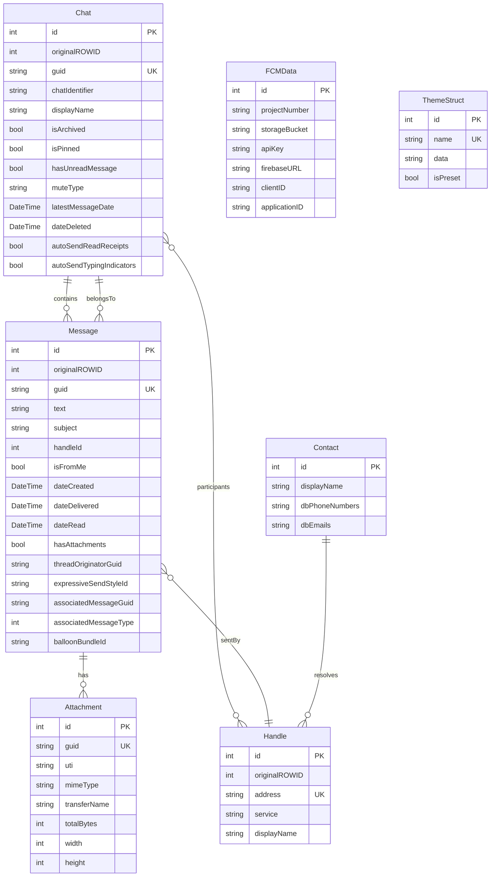

# BlueBubbles Flutter App - Architecture Overview

> **Version**: 1.15.0+70
> **Dart SDK**: >=3.1.3 <4.0.0
> **Platforms**: Android, iOS, Windows, macOS, Linux, Web
> **Database**: ObjectBox (native), IndexedDB (web)
> **State Management**: GetX
> **Codebase root**: `bluebubbles-app-ELECTRON/`

---

## 1. System Architecture

BlueBubbles is a cross-platform iMessage client that communicates with a macOS server application over HTTP and WebSocket connections. The Flutter client does not directly access iMessage; it relies entirely on the BlueBubbles Server running on a Mac to bridge iMessage data.

### 1.1 High-Level Architecture Diagram



### 1.2 Layered Architecture Detail



### 1.3 Data Flow for Incoming Messages



### 1.4 Data Flow for Outgoing Messages



---

## 2. Technology Stack

### 2.1 Core Framework

| Technology | Version | Role |
|---|---|---|
| Flutter | 3.x (stable channel) | Cross-platform UI framework |
| Dart | >=3.1.3, <4.0.0 | Programming language |
| GetX | ^4.6.6 | State management, dependency injection, navigation |
| ObjectBox | ^4.0.1 | Local database (native platforms) |
| Dio | ^5.4.2+1 | HTTP client for REST API |
| socket_io_client | ^2.0.3+1 | WebSocket communication with server |

### 2.2 Platform Support Matrix

| Feature | Android | iOS | Windows | macOS | Linux | Web |
|---|---|---|---|---|---|---|
| ObjectBox DB | Yes | Yes | Yes | Yes | Yes | No (IndexedDB) |
| FCM Push | Yes (native) | Yes (native) | Via firebase_dart | Via firebase_dart | Via firebase_dart | Via firebase_dart |
| UnifiedPush | Yes | No | No | No | No | No |
| Method Channel | Yes | Yes | No | No | No | No |
| System Tray | No | No | Yes | No | Yes | No |
| Window Manager | No | No | Yes | Yes | Yes | No |
| Local Auth | Yes (SDK>28) | Yes | Yes | No | No | No |
| ML Kit | Yes | Yes | No | No | No | No |
| Fast Contacts | Yes | Yes | No | No | No | No |
| Photo Manager | Yes | Yes | No | No | No | No |

---

## 3. Project Structure

```
bluebubbles-app-ELECTRON/
|
+-- lib/                              # Dart source code
|   +-- main.dart                     # Application entry point
|   +-- objectbox.g.dart              # Auto-generated ObjectBox bindings
|   +-- objectbox-model.json          # ObjectBox schema definition
|   |
|   +-- app/                          # UI layer
|   |   +-- animations/               # iMessage screen effects (balloons, fireworks, etc.)
|   |   |   +-- balloon_classes.dart
|   |   |   +-- balloon_rendering.dart
|   |   |   +-- celebration_class.dart
|   |   |   +-- celebration_rendering.dart
|   |   |   +-- fireworks_classes.dart
|   |   |   +-- fireworks_rendering.dart
|   |   |   +-- laser_classes.dart
|   |   |   +-- laser_rendering.dart
|   |   |   +-- love_classes.dart
|   |   |   +-- love_rendering.dart
|   |   |   +-- spotlight_classes.dart
|   |   |   +-- spotlight_rendering.dart
|   |   |
|   |   +-- components/              # Reusable UI components
|   |   |   +-- avatars/
|   |   |   |   +-- contact_avatar_group_widget.dart  # Group chat avatar composites
|   |   |   |   +-- contact_avatar_widget.dart        # Single contact avatar
|   |   |   +-- custom/
|   |   |   |   +-- custom_bouncing_scroll_physics.dart
|   |   |   |   +-- custom_cupertino_alert_dialog.dart
|   |   |   |   +-- custom_cupertino_page_transition.dart
|   |   |   |   +-- custom_error_box.dart             # Error display widget
|   |   |   +-- circle_progress_bar.dart
|   |   |   +-- custom_text_editing_controllers.dart   # Mention & spell-check controllers
|   |   |   +-- sliver_decoration.dart
|   |   |
|   |   +-- layouts/                  # Full-page layouts (screens)
|   |   |   +-- chat_creator/        # New conversation creation screen
|   |   |   +-- chat_selector_view/  # Chat selection for forwarding
|   |   |   +-- contact_selector_view/ # Contact picker
|   |   |   +-- conversation_details/ # Chat info panel (participants, media, options)
|   |   |   |   +-- dialogs/         # Add participant, rename, sync dialogs
|   |   |   |   +-- widgets/         # Chat info tiles, media gallery, contact tiles
|   |   |   +-- conversation_list/   # Main chat list screen
|   |   |   |   +-- pages/
|   |   |   |   |   +-- conversation_list.dart        # Root list (dispatches to skin)
|   |   |   |   |   +-- cupertino_conversation_list.dart  # iOS-style list
|   |   |   |   |   +-- material_conversation_list.dart   # Material-style list
|   |   |   |   |   +-- samsung_conversation_list.dart    # Samsung One UI-style list
|   |   |   |   |   +-- search/
|   |   |   |   |       +-- search_view.dart          # Global message search
|   |   |   |   +-- widgets/
|   |   |   |   |   +-- conversation_list_fab.dart    # Floating action button
|   |   |   |   |   +-- footer/                       # Samsung footer
|   |   |   |   |   +-- header/                       # Cupertino, Material, Samsung headers
|   |   |   |   |   +-- initial_widget_right.dart     # Tablet right-pane placeholder
|   |   |   |   |   +-- tile/                         # Conversation tiles per skin
|   |   |   |   +-- dialogs/
|   |   |   |       +-- conversation_peek_view.dart   # 3D Touch / long-press preview
|   |   |   +-- conversation_view/   # Individual chat message view
|   |   |   |   +-- pages/
|   |   |   |   |   +-- conversation_view.dart        # Chat screen wrapper
|   |   |   |   |   +-- messages_view.dart            # Scrollable message list
|   |   |   |   +-- widgets/
|   |   |   |   |   +-- effects/                      # Screen effects (send effect picker)
|   |   |   |   |   +-- header/                       # Chat header (Cupertino, Material)
|   |   |   |   |   +-- media_picker/                 # Attachment picker
|   |   |   |   |   +-- message/                      # Message rendering subsystem
|   |   |   |   |   |   +-- attachment/               # Image, video, audio, contact, sticker
|   |   |   |   |   |   +-- chat_event/               # System events (name changes, etc.)
|   |   |   |   |   |   +-- interactive/              # Apple Pay, URL previews, Game Pigeon
|   |   |   |   |   |   +-- misc/                     # Bubble effects, sender, select
|   |   |   |   |   |   +-- popup/                    # Message long-press popup menu
|   |   |   |   |   |   +-- reaction/                 # Tapback display
|   |   |   |   |   |   +-- reply/                    # Reply thread rendering
|   |   |   |   |   |   +-- text/                     # Text bubble rendering
|   |   |   |   |   |   +-- timestamp/                # Timestamps, delivered indicator
|   |   |   |   |   |   +-- typing/                   # Typing indicator
|   |   |   |   |   |   +-- message_holder.dart       # Root message widget
|   |   |   |   |   |   +-- send_animation.dart       # Send animation
|   |   |   |   |   +-- text_field/                   # Message input field subsystem
|   |   |   |   |       +-- conversation_text_field.dart  # Main text input
|   |   |   |   |       +-- picked_attachment.dart
|   |   |   |   |       +-- picked_attachments_holder.dart
|   |   |   |   |       +-- reply_holder.dart
|   |   |   |   |       +-- send_button.dart
|   |   |   |   |       +-- text_field_suffix.dart
|   |   |   |   |       +-- voice_message_recorder.dart
|   |   |   |   +-- dialogs/
|   |   |   |       +-- custom_mention_dialog.dart
|   |   |   +-- findmy/              # Find My Friends/Devices map view
|   |   |   +-- fullscreen_media/    # Full-screen image/video viewer
|   |   |   +-- handle_selector_view/ # Handle (phone/email) picker
|   |   |   +-- settings/            # Settings screens
|   |   |   |   +-- settings_page.dart                # Root settings scaffold
|   |   |   |   +-- dialogs/                          # Settings dialogs
|   |   |   |   +-- pages/
|   |   |   |   |   +-- advanced/                     # Firebase, Private API, redacted mode, Tasker
|   |   |   |   |   +-- conversation_list/            # Chat list appearance settings
|   |   |   |   |   +-- desktop/                      # Desktop-specific settings
|   |   |   |   |   +-- message_view/                 # Conversation appearance settings
|   |   |   |   |   +-- misc/                         # About, logging, troubleshoot
|   |   |   |   |   +-- profile/                      # User profile
|   |   |   |   |   +-- scheduling/                   # Scheduled messages, reminders
|   |   |   |   |   +-- server/                       # Server management, backup/restore, OAuth
|   |   |   |   |   +-- system/                       # Notification settings
|   |   |   |   |   +-- theming/                      # Theme editor, avatar customization
|   |   |   |   +-- widgets/                          # Reusable settings widgets
|   |   |   |       +-- content/                      # Tiles, switches, sliders, dropdowns
|   |   |   |       +-- layout/                       # Headers, sections, dividers, scaffolds
|   |   |   +-- setup/               # First-run setup wizard
|   |   |   |   +-- setup_view.dart                   # Setup flow controller
|   |   |   |   +-- dialogs/                          # Connection, QR scan, manual entry
|   |   |   |   +-- pages/                            # Welcome, server credentials, sync,
|   |   |   |                                         #   contacts permission, battery optimization
|   |   |   +-- startup/             # Splash screen, failure-to-start error screen
|   |   |
|   |   +-- wrappers/                # Widget wrappers for cross-cutting concerns
|   |       +-- cupertino_icon_wrapper.dart
|   |       +-- fade_on_scroll.dart
|   |       +-- gradient_background_wrapper.dart
|   |       +-- scrollbar_wrapper.dart
|   |       +-- stateful_boilerplate.dart   # Base classes: OptimizedState, StatefulController
|   |       +-- tablet_mode_wrapper.dart    # Split-pane tablet layout
|   |       +-- theme_switcher.dart         # Theme transition wrapper
|   |       +-- titlebar_wrapper.dart       # Custom desktop title bar
|   |
|   +-- database/                     # Data layer
|   |   +-- database.dart            # Database class: init, migrations, box accessors
|   |   +-- models.dart              # Conditional export hub (io vs html models)
|   |   +-- io/                      # Native platform models (ObjectBox entities)
|   |   |   +-- attachment.dart      # Attachment entity with ObjectBox annotations
|   |   |   +-- chat.dart            # Chat entity (conversations)
|   |   |   +-- contact.dart         # Contact entity
|   |   |   +-- fcm_data.dart        # Firebase Cloud Messaging configuration
|   |   |   +-- giphy.dart           # Giphy configuration
|   |   |   +-- handle.dart          # Handle entity (phone/email addresses)
|   |   |   +-- launch_at_startup.dart # Desktop launch-at-startup wrapper
|   |   |   +-- message.dart         # Message entity
|   |   |   +-- theme.dart           # ThemeStruct entity
|   |   |   +-- theme_entry.dart     # ThemeEntry entity
|   |   |   +-- theme_object.dart    # ThemeObject entity (deprecated)
|   |   +-- html/                    # Web-only model stubs (no ObjectBox on web)
|   |   |   +-- attachment.dart      # Web stub for Attachment
|   |   |   +-- chat.dart            # Web stub for Chat
|   |   |   +-- contact.dart         # Web stub for Contact
|   |   |   +-- fcm_data.dart        # Web stub for FCMData
|   |   |   +-- handle.dart          # Web stub for Handle
|   |   |   +-- launch_at_startup.dart
|   |   |   +-- media_kit.dart       # Web stub for media_kit
|   |   |   +-- message.dart         # Web stub for Message
|   |   |   +-- network_tools.dart   # Web stub for network_tools
|   |   |   +-- objectbox.dart       # Web stub for ObjectBox (empty Box/Store)
|   |   |   +-- theme.dart
|   |   |   +-- theme_entry.dart
|   |   |   +-- theme_object.dart
|   |   +-- global/                  # Platform-independent model classes
|   |       +-- apple_location.dart  # Apple Maps location data
|   |       +-- async_image_input.dart # Async image loading helpers
|   |       +-- attributed_body.dart # iMessage attributed body parsing
|   |       +-- chat_messages.dart   # Chat-message relationship helpers
|   |       +-- findmy_device.dart   # Find My device model
|   |       +-- findmy_friend.dart   # Find My friend model
|   |       +-- isolate.dart         # Isolate-safe data transfer objects
|   |       +-- message_part.dart    # Message part (multi-part message support)
|   |       +-- message_summary_info.dart # Message summary metadata
|   |       +-- payload_data.dart    # Interactive message payload
|   |       +-- platform_file.dart   # Cross-platform file abstraction
|   |       +-- queue_items.dart     # Queue item types (incoming/outgoing)
|   |       +-- scheduled_message.dart # Scheduled message model
|   |       +-- server_payload.dart  # Server response payloads
|   |       +-- settings.dart        # Settings model with Rx observables
|   |       +-- structured_name.dart # Contact name structure
|   |       +-- theme_colors.dart    # Theme color definitions
|   |
|   +-- services/                     # Service layer (business logic)
|   |   +-- services.dart            # Barrel export for all services
|   |   +-- backend/                 # Non-UI services
|   |   |   +-- action_handler.dart  # Central event handler (new/updated messages, reactions)
|   |   |   +-- filesystem/
|   |   |   |   +-- filesystem_service.dart  # File system operations, app directories, font loading
|   |   |   +-- java_dart_interop/
|   |   |   |   +-- background_isolate.dart  # Background Dart isolate for Android
|   |   |   |   +-- intents_service.dart     # Android intent handling (share, imessage:// links)
|   |   |   |   +-- method_channel_service.dart # Android/iOS native bridge
|   |   |   +-- lifecycle/
|   |   |   |   +-- lifecycle_service.dart   # App lifecycle (foreground/background/focus)
|   |   |   +-- notifications/
|   |   |   |   +-- notifications_service.dart # Push notifications (FCM, local, desktop)
|   |   |   +-- queue/
|   |   |   |   +-- incoming_queue.dart      # Queue for processing inbound messages
|   |   |   |   +-- outgoing_queue.dart      # Queue for processing outbound messages
|   |   |   +-- settings/
|   |   |   |   +-- settings_service.dart    # Settings persistence, server version checks
|   |   |   +-- setup/
|   |   |   |   +-- setup_service.dart       # First-run setup orchestration
|   |   |   +-- sync/
|   |   |   |   +-- full_sync_manager.dart         # Full database sync from server
|   |   |   |   +-- handle_sync_manager.dart       # Handle-specific sync
|   |   |   |   +-- incremental_sync_manager.dart  # Delta sync since last sync
|   |   |   |   +-- sync_manager_impl.dart         # Abstract sync manager base
|   |   |   |   +-- sync_service.dart              # Sync orchestrator
|   |   |   |   +-- tasks/
|   |   |   |       +-- sync_tasks.dart            # Individual sync task implementations
|   |   |   +-- web/
|   |   |       +-- listeners.dart   # Web-specific event listeners
|   |   +-- backend_ui_interop/      # Bridge between backend and UI
|   |   |   +-- event_dispatcher.dart  # Global event bus (StreamController broadcast)
|   |   |   +-- intents.dart           # Keyboard shortcut intents and actions
|   |   +-- network/                 # Network communication services
|   |   |   +-- downloads_service.dart       # Attachment download queue manager
|   |   |   +-- http_overrides.dart          # SSL certificate override
|   |   |   +-- http_service.dart            # REST API client (Dio-based, ~60 endpoints)
|   |   |   +-- socket_service.dart          # WebSocket client (socket.io)
|   |   |   +-- firebase/
|   |   |       +-- cloud_messaging_service.dart   # FCM registration and token management
|   |   |       +-- firebase_database_service.dart # Firebase RTDB/Firestore URL fetching
|   |   +-- ui/                      # UI-facing services
|   |       +-- attachments_service.dart    # Attachment metadata and caching
|   |       +-- contact_service.dart        # Contact loading and lookup
|   |       +-- unifiedpush.dart            # UnifiedPush registration (Android alternative to FCM)
|   |       +-- chat/
|   |       |   +-- chat_lifecycle_manager.dart     # Per-chat active/alive state tracking
|   |       |   +-- chat_manager.dart               # Active chat management (singleton)
|   |       |   +-- chats_service.dart              # Chat list loading, sorting, caching
|   |       |   +-- conversation_view_controller.dart # Per-conversation UI state controller
|   |       |   +-- global_chat_service.dart        # Global unread count and mute state tracking
|   |       +-- message/
|   |       |   +-- message_widget_controller.dart  # Per-message widget state
|   |       |   +-- messages_service.dart           # Message loading and pagination
|   |       +-- navigator/
|   |       |   +-- navigator_service.dart          # Navigation, tablet mode, split-pane widths
|   |       +-- theme/
|   |           +-- themes_service.dart             # Theme management, Material You / Monet
|   |
|   +-- helpers/                      # Pure utility functions
|   |   +-- helpers.dart             # Barrel export for all helpers
|   |   +-- backend/
|   |   |   +-- startup_tasks.dart   # Service initialization sequence
|   |   |   +-- sync/
|   |   |       +-- sync_helpers.dart
|   |   +-- network/
|   |   |   +-- metadata_helper.dart       # URL metadata fetching
|   |   |   +-- network_error_handler.dart # Network error display
|   |   |   +-- network_helpers.dart       # Network utility functions
|   |   |   +-- network_tasks.dart         # Localhost detection, on-connect tasks
|   |   +-- types/
|   |   |   +-- constants.dart             # App-wide constants
|   |   |   +-- extensions/
|   |   |   |   +-- extensions.dart        # Dart type extensions
|   |   |   +-- helpers/
|   |   |       +-- contact_helpers.dart   # Contact formatting
|   |   |       +-- date_helpers.dart      # Date formatting
|   |   |       +-- file_helpers.dart      # File type detection
|   |   |       +-- message_helper.dart    # Message processing utilities
|   |   |       +-- misc_helpers.dart      # isNullOrEmpty, platform checks
|   |   |       +-- string_helpers.dart    # String manipulation
|   |   +-- ui/
|   |       +-- async_task.dart            # Async task runner
|   |       +-- facetime_helpers.dart       # FaceTime call handling
|   |       +-- message_widget_helpers.dart # Message rendering helpers
|   |       +-- oauth_helpers.dart         # OAuth flow helpers
|   |       +-- reaction_helpers.dart      # Tapback type mapping
|   |       +-- theme_helpers.dart         # Theme data construction
|   |       +-- ui_helpers.dart            # UI utility functions
|   |
|   +-- utils/                        # Low-level utilities
|       +-- color_engine/             # Color calculation engine
|       +-- crypto_utils.dart         # AES encryption/decryption for socket data
|       +-- emoji.dart                # Emoji utilities
|       +-- emoticons.dart            # Emoticon-to-emoji conversion
|       +-- file_utils.dart           # File size formatting, MIME detection
|       +-- logger/
|       |   +-- logger.dart           # Centralized logging system
|       +-- parsers/                  # URL, phone number, mention parsers
|       +-- share.dart                # Share intent handling
|       +-- string_utils.dart         # String utility functions
|       +-- window_effects.dart       # Windows Mica/Acrylic effects
|
+-- android/                          # Android platform project
|   +-- app/
|   |   +-- build.gradle             # Android build config, minSdk, targetSdk
|   +-- build.gradle                 # Project-level Gradle config
|   +-- gradle/                      # Gradle wrapper
|   +-- gradle.properties            # Gradle build properties
|   +-- settings.gradle
|
+-- ios/                              # iOS platform project (Xcode)
|
+-- windows/                          # Windows platform project
|   +-- CMakeLists.txt               # CMake build configuration
|   +-- runner/                      # Win32 runner application
|   +-- flutter/                     # Flutter engine integration
|   +-- icons/                       # MSIX store icons
|   +-- bluebubbles_installer_script.iss  # Inno Setup installer script
|   +-- CodeDependencies.iss         # Inno Setup dependencies
|
+-- macos/                           # macOS platform project (Xcode)
|
+-- linux/                           # Linux platform project
|   +-- CMakeLists.txt               # CMake build configuration
|   +-- build.sh                     # Build helper script
|   +-- main.cc                      # GTK application entry
|   +-- my_application.cc/.h         # GTK window setup
|
+-- web/                             # Web platform assets
|
+-- snap/                            # Snapcraft packaging config (Linux Snap)
|
+-- assets/                          # Static assets
|   +-- icon/                        # App icons (PNG, ICO, SVG)
|   +-- images/                      # Placeholder images
|   +-- reactions/                   # Tapback SVG icons (light/dark variants)
|   +-- badges/                      # Windows taskbar badge overlays (1-10)
|   +-- changelog/                   # Changelog markdown
|   +-- .env                         # Environment variables (Giphy API key)
|
+-- pubspec.yaml                     # Dart package manifest
+-- pubspec.lock                     # Locked dependency versions
+-- analysis_options.yaml            # Dart linter configuration
```

---

## 4. Dependency Map

All 100+ dependencies from `pubspec.yaml` organized by functional category.

### 4.1 Core Framework

| Package | Version | Purpose |
|---|---|---|
| `flutter` | SDK | UI framework |
| `get` | ^4.6.6 | State management, DI, routing, reactive extensions |
| `collection` | ^1.18.0 | Advanced collection utilities (groupBy, firstWhereOrNull) |
| `tuple` | ^2.0.2 | Typed tuples for multi-value returns |
| `path` | ^1.9.0 | Cross-platform file path manipulation |
| `intl` | ^0.19.0 | Internationalization, date/number formatting |
| `async_task` | ^1.1.1 | Async task execution utilities |
| `synchronized` | ^3.1.0+1 | Mutex/lock for concurrent operations |
| `supercharged` | ^2.1.1 | Dart extension methods for collections, strings |

### 4.2 Networking

| Package | Version | Purpose |
|---|---|---|
| `dio` | ^5.4.2+1 | HTTP client for all REST API calls to server |
| `socket_io_client` | ^2.0.3+1 | WebSocket connection for real-time events |
| `connectivity_plus` | ^6.0.2 | Network connectivity monitoring |
| `network_info_plus` | ^6.0.1 | WiFi network info (SSID, IP for localhost detection) |
| `network_tools` | ^5.0.2 | Network scanning utilities |
| `chunked_stream` | ^1.4.2 | Streamed HTTP response handling |
| `metadata_fetch` | ^0.4.1 | URL metadata extraction for link previews |

### 4.3 Firebase and Push Notifications

| Package | Version | Purpose |
|---|---|---|
| `firebase_dart` | git (custom) | Pure Dart Firebase SDK for desktop/web |
| `flutter_local_notifications` | ^17.2.1+2 | Local notification display (Android/iOS) |
| `local_notifier` | git (custom) | Desktop notification display |
| `unifiedpush` | ^5.0.1 | Alternative push notification system (Android) |

### 4.4 Database and Storage

| Package | Version | Purpose |
|---|---|---|
| `objectbox` | ^4.0.1 | High-performance NoSQL database |
| `objectbox_flutter_libs` | any | ObjectBox native libraries |
| `objectbox_generator` | any (dev) | Code generation for ObjectBox entities |
| `shared_preferences` | ^2.2.2 | Key-value storage for settings |
| `idb_shim` | ^2.4.1+1 | IndexedDB abstraction for web platform |
| `path_provider` | ^2.1.2 | Platform-specific directory paths |

### 4.5 UI Framework and Theming

| Package | Version | Purpose |
|---|---|---|
| `adaptive_theme` | ^3.6.0 | System/light/dark theme switching |
| `flex_color_scheme` | ^7.3.1 | Material 3 color scheme generation |
| `flex_color_picker` | ^3.4.1 | Color picker for theme customization |
| `dynamic_color` | ^1.7.0 | Material You / Monet dynamic color extraction |
| `material_color_utilities` | ^0.11.1 | Core color algorithm utilities |
| `google_fonts` | ^6.2.1 | Google Fonts integration |
| `cupertino_icons` | ^1.0.6 | iOS-style icons |
| `flutter_svg` | ^2.0.10+1 | SVG rendering for reaction icons |
| `shimmer` | ^3.0.0 | Shimmer loading effect |
| `skeletonizer` | ^1.1.1 | Skeleton loading placeholders |
| `simple_animations` | ^5.0.2 | Declarative animation framework |
| `sprung` | ^3.0.1 | Spring physics for animations |

### 4.6 UI Components and Widgets

| Package | Version | Purpose |
|---|---|---|
| `animated_size_and_fade` | ^4.0.0 | Animated size/fade transitions |
| `animations` | ^2.0.11 | Material motion animations |
| `auto_size_text` | ^3.0.0 | Auto-sizing text widgets |
| `confetti` | ^0.7.0 | Confetti animation effect |
| `defer_pointer` | ^0.0.2 | Deferred pointer event handling |
| `emoji_picker_flutter` | ^3.0.0 | Emoji keyboard picker |
| `flutter_markdown` | ^0.7.2+1 | Markdown rendering |
| `flutter_slidable` | ^3.1.0 | Swipeable list items |
| `flutter_staggered_grid_view` | ^0.7.0 | Staggered grid for media gallery |
| `hand_signature` | ^3.0.2 | Handwriting/drawing input |
| `multi_value_listenable_builder` | ^0.0.2 | Multi-value listener widget |
| `numberpicker` | ^2.1.2 | Number picker widget |
| `particles_flutter` | ^1.0.1 | Particle effects |
| `photo_view` | ^0.15.0 | Zoomable image viewer |
| `pull_down_button` | ^0.10.1 | iOS-style pull-down menu |
| `qr_flutter` | ^4.1.0 | QR code generation for setup |
| `reorderables` | ^0.6.0 | Drag-to-reorder lists |
| `scroll_to_index` | ^3.0.1 | Programmatic scroll to item |
| `sliding_up_panel2` | ^3.3.0+1 | Sliding bottom panel |
| `smooth_page_indicator` | ^1.1.0 | Page indicator dots |
| `flutter_improved_scrolling` | ^0.0.3 | Enhanced scroll behavior |
| `languagetool_textfield` | ^0.0.6 | Spell-check text field |

### 4.7 Media Handling

| Package | Version | Purpose |
|---|---|---|
| `media_kit` | ^1.1.10+1 | Primary video/audio playback engine |
| `media_kit_video` | ^1.2.4 | Video rendering surface |
| `media_kit_native_event_loop` | ^1.0.8 | Native event loop for better performance |
| `media_kit_libs_android_video` | ^1.3.6 | Android native video libraries |
| `media_kit_libs_windows_video` | ^1.0.9 | Windows native video libraries |
| `media_kit_libs_linux` | ^1.1.3 | Linux native media libraries |
| `video_player` | ^2.8.5 | Fallback video player |
| `video_thumbnail` | git (custom) | Video thumbnail extraction |
| `audio_waveforms` | ^1.0.5 | Audio recording waveform display |
| `flutter_audio_waveforms` | ^1.2.1+8 | Audio waveform visualization |
| `record` | ^5.0.5 | Audio recording |
| `image` | ^4.1.7 | Image manipulation |
| `image_picker` | ^1.0.7 | Camera/gallery image selection |
| `image_size_getter` | ^2.1.3 | Image dimension extraction |
| `flutter_image_compress` | ^2.2.0 | Image compression before upload |
| `exif` | ^3.3.0 | EXIF metadata reading |
| `crop_your_image` | ^1.0.2 | Image cropping for avatars |
| `photo_manager` | ^3.2.0 | Device photo gallery access (mobile) |
| `saver_gallery` | ^3.0.3 | Save media to device gallery |

### 4.8 Maps and Location

| Package | Version | Purpose |
|---|---|---|
| `flutter_map` | ^7.0.1 | OpenStreetMap-based map widget |
| `flutter_map_marker_popup` | ^7.0.0 | Map marker popups |
| `geolocator` | ^13.0.1 | Device geolocation |
| `maps_launcher` | git (custom) | Launch native maps app |

### 4.9 Platform Integration

| Package | Version | Purpose |
|---|---|---|
| `device_info_plus` | ^10.1.0 | Device information (Android SDK version) |
| `package_info_plus` | ^8.0.0 | App version and build info |
| `permission_handler` | ^11.3.1 | Runtime permission requests (mobile) |
| `local_auth` | ^2.2.0 | Biometric/PIN authentication |
| `secure_application` | git (custom) | Screen content protection |
| `receive_intent` | ^0.2.5 | Android intent reception |
| `app_links` | ^6.1.1 | Deep link / URL scheme handling |
| `share_plus` | ^10.0.2 | Share sheet integration |
| `url_launcher` | ^6.2.5 | Open URLs in browser |
| `open_filex` | ^4.4.0 | Open files with native apps |
| `file_picker` | ^8.0.0+1 | File selection dialog |
| `pasteboard` | ^0.3.0 | Clipboard operations |
| `mobile_scanner` | ^5.1.1 | QR code scanning (mobile) |
| `disable_battery_optimization` | git (custom) | Battery optimization bypass (Android) |
| `flutter_displaymode` | ^0.6.0 | Refresh rate control (Android) |
| `flutter_keyboard_visibility` | ^6.0.0 | Keyboard show/hide detection |
| `flutter_timezone` | ^3.0.1 | Timezone detection |
| `in_app_review` | ^2.0.9 | App store review prompt |
| `app_install_date` | ^0.1.5 | App install date detection |
| `store_checker` | git (custom) | Detect install source (Play Store vs sideload) |

### 4.10 Desktop-Specific

| Package | Version | Purpose |
|---|---|---|
| `window_manager` | ^0.4.2 | Window size, position, visibility control |
| `bitsdojo_window` | ^0.1.6 | Custom window frame and title bar |
| `flutter_acrylic` | ^1.1.3 | Windows Mica/Acrylic blur effects |
| `screen_retriever` | ^0.1.9 | Display/screen info retrieval |
| `system_tray` | ^2.0.3 | System tray icon (Windows) |
| `tray_manager` | ^0.2.3 | System tray management (Linux/macOS) |
| `windows_taskbar` | ^1.1.2 | Windows taskbar badge overlay |
| `launch_at_startup` | ^0.3.1 | Auto-start on login |
| `on_exit` | ^1.0.0 | Process exit handler |
| `desktop_webview_auth` | git (custom) | OAuth via desktop webview |
| `local_notifier` | git (custom) | Desktop native notifications |
| `super_drag_and_drop` | ^0.8.20 | Desktop drag-and-drop file handling |

### 4.11 Authentication and Security

| Package | Version | Purpose |
|---|---|---|
| `google_sign_in` | ^6.2.1 | Google OAuth for Firebase setup |
| `encrypt` | ^5.0.3 | AES encryption for socket data |
| `local_auth` | ^2.2.0 | Biometric/device lock |
| `secure_application` | git (custom) | Screen content hiding when backgrounded |

### 4.12 Text and Content Processing

| Package | Version | Purpose |
|---|---|---|
| `emojis` | ^0.9.9 | Emoji data and lookup |
| `dlibphonenumber` | ^1.1.12 | Phone number parsing and formatting |
| `slugify` | ^2.0.0 | String slugification for filenames |
| `csslib` | ^1.0.0 | CSS parsing |
| `easy_debounce` | ^2.0.3 | Function debouncing |
| `faker` | ^2.1.0 | Name generation for redacted mode |
| `mime_type` | ^1.0.0 | MIME type detection |
| `vcf_dart` | ^1.0.1 | vCard parsing |
| `version` | ^3.0.2 | Semantic version parsing |

### 4.13 ML and AI

| Package | Version | Purpose |
|---|---|---|
| `google_ml_kit` | ^0.18.0 | On-device ML (entity extraction, mobile only) |
| `google_mlkit_smart_reply` | ^0.11.0 | Smart reply suggestions |

### 4.14 Other Integrations

| Package | Version | Purpose |
|---|---|---|
| `giphy_get` | ^3.5.4 | Giphy GIF picker |
| `github` | ^9.24.0 | GitHub API for update checking |
| `pdf` | ^3.10.8 | PDF generation |
| `printing` | ^5.12.0 | Print dialog integration |
| `archive` | ^3.6.1 | Archive/compression support |
| `logger` | ^2.4.0 | Structured logging |
| `flutter_dotenv` | ^5.1.0 | .env file loading |

### 4.15 Cross-Platform Abstractions

| Package | Version | Purpose |
|---|---|---|
| `universal_html` | ^2.2.4 | Cross-platform `dart:html` implementation |
| `universal_io` | ^2.2.2 | Cross-platform `dart:io` implementation |
| `js` | ^0.7.1 | JavaScript interop |

### 4.16 Build and Dev Tools

| Package | Version | Purpose |
|---|---|---|
| `msix` | ^3.16.8 | Windows MSIX packaging for Microsoft Store |
| `build_runner` | ^2.4.12 (dev) | Code generation runner |
| `build_verify` | ^3.1.0 (dev) | Build output verification |
| `flutter_launcher_icons` | ^0.13.1 (dev) | App icon generation |
| `flutter_native_splash` | ^2.4.0 (dev) | Native splash screen generation |
| `flutter_lints` | ^4.0.0 (dev) | Lint rules |
| `peanut` | ^5.0.0 (dev) | GitHub Pages deployment for web builds |
| `objectbox_generator` | any (dev) | ObjectBox entity code generation |

---

## 5. Platform Architecture

### 5.1 Conditional Import System

The app uses Dart's conditional import mechanism to provide platform-specific implementations. The key hub is `database/models.dart`:

```dart
// Pattern used throughout the codebase:
export 'package:bluebubbles/database/io/attachment.dart'
    if (dart.library.html) 'package:bluebubbles/models/html/attachment.dart';
```

This pattern is applied to every database model, ObjectBox bindings, and platform-specific libraries like `media_kit`. When compiling for web (`dart.library.html` is true), the HTML stubs are used instead of the ObjectBox-annotated models.

**Affected Models**:
- `Attachment`, `Chat`, `Contact`, `FCMData`, `Handle`, `Message`
- `ThemeStruct`, `ThemeEntry`, `ThemeObject`
- `Giphy`, `LaunchAtStartup`
- `MediaKit` / `VideoController` (web stubs provide no-op implementations)
- `ObjectBox` bindings (`Store`, `Box`, `Query`)

### 5.2 Platform Detection Constants

The codebase uses these constants and checks throughout:

```dart
kIsWeb          // Flutter's built-in web detection
kIsDesktop      // Custom: Platform.isWindows || Platform.isLinux || Platform.isMacOS
Platform.isAndroid
Platform.isWindows
Platform.isLinux
Platform.isMacOS
isFlatpak       // Linux Flatpak packaging detection
isSnap          // Linux Snap packaging detection
isMsix          // Windows MSIX (Microsoft Store) detection
```

### 5.3 Platform-Specific Code Paths

```mermaid
graph TD
    INIT["initApp()"]
    INIT -->|"!kIsWeb && !kIsDesktop"| MOBILE["Mobile Path"]
    INIT -->|"kIsDesktop"| DESKTOP["Desktop Path"]
    INIT -->|"kIsWeb"| WEB["Web Path"]

    MOBILE --> MC["MethodChannel Setup"]
    MOBILE --> TZ["Timezone Init"]
    MOBILE --> MLKIT["ML Kit Init"]
    MOBILE --> SPLASH["Splash Screen"]
    MOBILE --> PERMS["Permission Requests"]
    MOBILE --> FG_SVC["Foreground Service"]
    MOBILE --> BG_ISO["Background Isolate"]

    DESKTOP --> WIN_MGR["Window Manager"]
    DESKTOP --> ACRYLIC["Acrylic/Mica Effects"]
    DESKTOP --> SYS_TRAY["System Tray"]
    DESKTOP --> DOTENV[".env Load"]
    DESKTOP --> LAS["Launch At Startup"]
    DESKTOP --> LOCAL_NOTIF["local_notifier"]

    WEB --> IDB["IndexedDB Init"]
    WEB --> KEY_OVERRIDE["Ctrl+F Override"]
    WEB --> VER_CHECK["Server Version Check"]
```



### 5.4 Android-Specific Architecture

- **MethodChannel**: `com.bluebubbles.messaging` bridges Dart and Kotlin/Java
  - Handles: `NewServerUrl`, `new-message`, `updated-message`, `ChatOpen`, `socket-error-open`, `reply`, `markAsRead`, `alarm-wake`
  - Invokes: `start-foreground-service`, `stop-foreground-service`, `start-notification-listener`, `ready`
- **Background Isolate**: `BackgroundIsolate.initialize()` sets up a headless Dart isolate for processing messages when the app is backgrounded
- **FCM**: Native Firebase SDK for push notifications
- **UnifiedPush**: Alternative notification provider for de-Googled devices
- **Battery Optimization**: `disable_battery_optimization` to keep background connections alive
- **Display Mode**: `flutter_displaymode` for high refresh rate support

### 5.5 Desktop-Specific Architecture (Windows, macOS, Linux)

- **Window Management**: `window_manager` + `bitsdojo_window` control window chrome, size persistence, position persistence
- **System Tray**: Windows uses `system_tray` package; Linux/macOS use `tray_manager`
  - Context menu with Show/Hide/Close options
  - Left-click shows window, right-click shows context menu
- **Window Effects**: Windows-only Mica/Acrylic transparency via `flutter_acrylic`
- **Taskbar Badges**: Windows-only unread count badges via `windows_taskbar` (ICO overlays for counts 1-10)
- **Firebase**: Uses `firebase_dart` (pure Dart) instead of native Firebase SDKs
- **Socket Events**: Desktop listens to group-name-change, participant events, and incoming-facetime directly on the socket (no FCM intermediary for these events)
- **OAuth**: Desktop uses `desktop_webview_auth` for Google Sign-In flow

### 5.6 Web-Specific Architecture

- **No ObjectBox**: All model classes have HTML stubs in `database/html/` that provide in-memory or no-op implementations
- **IndexedDB**: Font caching and basic data persistence via `idb_shim`
- **No MethodChannel**: All platform channel calls are guarded by `kIsWeb` checks
- **Keyboard Override**: Captures `Ctrl+F` to use in-app search instead of browser find
- **Server Version Gate**: Requires server version >= v0.2.0 (version code 42)
- **Firebase**: Uses `firebase_dart` pure Dart SDK

---

## 6. State Management

### 6.1 GetX as the State Management Foundation

The entire application uses GetX (`package:get`) for three core functions:

1. **Dependency Injection**: All services are registered as `GetxService` singletons
2. **Reactive State**: Rx types (`RxBool`, `RxList`, `Rx<T>`, `Rxn<T>`) for observable values
3. **Navigation**: `GetMaterialApp` with nested navigators for tablet split-pane mode

### 6.2 Service Singleton Pattern

Every service follows the same initialization pattern using GetX's dependency injection:

```dart
// Top-level getter that lazily registers the service as a singleton
SettingsService ss = Get.isRegistered<SettingsService>()
    ? Get.find<SettingsService>()
    : Get.put(SettingsService());
```

This pattern is used for every service in the application:

| Accessor | Service | Purpose |
|---|---|---|
| `ss` | `SettingsService` | App settings, SharedPreferences, server version |
| `fs` | `FilesystemService` | File paths, package info, font loading |
| `ls` | `LifecycleService` | App foreground/background state |
| `ts` | `ThemesService` | Theme management, Material You |
| `cs` | `ContactsService` | Contact list management |
| `ns` | `NavigatorService` | Navigation, tablet mode |
| `cm` | `ChatManager` | Active chat tracking |
| `chats` | `ChatsService` | Chat list loading and caching |
| `socket` | `SocketService` | WebSocket connection |
| `http` | `HttpService` | REST API client |
| `ah` | `ActionHandler` | Central message/event handler |
| `notif` | `NotificationsService` | Notification display |
| `mcs` | `MethodChannelService` | Native platform bridge |
| `fdb` | `FirebaseDatabaseService` | Firebase RTDB/Firestore |
| `sync` | `SyncService` | Data synchronization |
| `intents` | `IntentsService` | Android intent handling |
| `inq` | `IncomingQueue` | Inbound message queue |
| `outq` | `OutgoingQueue` | Outbound message queue |
| `attachmentDownloader` | `AttachmentDownloadService` | Attachment download management |
| `eventDispatcher` | `EventDispatcher` | Global event bus |
| `GlobalChatService` | `_GlobalChatService` | Global unread/mute tracking |
| `cvc(chat)` | `ConversationViewController` | Per-chat UI controller (tagged) |

### 6.3 Reactive Data Flow



The UI layer uses `Obx(() => ...)` widgets to listen to reactive (`.obs`) values. When any `Rx` value changes, only the wrapping `Obx` widget rebuilds.

### 6.4 Event Dispatcher Pattern

For cross-cutting events that do not fit the reactive model, the app uses a broadcast `StreamController`:

```dart
class EventDispatcher extends GetxService {
  final StreamController<Tuple2<String, dynamic>> _stream =
      StreamController<Tuple2<String, dynamic>>.broadcast();

  void emit(String type, [dynamic data]) {
    _stream.sink.add(Tuple2(type, data));
  }
}
```

Events dispatched through this system:

| Event Name | Purpose |
|---|---|
| `refresh-all` | Force full UI rebuild |
| `theme-update` | Theme changed, re-apply window effects |
| `update-highlight` | Chat highlight changed in conversation list |

### 6.5 ObjectBox Watchers

For database-driven UI updates, the app uses ObjectBox's `query().watch()`:

```dart
// In ChatsService: watch for new chats
final countQuery = (Database.chats.query(Chat_.dateDeleted.isNull())
    ..order(Chat_.id, flags: Order.descending))
    .watch(triggerImmediately: true);
countSub = countQuery.listen((event) { ... });
```

```dart
// In GlobalChatService: watch all chats for unread/mute changes
final query = Database.chats.query().watch(triggerImmediately: true);
query.listen((event) { ... });
```

### 6.6 Optimized State Base Classes

The app defines custom base classes in `stateful_boilerplate.dart`:

- **`StatefulController`**: A `GetxController` with a map of per-widget update functions, enabling targeted widget rebuilds
- **`CustomStateful<T>`**: A `StatefulWidget` that accepts a parent controller
- **`CustomState<T, R, S>`**: A `State` class that integrates with the controller's targeted update system and waits for page animation completion before expensive operations
- **`OptimizedState<T>`**: A simplified state class with `ThemeHelpers` mixin for direct theme access

---

## 7. Build System

### 7.1 Flutter Build Commands

```bash
# Android (APK)
flutter build apk --release

# Android (App Bundle for Play Store)
flutter build appbundle --release

# Windows (EXE via CMake)
flutter build windows --release

# Windows (MSIX for Microsoft Store)
flutter pub run msix:create

# Linux (CMake)
flutter build linux --release

# Web (deploy to GitHub Pages)
flutter pub run peanut

# iOS
flutter build ios --release

# macOS
flutter build macos --release
```

### 7.2 Code Generation

ObjectBox requires code generation for entity bindings:

```bash
flutter pub run build_runner build --delete-conflicting-outputs
```

This generates:
- `lib/objectbox.g.dart` - Entity bindings, query conditions, model definitions
- `lib/objectbox-model.json` - Schema definition

### 7.3 MSIX Configuration (Windows Store)

Defined in `pubspec.yaml` under `msix_config`:

```yaml
msix_config:
  display_name: BlueBubbles
  publisher_display_name: BlueBubbles
  identity_name: 23344BlueBubbles.BlueBubbles
  msix_version: 1.15.0.0
  publisher: CN=BEC9154D-191E-4375-BF30-698BD4C141C4
  vs_generated_images_folder_path: windows/icons
  logo_path: assets/icon/icon.ico
  store: true
  icons_background_color: transparent
  languages: en-us
  architecture: x64
  capabilities: internetClient, location, microphone, webcam
  protocol_activation: imessage
```

The `protocol_activation: imessage` registers the app as a handler for `imessage://` URLs on Windows.

### 7.4 Windows Build (CMake + Inno Setup)

- `windows/CMakeLists.txt` configures the Win32 runner and Flutter engine
- `windows/bluebubbles_installer_script.iss` provides an Inno Setup installer for non-Store distribution
- `windows/CodeDependencies.iss` lists installer dependencies

### 7.5 Linux Build (CMake)

- `linux/CMakeLists.txt` configures the GTK runner
- `linux/build.sh` provides a build helper
- `linux/main.cc` and `linux/my_application.cc` implement the GTK application shell
- Supports packaging as Snap (`snap/`) and Flatpak

### 7.6 Android Build (Gradle)

- `android/app/build.gradle` configures Android-specific settings
- `android/build.gradle` defines project-level Gradle configuration
- `android/gradle.properties` sets build flags

### 7.7 App Icon and Splash Screen Generation

Defined in `pubspec.yaml`:

```yaml
flutter_icons:
  android: true
  ios: false
  image_path: "assets/icon/icon.png"
  adaptive_icon_foreground: "assets/icon/adaptive-foreground.png"
  adaptive_icon_background: "#4990de"

flutter_native_splash:
  color: "#FFFFFF"
  color_dark: "#000000"
  image: "assets/icon/splash-foreground-dark.png"
  # ... Android 12+ variants
```

---

## 8. Entry Points

### 8.1 Main Entry Point

The application has two entry points defined in `lib/main.dart`:

```dart
@pragma('vm:entry-point')
Future<Null> main(List<String> arguments) async {
  await initApp(false, arguments);
}

@pragma('vm:entry-point')
Future<Null> bubble() async {
  await initApp(true, []);
}
```

- **`main()`**: Standard app launch. `arguments` may contain `"minimized"` for launch-at-startup-minimized on desktop.
- **`bubble()`**: Android notification bubble entry point (launched as a lightweight overlay).

### 8.2 Initialization Sequence



### 8.3 Service Initialization Order (Critical)

The order in `StartupTasks.initStartupServices()` is dependency-driven:

1. **`FilesystemService`** (no dependencies) - Provides `appDocDir` used by everything
2. **`Logger`** (depends on `fs`) - File-based logging needs the app directory
3. **Instance lock check** (depends on `fs`) - Linux single-instance enforcement
4. **`SettingsService`** (no service deps) - Loads `SharedPreferences`, configures display
5. **`Database`** (depends on `fs`, `ss`) - Opens ObjectBox store at `fs.appDocDir/objectbox`
6. **`FCMData`** load (depends on `Database`) - Reads FCM config from ObjectBox
7. **`MethodChannelService`** (depends on `Database`) - Handles native events that may write to DB
8. **`LifecycleService`** (depends on `mcs`) - May trigger foreground service via method channel
9. **`ThemesService`** (no service deps) - Reads Monet palette from OS
10. **`ContactsService`** (depends on `Database`) - Loads contacts from ObjectBox
11. **`GlobalChatService`** (depends on `Database`) - Watches chat DB for unread counts
12. **`NotificationsService`** (depends on `ss`, `Database`) - Sets up notification channels
13. **`IntentsService`** (depends on navigation) - Handles incoming Android intents

### 8.4 Isolate Entry Points

For background processing on Android, a separate isolate is initialized with a reduced service set:

```dart
static Future<void> initIsolateServices() async {
  await fs.init(headless: true);
  await Logger.init();
  await ss.init(headless: true);
  await Database.init();
  await mcs.init(headless: true);
  await ls.init(headless: true);
}
```

The `headless: true` parameter skips UI-dependent initialization such as display mode configuration, splash screen asset loading, and biometric checks.

### 8.5 Widget Tree

```
AdaptiveTheme
  GetMaterialApp
    SafeArea
      SecureApplication            # Content protection when locked
        TitleBarWrapper            # Custom desktop title bar
          SecureGate               # Biometric auth gate
            Home                   # Root stateful widget
              AnnotatedRegion      # System UI overlay style
                Actions            # Keyboard shortcut bindings
                  Obx              # Reactive scaffold
                    Scaffold
                      ConversationList  # Main chat list
                        OR
                      SetupView / SplashScreen  # If not yet configured
```

### 8.6 Keyboard Shortcuts (Desktop)

Registered in the `Main` widget's `shortcuts` map:

| Shortcut | Action |
|---|---|
| `Ctrl+,` | Open Settings |
| `Alt+N` / `Ctrl+N` (desktop) | New Chat |
| `Ctrl+F` | Search |
| `Alt+R` / `Ctrl+R` (desktop) | Reply to most recent message |
| `Alt+G` / `Ctrl+Shift+R` / `Ctrl+G` (desktop) | Start incremental sync |
| `Ctrl+Shift+1-6` | React to most recent (heart, like, dislike, laugh, emphasize, question) |
| `Ctrl+Down` / `Ctrl+Tab` (desktop) | Next chat |
| `Ctrl+Up` / `Ctrl+Shift+Tab` (desktop) | Previous chat |
| `Ctrl+I` | Open chat details |
| `Escape` | Go back |

---

## 9. Database Schema

### 9.1 ObjectBox Entities



### 9.2 Database Version and Migrations

The current database version is **5**. Migrations run sequentially:

| Version | Migration |
|---|---|
| 2 | Rewrite `handleId` on messages to use server-side ROWID |
| 3 | Reset per-chat typing/read-receipt settings to follow global setting |
| 4 | Persist FCM data to SharedPreferences for Tasker integration |
| 5 | Reset "Bright White" and "OLED Dark" themes to updated default colors |

### 9.3 Web Storage Strategy

On web, the `models.dart` conditional exports route to `database/html/` stubs. These stubs implement the same interface but store data in memory or via `idb_shim` (IndexedDB). The web platform does not persist chat/message data locally; it fetches everything from the server on each session. Font data is the only thing persisted in IndexedDB.

---

## 10. Network Communication

### 10.1 REST API (HttpService)

The `HttpService` wraps Dio and communicates with the BlueBubbles server's REST API at `/api/v1/`. All requests include a `guid` query parameter for authentication.

**API Endpoint Categories** (~60 endpoints):

| Category | Endpoints |
|---|---|
| Server | `ping`, `server/info`, `server/restart/soft`, `server/restart/hard`, `server/update/check`, `server/update/install`, `server/statistics/*`, `server/logs` |
| Chat | `chat/query`, `chat/count`, `chat/{guid}`, `chat/{guid}/message`, `chat/{guid}/read`, `chat/{guid}/unread`, `chat/{guid}/icon`, `chat/{guid}/participant/*`, `chat/new`, `chat/{guid}/leave` |
| Message | `message/query`, `message/count`, `message/text`, `message/attachment`, `message/multipart`, `message/react`, `message/{guid}/edit`, `message/{guid}/unsend`, `message/{guid}/notify`, `message/{guid}/embedded-media`, `message/schedule` |
| Attachment | `attachment/{guid}`, `attachment/{guid}/download`, `attachment/{guid}/live`, `attachment/{guid}/blurhash`, `attachment/count` |
| Handle | `handle/query`, `handle/count`, `handle/{guid}`, `handle/{address}/focus`, `handle/availability/imessage`, `handle/availability/facetime` |
| Contact | `contact`, `contact/query` |
| FCM | `fcm/device`, `fcm/client` |
| Backup | `backup/theme`, `backup/settings` |
| FaceTime | `facetime/answer/{uuid}`, `facetime/leave/{uuid}` |
| iCloud | `icloud/findmy/devices`, `icloud/findmy/friends`, `icloud/account`, `icloud/contact` |
| Mac | `mac/lock`, `mac/imessage/restart` |

### 10.2 WebSocket Events (SocketService)

The socket connection uses socket.io protocol. Events handled:

| Event | Handler | Platform |
|---|---|---|
| `new-message` | `ah.handleEvent` | All |
| `updated-message` | `ah.handleEvent` | All |
| `typing-indicator` | `ah.handleEvent` | All |
| `chat-read-status-changed` | `ah.handleEvent` | All |
| `ft-call-status-changed` | `ah.handleEvent` | All |
| `imessage-aliases-removed` | `ah.handleEvent` | All |
| `group-name-change` | `ah.handleEvent` | Web + Desktop only |
| `participant-removed` | `ah.handleEvent` | Web + Desktop only |
| `participant-added` | `ah.handleEvent` | Web + Desktop only |
| `participant-left` | `ah.handleEvent` | Web + Desktop only |
| `incoming-facetime` | `ah.handleEvent` | Web + Desktop only |

The socket auto-reconnects on error with a 5-second delay. On reconnect failure, it attempts to fetch a new server URL via Firebase.

### 10.3 Encrypted Socket Communication

Socket responses may be encrypted with AES (when `response['encrypted'] == true`):

```dart
response['data'] = jsonDecode(decryptAESCryptoJS(response['data'], password));
```

The encryption key is the GUID auth key (`ss.settings.guidAuthKey`).

---

## 11. Conversation List Skins

The app supports three UI skins for the conversation list, selectable in settings:

| Skin | File | Style |
|---|---|---|
| iOS | `cupertino_conversation_list.dart` | iOS-style with large title, search bar, pinned chats |
| Material | `material_conversation_list.dart` | Material Design 3 with FAB |
| Samsung | `samsung_conversation_list.dart` | Samsung One UI style with bottom nav |

Each skin has corresponding header, tile, and widget implementations. The root `ConversationList` widget dispatches to the selected skin.

---

## 12. Message Rendering Pipeline

Individual messages flow through this widget hierarchy:

```
MessageHolder                    # Root: alignment, grouping, timestamp logic
  +-- MessageTimestamp           # Date separator between message groups
  +-- MessageSender              # Sender name in group chats
  +-- ReplyBubble                # Inline reply preview
  +-- TextBubble                 # Text content with attributed body rendering
  |   OR
  +-- AttachmentHolder           # Attachment content
  |   +-- ImageViewer
  |   +-- VideoPlayer
  |   +-- AudioPlayer
  |   +-- ContactCard
  |   +-- StickerHolder
  |   +-- OtherFile
  |   OR
  +-- InteractiveHolder          # Interactive messages
  |   +-- UrlPreview
  |   +-- ApplePay
  |   +-- GamePigeon
  |   +-- EmbeddedMedia
  +-- ReactionHolder             # Tapback reactions overlay
  +-- DeliveredIndicator         # Read/delivered status
  +-- SlideToReply               # Swipe gesture for reply
  +-- MessagePopupHolder         # Long-press popup menu
```

---

## 13. Sync Architecture

### 13.1 Full Sync

Executed during initial setup. Fetches all chats and messages from the server in batches. Managed by `FullSyncManager` which extends `SyncManager`.

### 13.2 Incremental Sync

Runs periodically and on app resume. Uses the `lastIncrementalSync` timestamp to fetch only new/updated data. Can run in a background isolate on Android for efficiency:

```dart
// On Android: runs in flutter_isolate
FlutterIsolate.spawn(incrementalSyncIsolateEntry, ...);

// On Web/Desktop: runs in main isolate
result = await incrementalSyncIsolate.call(null);
```

### 13.3 Handle Sync

`HandleSyncManager` synchronizes contact handle data separately from messages.

---

## 14. Security Model

### 14.1 Authentication

- **Server Auth**: GUID-based authentication key (`guidAuthKey`) sent as query parameter on all API requests and socket connections
- **Local Auth**: Optional biometric/PIN lock via `local_auth` (Android SDK 29+, Windows)
- **Screen Security**: `secure_application` hides app content when backgrounded (configurable security levels)

### 14.2 Encryption

- **Transport**: HTTPS for HTTP connections; WSS for WebSocket
- **Socket Payload**: Optional AES encryption of socket event data using the GUID auth key
- **SSL Override**: `BadCertOverride` in `http_overrides.dart` allows self-signed certificates for local/Cloudflare tunnel connections

---

## 15. Notification Architecture

### 15.1 Android

- **FCM**: Primary push notification delivery via Firebase Cloud Messaging
- **UnifiedPush**: Alternative for de-Googled devices
- **MethodChannel**: Native notification handling, reply-from-notification, mark-as-read
- **Foreground Service**: Optional persistent notification to keep the app alive when backgrounded

### 15.2 Desktop

- **local_notifier**: Cross-platform desktop notification library (forked version)
- Groups notifications by chat
- Click-to-open-chat support

### 15.3 Web

- Browser Notification API via `universal_html`

### 15.4 Notification Channels (Android)

| Channel | Purpose |
|---|---|
| `com.bluebubbles.new_messages` | New message notifications |
| `com.bluebubbles.errors` | Error notifications |
| `com.bluebubbles.reminders` | Scheduled message reminders |
| `com.bluebubbles.incoming_facetimes` | FaceTime call notifications |
| `com.bluebubbles.foreground_service` | Keep-alive foreground service |
