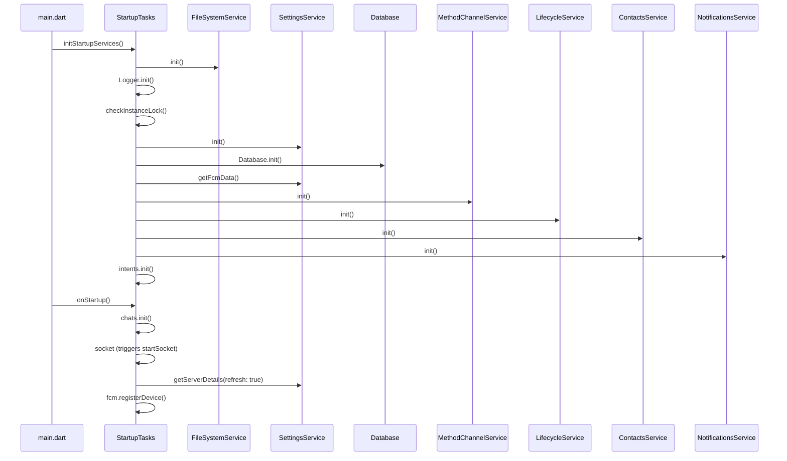
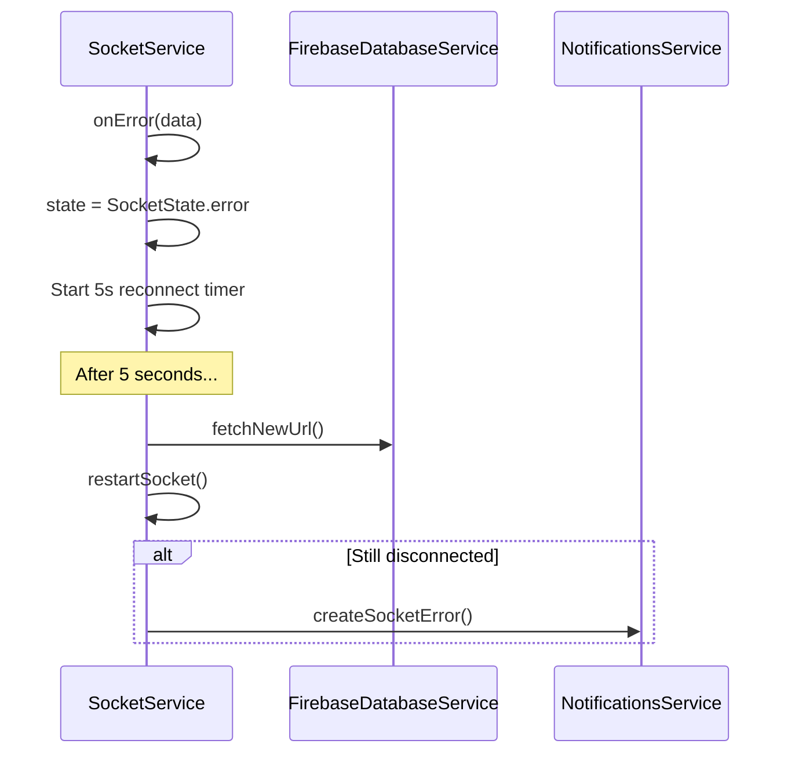
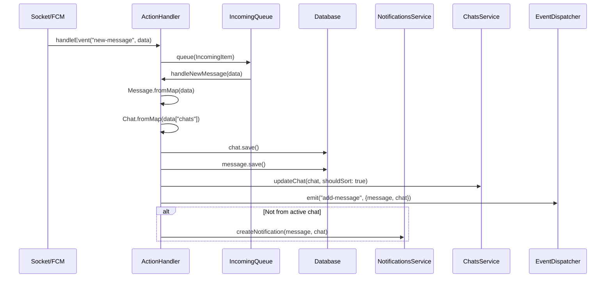
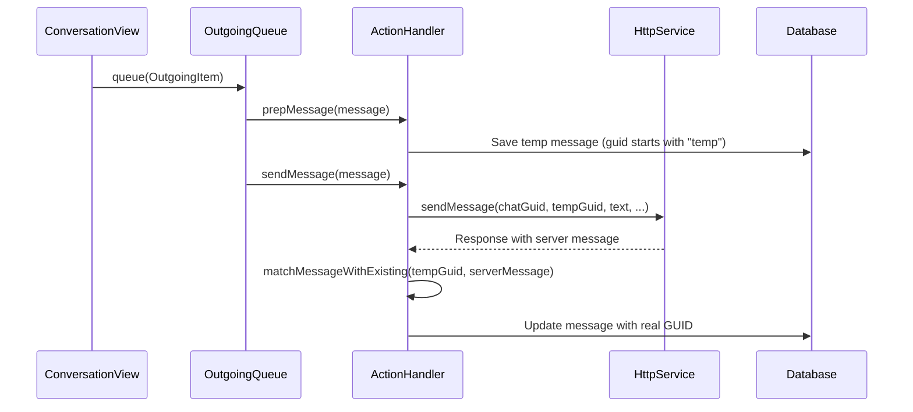
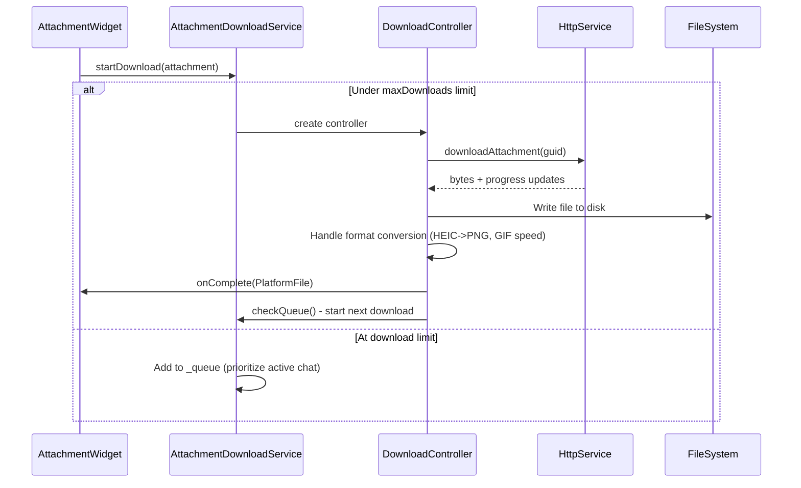
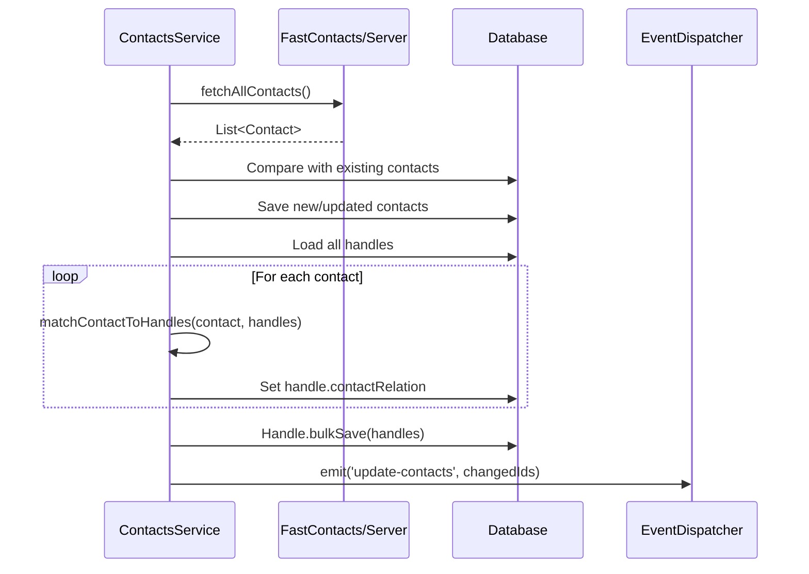

# Services and Business Logic

This document provides a comprehensive reference for the BlueBubbles Flutter application's service layer, business logic, and helper utilities. All method signatures, dependencies, and patterns are sourced directly from the codebase at `lib/services/` and `lib/helpers/`.

---

## Table of Contents

1. [Service Registry and Dependency Injection](#1-service-registry-and-dependency-injection)
2. [HTTP Service](#2-http-service)
3. [Socket Service](#3-socket-service)
4. [Action Handler](#4-action-handler)
5. [Event Dispatcher](#5-event-dispatcher)
6. [Downloads Service](#6-downloads-service)
7. [Attachments Service](#7-attachments-service)
8. [Contact Service](#8-contact-service)
9. [UnifiedPush Service](#9-unifiedpush-service)
10. [Intent System](#10-intent-system)
11. [Startup Tasks and Initialization](#11-startup-tasks-and-initialization)
12. [Helper Functions and Utilities](#12-helper-functions-and-utilities)

---

## 1. Service Registry and Dependency Injection

### Pattern Overview

All services use the GetX dependency injection framework. Each service follows a singleton registration pattern through a top-level global variable:

```dart
ServiceType variableName = Get.isRegistered<ServiceType>()
    ? Get.find<ServiceType>()
    : Get.put(ServiceType());
```

This pattern ensures only one instance of each service exists throughout the application lifecycle. If the service is already registered, it retrieves the existing instance. Otherwise, it creates and registers a new one.

### Service Registry

The barrel export file `lib/services/services.dart` defines the full list of exported services:

| Global Variable | Class | File Path |
|---|---|---|
| `http` | `HttpService` | `network/http_service.dart` |
| `socket` | `SocketService` | `network/socket_service.dart` |
| `attachmentDownloader` | `AttachmentDownloadService` | `network/downloads_service.dart` |
| `fcm` | `CloudMessagingService` | `network/firebase/cloud_messaging_service.dart` |
| `fdb` | `FirebaseDatabaseService` | `network/firebase/firebase_database_service.dart` |
| `ah` | `ActionHandler` | `backend/action_handler.dart` |
| `fs` | `FileSystemService` | `backend/filesystem/filesystem_service.dart` |
| `ls` | `LifecycleService` | `backend/lifecycle/lifecycle_service.dart` |
| `notif` | `NotificationsService` | `backend/notifications/notifications_service.dart` |
| `ss` | `SettingsService` | `backend/settings/settings_service.dart` |
| `setup` | `SetupService` | `backend/setup/setup_service.dart` |
| `sync` | `SyncService` | `backend/sync/sync_service.dart` |
| `mcs` | `MethodChannelService` | `backend/java_dart_interop/method_channel_service.dart` |
| `intents` | `IntentService` | `backend/java_dart_interop/intents_service.dart` |
| `inq` | `IncomingQueue` | `backend/queue/incoming_queue.dart` |
| `outq` | `OutgoingQueue` | `backend/queue/outgoing_queue.dart` |
| `eventDispatcher` | `EventDispatcher` | `backend_ui_interop/event_dispatcher.dart` |
| `as` | `AttachmentsService` | `ui/attachments_service.dart` |
| `cs` | `ContactsService` | `ui/contact_service.dart` |
| `upr` | `UnifiedPushPanelRefresh` | `ui/unifiedpush.dart` |
| `chats` | `ChatsService` | `ui/chat/chats_service.dart` |
| `cm` | `ChatManager` | `ui/chat/chat_manager.dart` |
| `GlobalChatService` | `_GlobalChatService` | `ui/chat/global_chat_service.dart` |
| `ns` | `NavigatorService` | `ui/navigator/navigator_service.dart` |
| `ts` | `ThemesService` | `ui/theme/themes_service.dart` |

### Initialization Order

Services are initialized in a specific order during startup (see `StartupTasks.initStartupServices()`):

```
fs (FileSystem) -> Logger -> checkInstanceLock -> ss (Settings)
-> Database -> getFcmData -> mcs (MethodChannel) -> ls (Lifecycle)
-> ts (Themes) -> cs (Contacts) -> GlobalChatService -> notif (Notifications)
-> intents (IntentService)
```

After setup completes, `StartupTasks.onStartup()` runs:

```
chats.init() -> socket (accessor triggers init) -> ss.getServerDetails()
-> fcm.registerDevice() -> [delayed 30s] checkServerUpdate + checkClientUpdate
-> [delayed 60s] reviewFlow (Android only)
```



---

## 2. HTTP Service

**File:** `lib/services/network/http_service.dart`
**Global accessor:** `http`
**Class:** `HttpService extends GetxService`

### Overview

The HTTP service wraps the Dio HTTP client and provides all REST API communication with the BlueBubbles server. It handles authentication, request logging, error handling, and response interception.

### Constructor and Initialization

```dart
class HttpService extends GetxService {
  late Dio dio;
  String? originOverride;

  String get origin => originOverride ?? ss.settings.serverAddress.value;
  Uri get originUri => Uri.parse(origin);
  String get apiRoot => "$origin/api/v1";

  Map<String, String> get headers => ss.settings.customHeaders.value.isNotEmpty
      ? Map<String, String>.from(jsonDecode(ss.settings.customHeaders.value))
      : {};

  @override
  void onInit() {
    super.onInit();
    dio = Dio(BaseOptions(
      connectTimeout: const Duration(milliseconds: 15000),
    ));
    dio.interceptors.add(ApiInterceptor());
  }
}
```

### Dependencies

- `ss` (SettingsService) -- for server address, auth key, custom headers
- `socket` (SocketService) -- for WebSocket-based message sending fallback

### Public Methods

#### Server Communication

| Method | Signature | Description |
|---|---|---|
| `ping` | `Future<Response> ping({CancelToken? cancelToken})` | Pings the server to check connectivity |
| `serverInfo` | `Future<Response> serverInfo({bool refresh = true})` | Gets server info. Cached for 1 minute unless `refresh=true` |
| `serverStat` | `Future<Response> serverStat()` | Fetches server statistics |
| `serverTotalHandles` | `Future<Response> serverTotalHandles()` | Gets total handle count from server stats |
| `serverLogs` | `Future<Response> serverLogs({int? count})` | Gets server logs |
| `restartImessage` | `Future<Response> restartImessage()` | Restarts iMessage on the server |
| `checkForUpdates` | `Future<Response> checkForUpdates()` | Checks if a server update is available |
| `landingPage` | `Future<Response> landingPage()` | Fetches the landing page HTML |

#### Chat Operations

| Method | Signature | Description |
|---|---|---|
| `chats` | `Future<Response> chats({String? withQuery, int offset = 0, int limit = 100, String? sort})` | Fetches paginated chat list |
| `chatCount` | `Future<Response> chatCount()` | Returns total number of chats |
| `singleChat` | `Future<Response> singleChat(String guid, {String? withQuery})` | Fetches a single chat by GUID |
| `chatMessages` | `Future<Response> chatMessages(String guid, {String withQuery = "", int offset = 0, int limit = 25, String sort = "DESC", int? after, int? before})` | Fetches messages for a specific chat |
| `createChat` | `Future<Response> createChat(List<String> addresses, {String? message, String? service})` | Creates a new chat with given addresses |
| `markChatRead` | `Future<Response> markChatRead(String chatGuid)` | Marks a chat as read on the server |
| `updateChat` | `Future<Response> updateChat(String chatGuid, String displayName)` | Updates a chat's display name |
| `addParticipant` | `Future<Response> addParticipant(String chatGuid, String address)` | Adds a participant to a group chat |
| `removeParticipant` | `Future<Response> removeParticipant(String chatGuid, String address)` | Removes a participant from a group chat |
| `leaveChat` | `Future<Response> leaveChat(String chatGuid)` | Leaves a group chat |
| `deleteChatMessage` | `Future<Response> deleteChatMessage(String chatGuid, String messageGuid)` | Deletes a message from a chat |

#### Message Operations

| Method | Signature | Description |
|---|---|---|
| `sendMessage` | `Future<Response> sendMessage(String chatGuid, String tempGuid, String message, {String? method, String? effectId, String? subject, String? selectedMessageGuid, int? partIndex, String? ddScan, bool? isAudioMessage, String? replyGuid})` | Sends a text message |
| `sendAttachment` | `Future<Response> sendAttachment(String chatGuid, String tempGuid, PlatformFile file, {void Function(int, int)? onSendProgress, CancelToken? cancelToken, bool? isAudioMessage, String? replyGuid, String? effectId, String? subject, String? selectedMessageGuid, int? partIndex})` | Sends an attachment |
| `sendMultipart` | `Future<Response> sendMultipart(String chatGuid, String tempGuid, String message, List<PlatformFile> files, {void Function(int, int)? onSendProgress, CancelToken? cancelToken, bool? isAudioMessage, String? replyGuid, String? effectId, String? subject, String? selectedMessageGuid, int? partIndex, String? ddScan})` | Sends a message with multiple attachments |
| `sendTapback` | `Future<Response> sendTapback(String chatGuid, String selectedMessageText, String selectedMessageGuid, String reaction, {int? partIndex})` | Sends a tapback/reaction |
| `unsend` | `Future<Response> unsend(String messageGuid, {int? partIndex})` | Unsends a message (Private API) |
| `edit` | `Future<Response> edit(String messageGuid, String editedMessage, String backwardsCompatText, {int? partIndex})` | Edits a message (Private API) |
| `notify` | `Future<Response> notify(String messageGuid, String chatGuid)` | Sends a notification for a message |
| `bulkMessages` | `Future<Response> bulkMessages({required List<String> chatGuids, int? after, int? before, int offset = 0, int limit = 100, String sort = "ASC", String? with_})` | Fetches messages across multiple chats |
| `message` | `Future<Response> message(String guid, {String withQuery = ""})` | Fetches a single message by GUID |
| `messageCount` | `Future<Response> messageCount({String? after, String? before, String? chatGuid, bool? isFromMe})` | Gets message count with optional filters |
| `embedContact` | `Future<Response> embedContact(String chatGuid, String contactId, String tempGuid)` | Embeds a contact vCard into a chat |
| `getScheduled` | `Future<Response> getScheduled(String chatGuid)` | Gets scheduled messages for a chat |
| `createScheduled` | `Future<Response> createScheduled(String chatGuid, String message, DateTime scheduledFor, Map<String, dynamic> schedule)` | Creates a scheduled message |
| `updateScheduled` | `Future<Response> updateScheduled(int id, String chatGuid, {String? message, DateTime? scheduledFor, Map<String, dynamic>? schedule})` | Updates a scheduled message |
| `deleteScheduled` | `Future<Response> deleteScheduled(int id, String chatGuid)` | Deletes a scheduled message |

#### Handle Operations

| Method | Signature | Description |
|---|---|---|
| `handles` | `Future<Response> handles({int offset = 0, int limit = 100})` | Fetches paginated handles |
| `handleCount` | `Future<Response> handleCount()` | Returns total handle count |
| `handleFocusState` | `Future<Response> handleFocusState(String address)` | Gets focus/DND status for a handle |
| `iMessageState` | `Future<Response> iMessageState(String address)` | Checks iMessage registration for an address |
| `iCloudAlias` | `Future<Response> iCloudAlias()` | Gets iCloud aliases |
| `removeICloudAlias` | `Future<Response> removeICloudAlias(Map<String, dynamic> body)` | Removes an iCloud alias |

#### Contact Operations

| Method | Signature | Description |
|---|---|---|
| `contacts` | `Future<Response> contacts({bool withAvatars = false})` | Fetches contacts from the server |
| `contactCard` | `Future<Response> contactCard(String address)` | Gets vCard data for an address |
| `addContact` | `Future<Response> addContact(Map<String, dynamic> contact)` | Adds a new contact on the server |
| `updateContact` | `Future<Response> updateContact(Map<String, dynamic> contact)` | Updates an existing contact |
| `deleteContact` | `Future<Response> deleteContact(String id)` | Deletes a contact |
| `uploadContacts` | `Future<Response> uploadContacts(List<Map<String, dynamic>> contacts)` | Bulk uploads contacts to the server |

#### Attachment Operations

| Method | Signature | Description |
|---|---|---|
| `downloadAttachment` | `Future<Response> downloadAttachment(String guid, {void Function(int, int)? onReceiveProgress, bool original = false, CancelToken? cancelToken})` | Downloads an attachment by GUID |
| `downloadLivePhoto` | `Future<Response> downloadLivePhoto(String guid, {void Function(int, int)? onReceiveProgress, CancelToken? cancelToken})` | Downloads a live photo's video component |

#### FaceTime Operations

| Method | Signature | Description |
|---|---|---|
| `answerFaceTime` | `Future<Response> answerFaceTime(String callUuid)` | Answers a FaceTime call |
| `leaveFaceTime` | `Future<Response> leaveFaceTime(String callUuid)` | Leaves a FaceTime call |

#### FindMy Operations

| Method | Signature | Description |
|---|---|---|
| `findMyDevices` | `Future<Response> findMyDevices()` | Fetches FindMy device locations |
| `findMyFriends` | `Future<Response> findMyFriends()` | Fetches FindMy friend locations |
| `refreshFindMyFriends` | `Future<Response> refreshFindMyFriends()` | Refreshes FindMy friend data |

#### Firebase Operations

| Method | Signature | Description |
|---|---|---|
| `getFirebaseProjects` | `Future<Response> getFirebaseProjects()` | Lists Firebase projects linked to server |
| `addFirebaseDevice` | `Future<Response> addFirebaseDevice(Map<String, dynamic> body)` | Registers a device with Firebase |
| `addFcmDevice` | `Future<Response> addFcmDevice(Map<String, dynamic> body)` | Registers an FCM device token |

### Error Handling

The `ApiInterceptor` class handles all HTTP errors:

```dart
class ApiInterceptor extends Interceptor {
  @override
  void onResponse(Response response, ResponseInterceptorHandler handler) {
    // Logs non-binary responses for debugging
    if (response.requestOptions.responseType != ResponseType.bytes) {
      Logger.info("(...) STATUS: ${response.statusCode}");
    }
    return super.onResponse(response, handler);
  }

  @override
  void onError(DioException e, ErrorInterceptorHandler handler) {
    if (e.type == DioExceptionType.connectionTimeout) {
      Logger.warn("Request timed out!");
    }
    // Logs error details for debugging
    return super.onError(e, handler);
  }
}
```

Authentication is passed as a query parameter `guid` on every request:

```dart
"$apiRoot/endpoint?guid=${ss.settings.guidAuthKey.value}"
```

### HTTP Overrides

**File:** `lib/services/network/http_overrides.dart`

Allows self-signed SSL certificates when the certificate's host matches the server URL:

```dart
class BadCertOverride extends HttpOverrides {
  @override
  HttpClient createHttpClient(SecurityContext? context) {
    return super.createHttpClient(context)
      ..badCertificateCallback = (X509Certificate cert, String host, int port) {
        return host == http.originUri.host;
      };
  }
}
```

---

## 3. Socket Service

**File:** `lib/services/network/socket_service.dart`
**Global accessor:** `socket`
**Class:** `SocketService extends GetxService`

### Overview

Manages the persistent WebSocket connection to the BlueBubbles server using Socket.IO. Handles real-time events including new messages, typing indicators, read receipts, and FaceTime calls.

### State Management

```dart
enum SocketState {
  connected,
  disconnected,
  error,
  connecting,
}
```

The state is exposed as `Rx<SocketState> state` for reactive UI binding.

### Constructor and Initialization

```dart
class SocketService extends GetxService {
  final Rx<SocketState> state = SocketState.disconnected.obs;
  SocketState _lastState = SocketState.disconnected;
  RxString lastError = "".obs;
  Timer? _reconnectTimer;
  late Socket socket;

  String get serverAddress => http.origin;
  String get password => ss.settings.guidAuthKey.value;
}
```

### Dependencies

- `http` (HttpService) -- for server origin URL
- `ss` (SettingsService) -- for auth key, keepAppAlive setting
- `ah` (ActionHandler) -- event handling delegation
- `fdb` (FirebaseDatabaseService) -- URL refresh on error
- `notif` (NotificationsService) -- socket error notifications

### Public Methods

| Method | Signature | Description |
|---|---|---|
| `startSocket` | `void startSocket()` | Creates and connects the Socket.IO client with all event listeners |
| `disconnect` | `void disconnect()` | Disconnects the socket |
| `reconnect` | `void reconnect()` | Reconnects if not already connected |
| `closeSocket` | `void closeSocket()` | Disposes the socket and sets state to disconnected |
| `restartSocket` | `void restartSocket()` | Calls `closeSocket()` then `startSocket()` |
| `forgetConnection` | `void forgetConnection()` | Closes socket and clears server URL and auth key |
| `sendMessage` | `Future<Map<String, dynamic>> sendMessage(String event, Map<String, dynamic> message)` | Emits a socket event with acknowledgment; decrypts AES responses |

### Socket Events Listened

Events are routed through `ah.handleEvent()`:

| Event | Platform | Description |
|---|---|---|
| `new-message` | All | New incoming message |
| `updated-message` | All | Message was updated (delivered, read, edited, etc.) |
| `typing-indicator` | All | Someone is typing |
| `chat-read-status-changed` | All | Chat read status changed |
| `ft-call-status-changed` | All | FaceTime call status changed |
| `imessage-aliases-removed` | All | iMessage alias was removed |
| `group-name-change` | Web/Desktop | Group chat name changed |
| `participant-removed` | Web/Desktop | Participant removed from group |
| `participant-added` | Web/Desktop | Participant added to group |
| `participant-left` | Web/Desktop | Participant left group |
| `incoming-facetime` | Web/Desktop | Incoming FaceTime call |

### Reconnection Flow



### Encrypted Response Handling

When the server sends encrypted responses, the socket service decrypts them:

```dart
socket.emitWithAck(event, message, ack: (response) {
  if (response['encrypted'] == true) {
    response['data'] = jsonDecode(
      decryptAESCryptoJS(response['data'], password)
    );
  }
  completer.complete(response);
});
```

---

## 4. Action Handler

**File:** `lib/services/backend/action_handler.dart`
**Global accessor:** `ah`
**Class:** `ActionHandler extends GetxService`

### Overview

The central event dispatcher and message handling coordinator. Routes incoming socket and FCM events to appropriate handlers, manages outgoing message preparation and sending, and handles FaceTime call events.

### Key Properties

```dart
class ActionHandler extends GetxService {
  // Tracks last 100 handled GUIDs to prevent duplicate notifications
  List<String> handledNewGuidNotification = [];

  // Tracks attachment upload progress as list of (guid, progress) tuples
  RxList<Tuple2<String, RxDouble>> attachmentProgress = <Tuple2<String, RxDouble>>[].obs;

  // Tracks send progress timers
  Map<String, Timer?> attachmentTimers = {};
}
```

### Dependencies

- `http` (HttpService) -- for sending messages and API calls
- `socket` (SocketService) -- for WebSocket message sending
- `inq` (IncomingQueue) -- queues incoming events
- `notif` (NotificationsService) -- creates notifications
- `ss` (SettingsService) -- for Private API settings
- `chats` (ChatsService) -- for chat list updates
- `cm` (ChatManager) -- for active chat state

### Public Methods

#### Event Routing

| Method | Signature | Description |
|---|---|---|
| `handleEvent` | `void handleEvent(String event, dynamic data, String source)` | Routes events by type to specific handlers |

The `handleEvent` method dispatches to:
- `"new-message"` -> `inq.queue(IncomingItem(type: QueueType.newMessage, data: data))`
- `"updated-message"` -> `inq.queue(IncomingItem(type: QueueType.updatedMessage, data: data))`
- `"typing-indicator"` -> `eventDispatcher.emit('typing-indicator', data)`
- `"chat-read-status-changed"` -> marks chat as read in DB
- `"group-name-change"` -> `handleGroupNameChange(data)`
- `"participant-removed"` -> `handleParticipantEvent('removed', data)`
- `"participant-added"` -> `handleParticipantEvent('added', data)`
- `"participant-left"` -> `handleParticipantEvent('left', data)`
- `"incoming-facetime"` -> `handleIncomingFaceTimeCall(data)`
- `"ft-call-status-changed"` -> `handleFaceTimeStatusChange(data)`
- `"imessage-aliases-removed"` -> `notif.createAliasesRemovedNotification(data)`

#### Incoming Message Handling

| Method | Signature | Description |
|---|---|---|
| `handleNewMessage` | `Future<void> handleNewMessage(Map<String, dynamic> data, {String? source})` | Processes new incoming messages; creates/updates chat, saves to DB, triggers notifications |
| `handleUpdatedMessage` | `Future<void> handleUpdatedMessage(Map<String, dynamic> data, {String? source, bool headless = false})` | Processes message updates (delivery, read, edit, unsend) |

#### Outgoing Message Handling

| Method | Signature | Description |
|---|---|---|
| `prepMessage` | `Future<void> prepMessage(Message m)` | Prepares a message for sending; saves temp message to DB |
| `prepAttachment` | `Future<void> prepAttachment(Message m)` | Prepares an attachment message; saves temp message and tracks progress |
| `sendMessage` | `Future<void> sendMessage(Message m)` | Sends a text message via HTTP or socket |
| `sendAttachment` | `Future<void> sendAttachment(Message m)` | Sends a single attachment via HTTP |
| `sendMultipart` | `Future<void> sendMultipart(Message m)` | Sends a message with multiple attachments via HTTP multipart |

#### FaceTime Handling

| Method | Signature | Description |
|---|---|---|
| `handleIncomingFaceTimeCall` | `Future<void> handleIncomingFaceTimeCall(Map<String, dynamic> data)` | Creates a FaceTime notification with answer/decline actions |
| `handleFaceTimeStatusChange` | `void handleFaceTimeStatusChange(Map<String, dynamic> data)` | Updates FaceTime call UI state |

### Incoming Message Flow



### Outgoing Message Flow



### Duplicate Prevention

The action handler maintains a list of the last 100 processed GUIDs to prevent duplicate notification handling:

```dart
if (handledNewGuidNotification.contains(message.guid)) return;
handledNewGuidNotification.add(message.guid!);
if (handledNewGuidNotification.length > 100) {
  handledNewGuidNotification.removeAt(0);
}
```

---

## 5. Event Dispatcher

**File:** `lib/services/backend_ui_interop/event_dispatcher.dart`
**Global accessor:** `eventDispatcher`
**Class:** `EventDispatcher extends GetxService`

### Overview

A lightweight, application-wide event bus using Dart's `StreamController.broadcast()`. Enables decoupled communication between services and UI components.

### Implementation

```dart
class EventDispatcher extends GetxService {
  StreamController<Tuple2<String, dynamic>> stream =
      StreamController<Tuple2<String, dynamic>>.broadcast();

  void emit(String type, [dynamic data]) {
    stream.add(Tuple2(type, data));
  }

  void close() {
    stream.close();
  }
}
```

### Dependencies

None. This is a standalone event bus.

### Event Types Used Across the Application

| Event Name | Emitted By | Data Type | Description |
|---|---|---|---|
| `add-message` | ActionHandler | `{Message, Chat}` | New message added to a chat |
| `update-message` | ActionHandler | `{Message}` | Message was updated |
| `update-contacts` | ContactsService | `List<List<int>>` | Contact data was refreshed |
| `update-highlight` | ChatManager | `String?` (chat GUID) | Active chat highlight changed |
| `typing-indicator` | ActionHandler | `Map<String, dynamic>` | Typing indicator event |

### Usage Pattern

Listeners subscribe to the broadcast stream and filter by event type:

```dart
eventDispatcher.stream.listen((event) {
  if (event.item1 != 'update-contacts') return;
  // Handle contact update
});
```

---

## 6. Downloads Service

**File:** `lib/services/network/downloads_service.dart`
**Global accessor:** `attachmentDownloader`
**Class:** `AttachmentDownloadService extends GetxService`

### Overview

Manages a concurrent queue for downloading message attachments from the server. Limits concurrent downloads to 2 and prioritizes attachments from the currently active chat.

### Key Properties

```dart
class AttachmentDownloadService extends GetxService {
  int maxDownloads = 2;
  final List<String> _downloaders = [];
  final List<AttachmentDownloadController> _queue = [];
}
```

### Dependencies

- `http` (HttpService) -- for downloading attachment data
- `cm` (ChatManager) -- for determining active chat (download prioritization)
- `ss` (SettingsService) -- for auto-save settings

### Public Methods

| Method | Signature | Description |
|---|---|---|
| `startDownload` | `AttachmentDownloadController startDownload(Attachment attachment, {Function(PlatformFile)? onComplete})` | Starts or queues an attachment download |
| `getController` | `AttachmentDownloadController? getController(String? guid)` | Gets the download controller for a given attachment GUID |

### AttachmentDownloadController

Each download is managed by an `AttachmentDownloadController` registered as a GetX controller:

```dart
class AttachmentDownloadController extends GetxController {
  final Attachment attachment;
  final Function(PlatformFile)? onComplete;
  final Function()? onError;
  final RxDouble progress = 0.0.obs;
  final Rxn<PlatformFile> file = Rxn<PlatformFile>();
  final RxBool error = false.obs;
}
```

### Download Flow



### Post-Download Processing

After download completes, the controller handles:
1. GIF frame speed correction (fixes server-side speed issues)
2. HEIC to PNG conversion on mobile
3. TIFF to PNG conversion
4. Auto-save to gallery/downloads if enabled
5. Removal from queue and triggering next download

---

## 7. Attachments Service

**File:** `lib/services/ui/attachments_service.dart`
**Global accessor:** `as`
**Class:** `AttachmentsService extends GetxService`

### Overview

Handles attachment content resolution, media format conversions, file saving operations, and vCard/location parsing. Acts as the bridge between raw attachment data and UI-ready content.

### Dependencies

- `ss` (SettingsService) -- for auto-download and save location settings
- `ah` (ActionHandler) -- for tracking upload progress
- `attachmentDownloader` (AttachmentDownloadService) -- for triggering downloads

### Public Methods

#### Content Resolution

| Method | Signature | Description |
|---|---|---|
| `getContent` | `dynamic getContent(Attachment attachment, {String? path, bool? autoDownload, Function(PlatformFile)? onComplete})` | Returns the appropriate content for an attachment: a PlatformFile if downloaded, an AttachmentDownloadController if downloading, or the raw Attachment if not yet downloaded |

The `getContent` method uses this resolution logic:
1. If GUID starts with `"temp"` -- returns the send progress tuple
2. If GUID contains `"demo"` -- returns an empty PlatformFile
3. If web or no GUID -- starts download or returns cached bytes
4. If file exists on disk -- returns PlatformFile with path
5. If auto-download enabled -- starts download
6. Otherwise -- returns the raw Attachment object

#### File Saving

| Method | Signature | Description |
|---|---|---|
| `saveToDisk` | `Future<void> saveToDisk(PlatformFile file, {bool isAutoDownload = false, bool isDocument = false})` | Saves a file with platform-specific behavior |

Platform-specific save behavior:
- **Web:** Creates a download anchor element with base64 data
- **Desktop:** Opens a native file picker dialog with overwrite confirmation
- **Mobile:** Saves to gallery via `SaverGallery` (images/video) or to a configurable documents directory

#### Media Processing

| Method | Signature | Description |
|---|---|---|
| `getImageSizing` | `Future<Size> getImageSizing(String filePath, Attachment attachment)` | Gets image dimensions from a file |
| `getVideoThumbnail` | `Future<Uint8List?> getVideoThumbnail(String filePath, {bool useCachedFile = true})` | Generates and caches a video thumbnail |
| `loadAndGetProperties` | `Future<Uint8List?> loadAndGetProperties(Attachment attachment, {bool onlyFetchData = false, String? actualPath, bool isPreview = false})` | Loads an attachment, handles HEIC/TIFF conversion, extracts EXIF data, and determines dimensions |

#### vCard and Location Parsing

| Method | Signature | Description |
|---|---|---|
| `createAppleLocation` | `String createAppleLocation(double longitude, double latitude)` | Creates an Apple Maps location vCard string |
| `parseAppleLocationUrl` | `String? parseAppleLocationUrl(String appleLocation)` | Extracts the URL from an Apple Maps location vCard |
| `parseAppleContact` | `Contact parseAppleContact(String appleContact)` | Parses a vCard string into a Contact object |

#### Auto-Download Check

| Method | Signature | Description |
|---|---|---|
| `canAutoDownload` | `Future<bool> canAutoDownload()` | Checks storage permission, auto-download setting, and wifi-only preference |

---

## 8. Contact Service

**File:** `lib/services/ui/contact_service.dart`
**Global accessor:** `cs`
**Class:** `ContactsService extends GetxService`

### Overview

Manages contact loading, syncing, and matching between device contacts and message handles. Supports both on-device contacts (via `fast_contacts` package on mobile) and server-fetched contacts (on web/desktop).

### Key Properties

```dart
class ContactsService extends GetxService {
  List<Contact> contacts = [];
  bool _hasContactAccess = false;
}
```

### Dependencies

- `ss` (SettingsService) -- for server details and version checks
- `http` (HttpService) -- for fetching contacts from server
- `chats` (ChatsService) -- for web-cached handles
- `eventDispatcher` (EventDispatcher) -- for emitting contact update events
- Database -- for persisting contacts and handle-contact relationships

### Public Methods

#### Initialization

| Method | Signature | Description |
|---|---|---|
| `init` | `Future<void> init()` | Loads contact access state and initial contacts from DB or network |
| `canAccessContacts` | `Future<bool> canAccessContacts()` | On mobile: checks permission. On web/desktop: checks server version >= 42 |
| `hasContactAccess` | `Future<bool> get hasContactAccess` | Cached access check |

#### Contact Refresh

| Method | Signature | Description |
|---|---|---|
| `refreshContacts` | `Future<List<List<int>>> refreshContacts()` | Full contact sync. Returns `[changedContactIds, changedHandleIds]` |
| `fetchAllContacts` | `Future<List<Contact>> fetchAllContacts()` | Fetches from device (mobile) or server (web/desktop), including avatars |
| `fetchNetworkContacts` | `Future<List<Contact>> fetchNetworkContacts({Function(String)? logger})` | Fetches contacts from the BlueBubbles server API. On web, does a two-pass fetch: first without avatars for fast UI, then with avatars |
| `completeContactsRefresh` | `void completeContactsRefresh(List<Contact> refreshedContacts, {List<List<int>>? reloadUI})` | Updates the master contact list and emits UI refresh event |

#### Contact Matching

| Method | Signature | Description |
|---|---|---|
| `matchContactToHandles` | `List<Handle> matchContactToHandles(Contact c, List<Handle> handles)` | Matches a contact to handles via email exact match or phone number partial match (last 7-15 digits) |
| `matchHandleToContact` | `Contact? matchHandleToContact(Handle h)` | Finds the contact matching a given handle |
| `getContact` | `Contact? getContact(String address)` | Creates a temporary handle and matches it to a contact |

### Phone Number Matching Algorithm

The contact-to-handle matching uses a progressive digit matching strategy:

1. Exact email address match
2. Exact phone number match (numeric only)
3. Suffix match on the last 7 through 15 digits, with leading zeros removed

```dart
final matchLengths = [15, 14, 13, 12, 11, 10, 9, 8, 7];
if (matchLengths.contains(leadingZerosRemoved.length) &&
    numericAddress.endsWith(leadingZerosRemoved)) {
  handleMatches.add(h);
}
```

### Contact Refresh Flow



---

## 9. UnifiedPush Service

**File:** `lib/services/ui/unifiedpush.dart`
**Global accessor:** `upr`
**Class:** `UnifiedPushPanelRefresh extends GetxService`

### Overview

A lightweight reactive wrapper for UnifiedPush notification settings. UnifiedPush is an alternative to Firebase Cloud Messaging (FCM) for push notifications, commonly used on degoogled Android devices.

### Implementation

```dart
class UnifiedPushPanelRefresh extends GetxService {
  var enabled = ss.settings.enableUnifiedPush.value.obs;
  var endpoint = ss.settings.endpointUnifiedPush.value.obs;

  void update(String newEndpoint) {
    endpoint.value = newEndpoint;
    enabled.value = newEndpoint != "";
    ss.settings.endpointUnifiedPush.value = newEndpoint;
    ss.settings.enableUnifiedPush.value = enabled.value;
    ss.saveSettings();
  }
}
```

### Dependencies

- `ss` (SettingsService) -- for persisting UnifiedPush settings

### Public Methods

| Method | Signature | Description |
|---|---|---|
| `update` | `void update(String newEndpoint)` | Updates the UnifiedPush endpoint. An empty string disables UnifiedPush |

---

## 10. Intent System

The intent system has two distinct components: Flutter keyboard shortcut intents (desktop/web) and Android native intents.

### 10A. Flutter Keyboard Intents

**File:** `lib/services/backend_ui_interop/intents.dart`

#### Intent/Action Pairs

Each keyboard shortcut is defined as an `Intent` subclass with a corresponding `Action<Intent>` subclass:

| Intent Class | Action Class | Default Shortcut | Description |
|---|---|---|---|
| `OpenSettingsIntent` | `OpenSettingsAction` | `Ctrl+,` | Opens app settings |
| `OpenNewChatCreatorIntent` | `OpenNewChatCreatorAction` | `Ctrl+N` | Opens the new chat creator |
| `OpenSearchIntent` | `OpenSearchAction` | `Ctrl+F` | Opens search |
| `ReplyRecentIntent` | `ReplyRecentAction` | `Ctrl+R` | Opens reply for the most recent message |
| `HeartRecentIntent` | `HeartRecentAction` | `Ctrl+1` | Sends heart reaction to recent message |
| `LikeRecentIntent` | `LikeRecentAction` | `Ctrl+2` | Sends like reaction to recent message |
| `DislikeRecentIntent` | `DislikeRecentAction` | `Ctrl+3` | Sends dislike reaction to recent message |
| `LaughRecentIntent` | `LaughRecentAction` | `Ctrl+4` | Sends laugh reaction to recent message |
| `EmphasizeRecentIntent` | `EmphasizeRecentAction` | `Ctrl+5` | Sends emphasize reaction to recent message |
| `QuestionRecentIntent` | `QuestionRecentAction` | `Ctrl+6` | Sends question reaction to recent message |
| `OpenNextChatIntent` | `OpenNextChatAction` | `Ctrl+Tab` | Switches to the next chat in list |
| `OpenPreviousChatIntent` | `OpenPreviousChatAction` | `Ctrl+Shift+Tab` | Switches to the previous chat in list |
| `OpenChatDetailsIntent` | `OpenChatDetailsAction` | `Ctrl+I` | Opens chat details panel |
| `StartIncrementalSyncIntent` | `StartIncrementalSyncAction` | `Ctrl+Shift+R` | Triggers an incremental sync |
| `GoBackIntent` | `GoBackAction` | `Alt+Left` | Navigates back |

#### Reaction Helper

All reaction intents use a shared helper:

```dart
static void _sendReactionHelper(String reaction) {
  // Gets the most recent non-self message from the active chat
  // Queues a reaction via outq.queue(OutgoingItem(...))
}
```

### 10B. Android Intent Service

**File:** `lib/services/backend/java_dart_interop/intents_service.dart`
**Global accessor:** `intents`
**Class:** `IntentService extends GetxService`

#### Overview

Handles Android system intents including sharing content, deep links (`imessage://` URIs), opening specific chats, and answering FaceTime calls.

#### Dependencies

- `http` (HttpService) -- for FaceTime link generation
- `ns` (NavigatorService) -- for navigation
- `cm` (ChatManager) -- for setting active chat
- `chats` (ChatsService) -- for chat lookup

#### Public Methods

| Method | Signature | Description |
|---|---|---|
| `init` | `Future<void> init()` | Initializes intent listeners on Android |
| `handleSharing` | `Future<void> handleSharing(Map<String, dynamic> data)` | Handles `ACTION_SEND` / `ACTION_SEND_MULTIPLE` intents with text/files |
| `handleUri` | `Future<void> handleUri(Uri? uri)` | Handles `imessage://` URI deep links |
| `openChat` | `Future<void> openChat(String chatGuid, {String? text, List<PlatformFile>? files})` | Opens a specific chat by GUID, optionally pre-filling text or files |
| `answerFaceTime` | `Future<void> answerFaceTime(String callUuid)` | Answers a FaceTime call by requesting a link from the server |

### 10C. MethodChannel Service

**File:** `lib/services/backend/java_dart_interop/method_channel_service.dart`
**Global accessor:** `mcs`
**Class:** `MethodChannelService extends GetxService`

#### Overview

Bridges Flutter and native Android (Kotlin) code via a MethodChannel named `com.bluebubbles.messaging`. Handles two-way communication: receiving native events and invoking native methods.

#### Key Incoming Method Calls

| Method Name | Handler | Description |
|---|---|---|
| `NewServerUrl` | Saves new server URL | Server URL updated from native |
| `new-message` | `ah.handleEvent()` | New message from FCM push |
| `updated-message` | `ah.handleEvent()` | Message update from FCM push |
| `ReplyChat` | `ah.sendMessage()` | Reply from notification action |
| `MarkChatRead` | `http.markChatRead()` | Mark as read from notification action |
| `incoming-facetime` | `ah.handleEvent()` | Incoming FaceTime call |
| `ft-call-status-changed` | `ah.handleEvent()` | FaceTime status change |
| `answer-facetime` | `intents.answerFaceTime()` | Answer FaceTime from notification |
| `socket-event` | `ah.handleEvent()` | Generic socket event forwarded from native |
| `unifiedpush-settings` | `upr.update()` | UnifiedPush endpoint changed |

#### Deduplication Logic

The MethodChannel service implements deduplication to avoid processing events already handled by the socket:

```dart
// For "new-message" and "updated-message" from FCM:
// If ls.isAlive is true and event source is not "socket-event",
// skip handling because the socket connection will handle it instead.
```

#### Public Methods

| Method | Signature | Description |
|---|---|---|
| `init` | `Future<void> init({bool headless = false})` | Sets up the MethodChannel handler |
| `invokeMethod` | `Future<dynamic> invokeMethod(String method, [dynamic arguments])` | Invokes a native method (no-op on web/desktop unless supported) |

---

## 11. Startup Tasks and Initialization

**File:** `lib/helpers/backend/startup_tasks.dart`
**Class:** `StartupTasks` (static methods)

### Overview

Orchestrates the application startup sequence with distinct initialization phases for different contexts (full app, isolate, incremental sync).

### Static Methods

| Method | Signature | Description |
|---|---|---|
| `waitForUI` | `static Future<void> waitForUI()` | Returns a future that completes when the UI is ready (uses a `Completer`) |
| `initStartupServices` | `static Future<void> initStartupServices({bool isBubble = false})` | Core initialization: filesystem, logger, instance lock, settings, database, services |
| `initIsolateServices` | `static Future<void> initIsolateServices()` | Headless initialization for background isolates |
| `initIncrementalSyncServices` | `static Future<void> initIncrementalSyncServices()` | Minimal initialization for sync isolates |
| `onStartup` | `static Future<void> onStartup()` | Post-setup tasks: chat loading, socket, server details, FCM, update checks |
| `checkInstanceLock` | `static Future<void> checkInstanceLock()` | Linux-only single-instance enforcement via PID lock file |

### Initialization Contexts

#### Full App Startup (`initStartupServices`)

```
1. fs.init()                    -- FileSystem: app doc dir, package info
2. Logger.init()                -- Logging system
3. checkInstanceLock()          -- Single-instance guard (Linux)
4. ss.init()                    -- Settings: SharedPreferences, DB settings
5. Database.init()              -- ObjectBox database
6. ss.getFcmData()              -- Load Firebase config from DB
7. mcs.init()                   -- MethodChannel setup
8. ls.init(isBubble)            -- Lifecycle management
9. ts.init()                    -- Theme loading
10. cs.init()                   -- Contact loading (non-web only)
11. GlobalChatService           -- Triggers GetX registration
12. notif.init()                -- Notification channels setup
13. intents.init()              -- Intent listeners
```

#### Background Isolate (`initIsolateServices`)

```
1. fs.init(headless: true)
2. Logger.init()
3. ss.init(headless: true)
4. Database.init()
5. mcs.init(headless: true)
6. ls.init(headless: true)
```

#### Incremental Sync Isolate (`initIncrementalSyncServices`)

```
1. fs.init()
2. Logger.init()
3. ss.init()
4. Database.init()
```

### Linux Instance Lock

On Linux, `checkInstanceLock` enforces single-instance behavior:

1. Creates/reads a `.lck` file in the app data directory
2. Checks if the PID in the lock file corresponds to a running BlueBubbles process
3. If another instance is running, signals it to foreground and exits
4. Watches a `.instance` file for signals from new instances attempting to start

### Setup Service

**File:** `lib/services/backend/setup/setup_service.dart`
**Global accessor:** `setup`

Handles first-time setup by coordinating the full sync and completing initialization:

```dart
class SetupService extends GetxService {
  Future<void> startSetup(int numberOfMessagesPerPage,
      bool skipEmptyChats, bool saveToDownloads) async {
    sync.numberOfMessagesPerPage = numberOfMessagesPerPage;
    sync.skipEmptyChats = skipEmptyChats;
    sync.saveToDownloads = saveToDownloads;
    await sync.startFullSync();
    await _finishSetup();
  }

  Future<void> _finishSetup() async {
    ss.settings.finishedSetup.value = true;
    await ss.saveSettings();
    await StartupTasks.onStartup();
    await NetworkTasks.onConnect();
  }
}
```

---

## 12. Helper Functions and Utilities

### 12A. Network Tasks

**File:** `lib/helpers/network/network_tasks.dart`
**Class:** `NetworkTasks` (static methods)

| Method | Signature | Description |
|---|---|---|
| `onConnect` | `static Future<void> onConnect()` | Triggered on socket connect. Starts incremental sync, detects localhost |
| `detectLocalhost` | `static Future<void> detectLocalhost()` | Scans local network for the BlueBubbles server to use a faster local connection |

`detectLocalhost` flow:
1. Get all network interface IP addresses
2. For each IP, scan common local addresses (same subnet)
3. Attempt to ping the server on the local address
4. If successful, set `http.originOverride` for faster local communication

### 12B. Network Helpers

**File:** `lib/helpers/network/network_helpers.dart`

| Function | Signature | Description |
|---|---|---|
| `sanitizeServerAddress` | `String sanitizeServerAddress({required String address})` | Normalizes server URL: ensures `https://` prefix, removes trailing slash |
| `getDeviceName` | `Future<String> getDeviceName()` | Returns a platform-specific device name (e.g., Android model, hostname on desktop) |

### 12C. Network Error Handler

**File:** `lib/helpers/network/network_error_handler.dart`

| Function | Signature | Description |
|---|---|---|
| `handleSendError` | `void handleSendError(dynamic error, Message message)` | Maps Dio errors to `MessageError` enum values on the message object. Handles: timeout, bad response (500, 400, etc.), and unknown errors |

Error mapping:
- `DioExceptionType.connectionTimeout` / `sendTimeout` / `receiveTimeout` -> `MessageError.timeout`
- HTTP 500 -> `MessageError.serverError`
- HTTP 400 -> `MessageError.badRequest`
- HTTP 403 -> `MessageError.noAccessToConversation`
- Other -> `MessageError.unknown`

### 12D. Settings Helpers

**File:** `lib/helpers/backend/settings_helpers.dart`

| Function | Signature | Description |
|---|---|---|
| `saveNewServerUrl` | `Future<void> saveNewServerUrl(String newUrl, {String? customHeaders})` | Saves a new server URL, restarts socket, updates Firebase DB, registers FCM device |
| `clearServerUrl` | `void clearServerUrl({List<String>? saveAdditionalSettings})` | Clears all server connection settings |
| `disableBatteryOptimizations` | `Future<void> disableBatteryOptimizations()` | Requests Android to disable battery optimization for the app |

### 12E. Message Helper

**File:** `lib/helpers/types/helpers/message_helper.dart`
**Class:** `MessageHelper` (static methods)

| Method | Signature | Description |
|---|---|---|
| `bulkAddMessages` | `static Future<List<Message>> bulkAddMessages(Chat chat, List<dynamic> messages, {bool notifyForNewMessage = false, bool checkForLatestMessageText = true, bool isIncremental = false, Function(int progress, int total)? onProgress})` | Bulk inserts messages with handle matching, attachment sync, and optional notification |
| `handleNotification` | `static Future<void> handleNotification(Message message, Chat chat, {bool findExisting = true})` | Creates a notification for a message if conditions are met (not muted, not from self, chat not active) |
| `getNotificationText` | `static String getNotificationText(Message message)` | Generates human-readable notification text from a message object |
| `shouldShowBigEmoji` | `static bool shouldShowBigEmoji(String text)` | Determines if text consists solely of emoji (for large emoji display) |

### 12F. Miscellaneous Helpers

**File:** `lib/helpers/types/helpers/misc_helpers.dart`

| Function | Signature | Description |
|---|---|---|
| `isNullOrEmpty` | `bool isNullOrEmpty(dynamic input)` | Checks if a value is null, empty string, empty list, or empty map |
| `isNullOrZero` | `bool isNullOrZero(int? input)` | Checks if an integer is null or zero |
| `kIsDesktop` | `bool kIsDesktop` | True if running on Windows, Linux, or macOS (non-web) |
| `isMsix` | `bool isMsix` | True if the app is packaged as MSIX (Windows Store) |
| `isSnap` | `bool isSnap` | True if running as a Snap package (Linux) |
| `isFlatpak` | `bool isFlatpak` | True if running as a Flatpak package (Linux) |
| `prettyDuration` | `String prettyDuration(Duration duration)` | Formats a duration as a human-readable string |

### 12G. Constants

**File:** `lib/helpers/types/constants.dart`

Key definitions:

**Enums:**
- `MessageEffect` -- iMessage screen effects (slam, loud, gentle, invisibleInk, echo, spotlight, balloons, confetti, love, lasers, fireworks, celebration)
- `MessageError` -- Error states for messages (noError, timeout, noConnection, badRequest, serverError, noAccessToConversation, failedToSend, unknown)
- `Skins` -- UI skin options (iOS, Material, Samsung)
- `SwipeDirection` -- left, right

**Maps:**
- `effectMap` -- Maps `MessageEffect` enum to iMessage effect identifiers
- `balloonBundleIdMap` -- Maps bundle IDs to human-readable names (e.g., `"com.apple.Handwriting.HandwritingProvider"` -> `"Handwritten Message"`)

**Regex patterns:**
- URL detection patterns for link parsing
- Phone number patterns for contact matching

---

## Additional Services Reference

### Sync Service

**File:** `lib/services/backend/sync/sync_service.dart`
**Global accessor:** `sync`

Orchestrates full and incremental synchronization:

| Method | Signature | Description |
|---|---|---|
| `startFullSync` | `Future<void> startFullSync()` | Creates and runs a `FullSyncManager` |
| `startIncrementalSync` | `Future<void> startIncrementalSync({String? chatGuid, bool saveToDownloads = false, Function(String)? onConnectionError, Function(String)? onComplete})` | Runs incremental sync in an isolate (mobile) or inline (web/desktop) |

### Full Sync Manager

**File:** `lib/services/backend/sync/full_sync_manager.dart`
**Class:** `FullSyncManager extends SyncManager`

Streams all chats (200 per batch) then messages per chat from the server. Shows taskbar progress on Windows.

### Incremental Sync Manager

**File:** `lib/services/backend/sync/incremental_sync_manager.dart`
**Class:** `IncrementalSyncManager extends SyncManager`

Uses three strategies based on server version:
- **v1.6.0+** (`startMin_1_6_0`): Row-ID-based sync for precise incremental updates
- **v1.2.0+** (`startMin_1_2_0`): Timestamp-based sync
- **Pre v1.2.0** (`startPre_1_2_0`): Doubled-count workaround for older servers

### Handle Sync Manager

**File:** `lib/services/backend/sync/handle_sync_manager.dart`
**Class:** `HandleSyncManager extends SyncManager`

Full handle resync with backup/restore safety mechanism:
1. Backs up existing handles
2. Caches chat-handle relationships
3. Clears handle database
4. Streams new handles from server (200/batch)
5. Rebuilds chat-handle relationships
6. On error: restores original handles from backup

### Sync Tasks (Async Tasks)

**File:** `lib/services/backend/sync/tasks/sync_tasks.dart`

Database-level bulk sync operations run in ObjectBox transactions:

| Class | Description |
|---|---|
| `BulkSyncChats` | Saves chats, handles, and their relationships in a single transaction |
| `BulkSyncMessages` | Saves messages with handle matching and attachment syncing in a single transaction |
| `SyncLastMessages` | Updates the latest message for a batch of chats |

### Queue System

**File:** `lib/services/backend/queue/queue_impl.dart`

Abstract base class for sequential item processing:

```dart
abstract class Queue<T> {
  List<T> items = [];
  bool isProcessing = false;

  void queue(T item);          // Adds item and starts processing
  Future<void> processNextItem();  // Processes items sequentially
  Future<void> prepItem(T item);   // Abstract: prepare item before handling
  Future<void> handleQueueItem(T item); // Abstract: handle the item
}
```

**Incoming Queue** (`lib/services/backend/queue/incoming_queue.dart`):
- Dispatches to `ah.handleNewMessage()` or `ah.handleUpdatedMessage()`

**Outgoing Queue** (`lib/services/backend/queue/outgoing_queue.dart`):
- `prepItem()` calls `ah.prepMessage()` or `ah.prepAttachment()`
- `handleQueueItem()` dispatches to `ah.sendMessage()`, `ah.sendAttachment()`, or `ah.sendMultipart()`
- Wraps sending in a progress timer that shows send progress in the UI

### Chats Service

**File:** `lib/services/ui/chat/chats_service.dart`
**Global accessor:** `chats`

Manages the reactive chat list displayed in the UI:

| Method | Signature | Description |
|---|---|---|
| `init` | `Future<void> init({bool force = false})` | Loads chats in batches of 15 from DB (mobile) or server (web) |
| `sort` | `void sort()` | Sorts chats by the `Chat.sort` comparator (pinned first, then by latest message date) |
| `updateChat` | `bool updateChat(Chat updated, {bool shouldSort = false, bool override = false})` | Updates a chat in the reactive list |
| `addChat` | `Future<void> addChat(Chat toAdd)` | Adds a new chat to the list |
| `removeChat` | `void removeChat(Chat toRemove)` | Removes a chat from the list |
| `markAllAsRead` | `void markAllAsRead()` | Marks all chats as read and clears notifications |
| `updateChatPinIndex` | `void updateChatPinIndex(int oldIndex, int newIndex)` | Reorders pinned chats |

### Chat Manager

**File:** `lib/services/ui/chat/chat_manager.dart`
**Global accessor:** `cm`

Manages chat lifecycle controllers and active chat state:

| Method | Signature | Description |
|---|---|---|
| `setActiveChat` | `Future<void> setActiveChat(Chat chat, {clearNotifications = true})` | Sets the currently active chat |
| `setAllInactive` | `Future<void> setAllInactive()` | Deactivates all chats |
| `createChatController` | `ChatLifecycleManager createChatController(Chat chat, {active = false})` | Creates or retrieves a lifecycle manager for a chat |
| `getChatController` | `ChatLifecycleManager? getChatController(String guid)` | Gets the lifecycle manager for a chat GUID |
| `isChatActive` | `bool isChatActive(String guid)` | Checks if a chat is both active and alive |
| `fetchChat` | `Future<Chat?> fetchChat(String chatGuid, {withParticipants = true, withLastMessage = false})` | Fetches full chat metadata from the server |
| `getChats` | `Future<List<Chat>> getChats({...})` | Fetches chats from the server (used on web) |
| `getMessages` | `Future<List<dynamic>> getMessages(String guid, {...})` | Fetches messages for a chat from the server |

### Chat Lifecycle Manager

**File:** `lib/services/ui/chat/chat_lifecycle_manager.dart`

Per-chat state manager that watches for database changes and contact updates:

```dart
class ChatLifecycleManager {
  late Chat chat;
  bool isActive = false;
  bool isAlive = false;
  ConversationViewController? controller;
}
```

On native platforms, watches the ObjectBox database for chat changes. On web, listens to `WebListeners` streams.

### Global Chat Service

**File:** `lib/services/ui/chat/global_chat_service.dart`
**Global accessor:** `GlobalChatService`

Watches the chat database and maintains reactive unread counts and mute states:

| Property/Method | Type | Description |
|---|---|---|
| `unreadCount` | `RxInt` | Total number of unread chats |
| `unreadState(chatGuid)` | `RxBool` | Reactive unread state for a specific chat |
| `muteState(chatGuid)` | `RxnString` | Reactive mute type for a specific chat |

### Settings Service

**File:** `lib/services/backend/settings/settings_service.dart`
**Global accessor:** `ss`

| Method | Signature | Description |
|---|---|---|
| `init` | `Future<void> init({bool headless = false})` | Loads SharedPreferences, Settings from DB, system appearance |
| `saveSettings` | `Future<void> saveSettings()` | Saves all settings to the database |
| `getServerDetails` | `Future<Tuple5> getServerDetails({bool refresh = false})` | Fetches macOS version, server version, Private API status, version code, and min OS |
| `checkServerUpdate` | `Future<void> checkServerUpdate()` | Checks for server updates and shows dialog if available |
| `checkClientUpdate` | `Future<void> checkClientUpdate()` | Checks for client updates via GitHub releases |

Version detection properties: `isMinBigSur`, `isMinMonterey`, `isMinVentura`, `isMinSonoma`, `isMinSequioa`.

### Lifecycle Service

**File:** `lib/services/backend/lifecycle/lifecycle_service.dart`
**Global accessor:** `ls`

| Method | Signature | Description |
|---|---|---|
| `init` | `Future<void> init({bool isBubble = false, bool headless = false})` | Initializes lifecycle listeners |
| `isAlive` | `bool get isAlive` | Whether the app is in the foreground |
| `open` | `Future<void> open()` | Called when app comes to foreground; reconnects socket, detects localhost |
| `close` | `void close()` | Called when app goes to background; disconnects socket if configured |

### Notifications Service

**File:** `lib/services/backend/notifications/notifications_service.dart`
**Global accessor:** `notif`

| Method | Signature | Description |
|---|---|---|
| `init` | `Future<void> init()` | Creates notification channels (Android) |
| `createNotification` | `Future<void> createNotification(Message message, Chat chat)` | Creates platform-specific notification for a message |
| `createFaceTimeNotification` | `void createFaceTimeNotification(String callUuid, String caller, {bool isAudio = false})` | Shows FaceTime call notification with answer/decline |
| `createSocketError` | `void createSocketError()` | Shows persistent socket disconnection notification |
| `clearSocketError` | `void clearSocketError()` | Clears socket error notification |
| `createAliasesRemovedNotification` | `Future<void> createAliasesRemovedNotification(Map<String, dynamic> data)` | Notifies user about removed iMessage aliases |

Notification channels: `NEW_MESSAGE`, `ERROR`, `REMINDER`, `FACETIME`, `FOREGROUND_SERVICE`.

Desktop notification combining: max 2 chats, max 4 message lines per notification.

### Firebase Services

**Cloud Messaging Service** (`lib/services/network/firebase/cloud_messaging_service.dart`, accessor `fcm`):
- `registerDevice()` -- Registers the device with FCM; retries once with fresh FCM data on failure

**Firebase Database Service** (`lib/services/network/firebase/firebase_database_service.dart`, accessor `fdb`):
- `fetchNewUrl()` -- Reads the current server URL from Firebase RTDB or Firestore. Uses `firebase_dart` package on web/desktop, MethodChannel on mobile.

### FileSystem Service

**File:** `lib/services/backend/filesystem/filesystem_service.dart`
**Global accessor:** `fs`

| Method | Signature | Description |
|---|---|---|
| `init` | `Future<void> init({bool headless = false})` | Sets `appDocDir`, loads PackageInfo and AndroidDeviceInfo |
| `checkFont` | `Future<void> checkFont()` | Downloads and registers Apple Color Emoji font |
| `deleteDB` | `Future<void> deleteDB()` | Deletes the ObjectBox database files |

### Web Listeners

**File:** `lib/services/backend/web/listeners.dart`

Static broadcast streams for web-specific events:

```dart
class WebListeners {
  static StreamController<Tuple2<Message, Chat?>> newMessage = ...;
  static StreamController<Message> updatedMessage = ...;
  static StreamController<Chat> newChat = ...;
  static StreamController<Chat> chatUpdate = ...;
}
```
