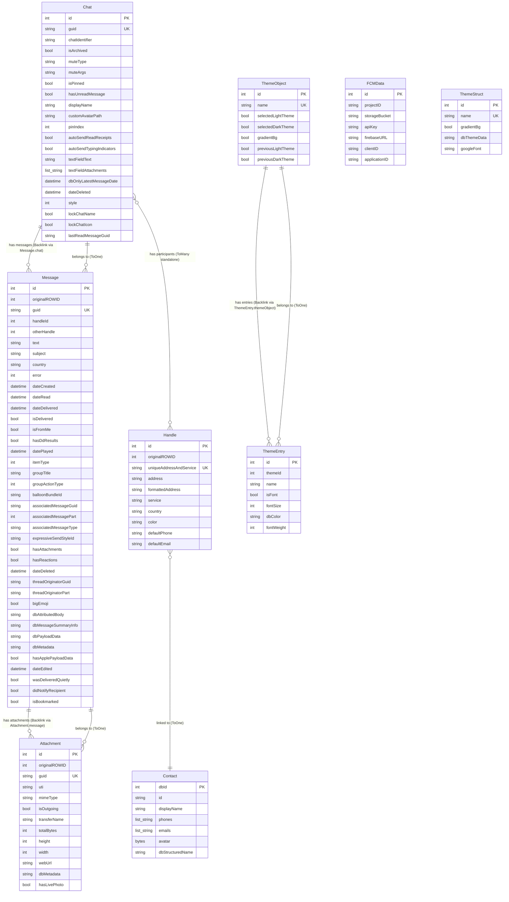

# Database and Models

This document provides a complete reference for the BlueBubbles data layer, covering every ObjectBox entity, global model, relationship, query pattern, settings schema, and theme structure used throughout the application.

---

## Table of Contents

1. [Database Engine](#1-database-engine)
2. [Entity Definitions (ObjectBox)](#2-entity-definitions-objectbox)
3. [Platform-Specific Models](#3-platform-specific-models)
4. [Global Models](#4-global-models)
5. [Data Relationships](#5-data-relationships)
6. [Query Patterns](#6-query-patterns)
7. [Settings Model](#7-settings-model)
8. [Theme Model](#8-theme-model)

---

## 1. Database Engine

### Technology

The app uses **ObjectBox** as its local database on mobile and desktop platforms. Web does not use a database; all web model stubs are no-ops or in-memory only.

### Key File: `lib/database/database.dart`

The `Database` class is a static singleton that owns the ObjectBox `Store` and all typed `Box<T>` accessors.

```
class Database {
  static int version = 5;

  static late final Store store;
  static late final Box<Attachment> attachments;
  static late final Box<Chat> chats;
  static late final Box<Contact> contacts;
  static late final Box<FCMData> fcmData;
  static late final Box<Handle> handles;
  static late final Box<Message> messages;
  static late final Box<ScheduledMessage> scheduledMessages;
  static late final Box<ThemeStruct> themes;
  static late final Box<ThemeEntry> themeEntries;
  static late final Box<ThemeObject> themeObjects; // deprecated
}
```

### Initialization Flow

1. `Database.init()` is called at app startup.
2. **Web** -- returns immediately (no database).
3. **Mobile** (`_initDatabaseMobile`) -- Opens or attaches to an ObjectBox store at `{appDocDir}/objectbox`. If the store is already open (e.g., from a background isolate), it calls `Store.attach()` instead of `openStore()`.
4. **Desktop** (`_initDatabaseDesktop`) -- Creates the objectbox directory, handles migration from legacy custom-path settings, and opens the store. On Linux, if another instance is detected, it writes an `.instance` file and exits.
5. After the store is opened, all `Box<T>` instances are assigned.
6. If setup is not finished (`!ss.settings.finishedSetup.value`), all boxes are cleared.
7. Default themes ("OLED Dark", "Bright White") are seeded if the themes box is empty.
8. `_performDatabaseMigrations()` runs.
9. The database version is written to shared preferences (`dbVersion`).
10. `initComplete` Completer resolves.

### Version Management

- Current version: **5**
- The version is stored in `SharedPreferences` under the key `dbVersion`.
- The method `_performDatabaseMigrations` reads the stored version and falls through a `switch` statement to apply each migration in sequence.

### Migration History

| Version | Description |
|---------|-------------|
| 2 | Changed `handleId` on messages to use server-side `originalROWID` instead of client-side ROWID. Iterates all messages and replaces handleIds by looking up handles by their local ID and substituting `originalROWID`. |
| 3 | Resets per-chat `autoSendReadReceipts` and `autoSendTypingIndicators` to `null` so they follow the global setting, unless the user had explicitly disabled them. |
| 4 | Saves FCM data to SharedPreferences for Tasker integration. |
| 5 | Resets the "Bright White" and "OLED Dark" themes back to their default color values. |

### Transaction Support

The `Database.runInTransaction<R>(TxMode mode, R Function() fn)` static method wraps `store.runInTransaction`. Most save/query operations use this for atomicity.

### Reset

`Database.reset()` removes all data from every box except `themeObjects`.

### ObjectBox Model File: `lib/objectbox-model.json`

This JSON file tracks ObjectBox entity IDs, property IDs, relation IDs, and index IDs. It must be checked into version control. Key metadata:

- `modelVersion`: 5
- `lastEntityId`: 17 (Contact)
- `lastIndexId`: 16
- `lastRelationId`: 1
- Total entities defined: 8 (Attachment, Chat, FCMData, Handle, ThemeEntry, Message, ThemeObject, ThemeStruct, Contact -- note entity IDs 2, 4, 5, 8, 9, 11, 12, 14 are retired)

---

## 2. Entity Definitions (ObjectBox)

### 2.1 Chat

**File:** `lib/database/io/chat.dart`
**ObjectBox Entity ID:** 3

#### Fields

| Field | Dart Type | OB Type | Annotations | Default | Description |
|-------|-----------|---------|-------------|---------|-------------|
| `id` | `int?` | long (6) | auto-ID | null | Local ObjectBox ID |
| `guid` | `String` | String (9) | `@Index(type: IndexType.value)`, `@Unique()` | required | Server-side chat GUID, unique indexed |
| `chatIdentifier` | `String?` | String (9) | | null | Chat address identifier (phone/email/group ID) |
| `isArchived` | `bool?` | bool (1) | | false | Whether chat is archived |
| `muteType` | `String?` | String (9) | | null | Mute mode: `"mute"`, `"mute_individuals"`, `"temporary_mute"`, `"text_detection"`, or null |
| `muteArgs` | `String?` | String (9) | | null | Arguments for the mute type (comma-separated addresses, datetime, or text patterns) |
| `isPinned` | `bool?` | bool (1) | | false | Whether chat is pinned |
| `hasUnreadMessage` | `bool?` | bool (1) | | false | Unread indicator |
| `title` | `String?` | -- | `@Transient()` (not persisted directly) | null | Computed display title |
| `displayName` | `String?` | String (9) | | null | User-set custom display name |
| `customAvatarPath` | `String?` | String (9) | backed by `RxnString _customAvatarPath` | null | File path to custom avatar image |
| `pinIndex` | `int?` | long (6) | backed by `RxnInt _pinIndex` | null | Sort order index among pinned chats |
| `autoSendReadReceipts` | `bool?` | bool (1) | | null | Per-chat read receipt override (null = follow global) |
| `autoSendTypingIndicators` | `bool?` | bool (1) | | null | Per-chat typing indicator override (null = follow global) |
| `textFieldText` | `String?` | String (9) | | null | Draft text persisted per chat |
| `textFieldAttachments` | `List<String>` | StringVector (30) | | [] | Draft attachment paths persisted per chat |
| `dbOnlyLatestMessageDate` | `DateTime?` | DateNano (10) | `@Property(uid: 526293286661780207)` | null | Cached latest message date for sorting; updated on save |
| `dateDeleted` | `DateTime?` | DateNano (10) | | null | Soft-delete timestamp |
| `style` | `int?` | long (6) | | null | Chat style identifier (43 = group) |
| `lockChatName` | `bool` | bool (1) | | false | Prevent server sync from overwriting display name |
| `lockChatIcon` | `bool` | bool (1) | | false | Prevent server sync from overwriting chat icon |
| `lastReadMessageGuid` | `String?` | String (9) | | null | GUID of last read message |

#### Transient Fields (not persisted)

| Field | Dart Type | Description |
|-------|-----------|-------------|
| `sendProgress` | `RxDouble` | Upload progress for outgoing messages |
| `_participants` | `List<Handle>` | Lazily-loaded list of chat participants |
| `_latestMessage` | `Message?` | Cached latest message object |

#### Relations

| Name | Type | Target | Description |
|------|------|--------|-------------|
| `handles` | `ToMany<Handle>` | Handle | Chat participants (standalone relation, OB relation ID 1) |
| `messages` | `ToMany<Message>` | Message | All messages in this chat (`@Backlink('chat')`) |

#### Indexes (from objectbox-model.json)

- `guid`: Unique hash index (indexId 2)

#### Key Methods

- **`fromMap(Map<String, dynamic>)`** -- Factory constructor deserializing from server JSON. Parses `participants` list into `Handle` objects, `lastMessage` into a `Message`.
- **`toMap()`** -- Serializes to a map including participants. Uses `"ROWID"` key for id.
- **`save({...update flags})`** -- Upserts the chat. Finds existing by guid, preserves fields not marked for update, saves participants, updates `dbOnlyLatestMessageDate`, and puts into the box. Catches `UniqueViolationException`.
- **`findOne({guid, chatIdentifier})`** -- Queries by guid or chatIdentifier.
- **`getMessages(chat, {offset, limit, includeDeleted, getDetails})`** -- Synchronous paginated message query ordered by `dateCreated` descending. Links through `Message_.chat`. Optionally fetches attachments and associated messages (reactions).
- **`getMessagesAsync(...)`** -- Async version using `GetMessages` AsyncTask.
- **`addMessage(message, ...)`** -- Saves a message to this chat, handles metadata fetching, updates latest message, manages unread status, and triggers participant sync for group events.
- **`toggleHasUnread(bool)`**, **`togglePin(bool)`**, **`toggleMute(bool)`**, **`toggleArchived(bool)`** -- State toggle methods that save and update the chat list.
- **`shouldMuteNotification(Message?)`** -- Complex mute logic evaluating `muteType`, `muteArgs`, global text detection, and unknown sender filtering.
- **`deleteChat(chat)`** / **`softDelete(chat)`** / **`unDelete(chat)`** -- Hard delete (removes from DB), soft delete (sets `dateDeleted`), and un-delete.
- **`merge(Chat other)`** -- Merges non-null fields from another Chat instance.
- **`sort(Chat? a, Chat? b)`** -- Static comparator: pinned chats first (by `pinIndex`), then by `latestMessage.dateCreated` descending.

#### Computed Properties

- `isTextForwarding` -- `guid.startsWith("SMS")`
- `isSMS` -- always false (placeholder)
- `isIMessage` -- `!isTextForwarding && !isSMS`
- `isGroup` -- `participants.length > 1 || style == 43`
- `properTitle` -- Returns `displayName` or generated title, respecting redacted mode

---

### 2.2 Message

**File:** `lib/database/io/message.dart`
**ObjectBox Entity ID:** 13

#### Fields

| Field | Dart Type | OB Type | Annotations | Default | Description |
|-------|-----------|---------|-------------|---------|-------------|
| `id` | `int?` | long (6) | auto-ID | null | Local ObjectBox ID |
| `originalROWID` | `int?` | long (6) | | null | Server-side ROWID |
| `guid` | `String?` | String (9) | `@Index(type: IndexType.value)`, `@Unique()` | null | Server-side message GUID |
| `handleId` | `int?` | long (6) | | null | Server-side handle ROWID of sender |
| `otherHandle` | `int?` | long (6) | | null | Handle for group event target participant |
| `text` | `String?` | String (9) | | null | Message text content |
| `subject` | `String?` | String (9) | | null | Subject line (MMS/rich messages) |
| `country` | `String?` | String (9) | | null | Country code |
| `dateCreated` | `DateTime?` | DateNano (10) | `@Index()` | null | When message was created |
| `isFromMe` | `bool?` | bool (1) | | true | Whether sent by the local user |
| `hasDdResults` | `bool?` | bool (1) | | false | Has data detector results |
| `datePlayed` | `DateTime?` | DateNano (10) | | null | When audio message was played |
| `itemType` | `int?` | long (6) | | 0 | Group event type (0=normal, 1=participant, 2=name, 3=leave/photo, 4=location, 5=audio kept, 6=FaceTime) |
| `groupTitle` | `String?` | String (9) | | null | New group name (for itemType=2) |
| `groupActionType` | `int?` | long (6) | | 0 | Sub-action (0=add/leave, 1=remove/change photo, 2=remove photo) |
| `balloonBundleId` | `String?` | String (9) | | null | iMessage app / interactive message bundle ID |
| `associatedMessageGuid` | `String?` | String (9) | | null | GUID of message this reacts to |
| `associatedMessagePart` | `int?` | long (6) | | null | Part index of associated message |
| `associatedMessageType` | `String?` | String (9) | | null | Reaction type (love, like, dislike, laugh, emphasize, question) |
| `expressiveSendStyleId` | `String?` | String (9) | | null | Send effect identifier (slam, loud, gentle, invisible ink, etc.) |
| `hasAttachments` | `bool` | bool (1) | | false | Whether message has attachments |
| `hasReactions` | `bool` | bool (1) | | false | Whether message has reactions |
| `dateDeleted` | `DateTime?` | DateNano (10) | | null | Soft-delete timestamp |
| `threadOriginatorGuid` | `String?` | String (9) | | null | GUID of thread originator message (inline replies) |
| `threadOriginatorPart` | `String?` | String (9) | | null | Part index of thread originator |
| `bigEmoji` | `bool?` | bool (1) | | null | Cached big emoji check result |
| `hasApplePayloadData` | `bool` | bool (1) | | false | Whether message contains Apple payload data |
| `wasDeliveredQuietly` | `bool` | bool (1) | | false | Focus/DND quiet delivery flag |
| `didNotifyRecipient` | `bool` | bool (1) | | false | Whether a notification breakthrough was sent |
| `isBookmarked` | `bool` | bool (1) | | false | User-bookmarked message |

#### Reactive Fields (backed by Rx, persisted)

| Field | Rx Type | OB Property | Description |
|-------|---------|-------------|-------------|
| `error` | `RxInt` | long (6) | Error code (0 = no error) |
| `dateRead` | `Rxn<DateTime>` | DateNano (10) | When message was read |
| `dateDelivered` | `Rxn<DateTime>` | DateNano (10) | When message was delivered |
| `isDelivered` | `RxBool` | bool (1) | Delivery flag (also true if `dateDelivered != null`) |
| `dateEdited` | `Rxn<DateTime>` | DateNano (10) | When message was last edited |

#### JSON-Serialized Fields (stored as String in DB)

| Property | DB Column | Dart Type | Description |
|----------|-----------|-----------|-------------|
| `dbAttributedBody` | String (9) | `List<AttributedBody>` | Rich text runs with mentions, attachments |
| `dbMessageSummaryInfo` | String (9) | `List<MessageSummaryInfo>` | Edit/unsend summary |
| `dbPayloadData` | String (9) | `PayloadData?` | URL previews / iMessage app data |
| `dbMetadata` | String (9) | `Map<String, dynamic>?` | Link preview metadata |

#### Transient Fields

| Field | Type | Description |
|-------|------|-------------|
| `handle` | `Handle?` | Sender handle (looked up, not persisted as a relation) |
| `attachments` | `List<Attachment?>` | Loaded attachments |
| `associatedMessages` | `List<Message>` | Loaded reactions |
| `attributedBody` | `List<AttributedBody>` | Deserialized from `dbAttributedBody` |
| `messageSummaryInfo` | `List<MessageSummaryInfo>` | Deserialized from `dbMessageSummaryInfo` |
| `payloadData` | `PayloadData?` | Deserialized from `dbPayloadData` |
| `metadata` | `Map<String, dynamic>?` | Deserialized from `dbMetadata` |

#### Relations

| Name | Type | Target | Description |
|------|------|--------|-------------|
| `dbAttachments` | `ToMany<Attachment>` | Attachment | `@Backlink('message')` -- attachments linked to this message |
| `chat` | `ToOne<Chat>` | Chat | The chat this message belongs to |

#### Indexes

- `guid`: Unique hash index (indexId 6)
- `dateCreated`: Value index (indexId 16)
- `chatId` (ToOne target): Index (indexId 9)

#### Key Methods

- **`fromMap(Map<String, dynamic>)`** -- Comprehensive factory that parses server JSON. Handles `attributedBody` as either a Map or List, parses `metadata` from String or Map, extracts `associatedMessagePart` from the GUID format `p:N/GUID`, sanitizes text using attributed body string.
- **`toMap({includeObjects})`** -- Serializes to map. When `includeObjects` is true, includes nested attachments, handle, attributedBody, messageSummaryInfo, and payloadData.
- **`save({chat, updateIsBookmarked})`** -- Upserts. Finds existing by guid, preserves text if not set, looks up handle by `handleId`, updates `hasReactions` flag on associated messages.
- **`bulkSave(List<Message>)`** -- Batch save with reaction flag management. Finds existing messages, saves, then queries for associated messages and original messages to update `hasReactions`.
- **`replaceMessage(oldGuid, newMessage)`** -- Updates a temp message with server data. Preserves local state where server data is null.
- **`findOne({guid, associatedMessageGuid})`** -- Query by guid or by associated message guid.
- **`find({Condition<Message>? cond})`** -- General-purpose query.
- **`delete(guid)`** / **`softDelete(guid)`** -- Hard and soft delete.
- **`merge(existing, newMessage)`** -- Merges two message instances, taking the newer/non-null value for each field.
- **`fetchAttachments()`** -- Loads attachments from `dbAttachments` relation.
- **`fetchAssociatedMessages()`** -- Loads reactions and thread originator.
- **`getHandle()`** -- Looks up handle by `handleId` using `Handle.findOne(originalROWID:)`.

#### Computed Properties

- `fullText` -- Concatenation of subject and text, sanitized
- `isLegacyUrlPreview` -- Detects old-style URL previews
- `url` -- Extracts first URL from text
- `isInteractive` -- Has a `balloonBundleId` and is not a legacy URL preview
- `interactiveText` -- Human-readable description of the interactive message type
- `interactiveMediaPath` -- File path for embedded media
- `isGroupEvent` -- Message is a group event (name change, participant change, etc.)
- `groupEventText` -- Human-readable group event description
- `isParticipantEvent` -- Specifically a participant add/remove event
- `isBigEmoji` -- Message should render with large emoji
- `realAttachments` -- Attachments with a mimeType (actual files)
- `previewAttachments` -- Attachments without a mimeType (previews)
- `reactions` -- Filtered associated messages that are reaction types
- `indicatorToShow` -- Returns `Indicator.READ`, `DELIVERED`, `SENT`, or `NONE`
- `hasAudioTranscript` -- Whether any attributed body run has an audio transcription
- `normalizedThreadPart` -- Parses first character of `threadOriginatorPart` as int

#### Static Sort

`Message.sort(a, b, {descending})` -- Compares by the earlier of `dateCreated` and `dateDelivered` (handles Mac date reporting bugs).

---

### 2.3 Attachment

**File:** `lib/database/io/attachment.dart`
**ObjectBox Entity ID:** 1

#### Fields

| Field | Dart Type | OB Type | Annotations | Default | Description |
|-------|-----------|---------|-------------|---------|-------------|
| `id` | `int?` | long (6) | auto-ID | null | Local ObjectBox ID |
| `originalROWID` | `int?` | long (6) | | null | Server-side ROWID |
| `guid` | `String?` | String (9) | `@Index(type: IndexType.value)`, `@Unique()` | null | Server-side attachment GUID |
| `uti` | `String?` | String (9) | | null | Uniform Type Identifier |
| `mimeType` | `String?` | String (9) | | null | MIME type (auto-detected from UTI for .caf files) |
| `isOutgoing` | `bool?` | bool (1) | | null | Whether attachment was sent by local user |
| `transferName` | `String?` | String (9) | | null | Original filename |
| `totalBytes` | `int?` | long (6) | | null | File size in bytes |
| `height` | `int?` | long (6) | | null | Image/video height in pixels |
| `width` | `int?` | long (6) | | null | Image/video width in pixels |
| `webUrl` | `String?` | String (9) | | null | URL for web-based attachment access |
| `hasLivePhoto` | `bool` | bool (1) | | false | Whether this is a Live Photo |

#### Transient Fields

| Field | Type | Description |
|-------|------|-------------|
| `bytes` | `Uint8List?` | `@Transient()` -- In-memory byte data, not persisted |

#### JSON-Serialized Fields

| Property | DB Column | Dart Type | Description |
|----------|-----------|-----------|-------------|
| `dbMetadata` | String (9) | `Map<String, dynamic>?` | Orientation and other metadata |

#### Relations

| Name | Type | Target | Description |
|------|------|--------|-------------|
| `message` | `ToOne<Message>` | Message | The message this attachment belongs to |

#### Indexes

- `guid`: Unique hash index (indexId 1)
- `messageId` (ToOne target): Index (indexId 8)

#### Key Methods

- **`fromMap(Map<String, dynamic>)`** -- Factory. Special-cases `.caf` audio files to `audio/caf`. Falls back to MIME detection from `transferName`.
- **`toMap()`** -- Serializes with JSON-encoded metadata.
- **`save(Message?)`** -- Upserts. Sets `message` ToOne target if message has an id.
- **`bulkSave(Map<Message, List<Attachment>>)`** -- Batch upsert for message-attachment pairs.
- **`replaceAttachment(oldGuid, newAttachment)`** -- Updates temp attachment with server data, renames the file directory on disk.
- **`findOne(String guid)`** -- Query by guid.
- **`find({Condition<Attachment>? cond})`** -- General query.
- **`delete(String guid)`** -- Removes from DB.
- **`merge(a1, a2)`** -- Merges two attachments.

#### Computed Properties

- `hasValidSize` -- Width and height are both positive
- `aspectRatio` -- Computed from width/height, accounting for portrait orientation from metadata
- `mimeStart` -- First part of MIME type (e.g., "image", "video", "audio")
- `baseDirectory` -- `{appDocDir}/attachments`
- `directory` -- `{baseDirectory}/{guid}`
- `path` -- Full file path with platform-specific filename sanitization
- `convertedPath` -- `.png` conversion path
- `existsOnDisk` / `existsOnDiskAsync` -- File existence checks
- `canCompress` -- Is image and not GIF
- `getFriendlySize()` -- Human-readable size string

---

### 2.4 Handle

**File:** `lib/database/io/handle.dart`
**ObjectBox Entity ID:** 7

#### Fields

| Field | Dart Type | OB Type | Annotations | Default | Description |
|-------|-----------|---------|-------------|---------|-------------|
| `id` | `int?` | long (6) | auto-ID | null | Local ObjectBox ID |
| `originalROWID` | `int?` | long (6) | | null | Server-side ROWID |
| `uniqueAddressAndService` | `String` | String (9) | `@Unique()` | "" | Composite unique key: `{address}/{service}` |
| `address` | `String` | String (9) | | "" | Phone number or email |
| `formattedAddress` | `String?` | String (9) | | null | Formatted phone number |
| `service` | `String` | String (9) | | "iMessage" | Service type ("iMessage", "SMS") |
| `country` | `String?` | String (9) | | null | Country code |
| `defaultEmail` | `String?` | String (9) | | null | Preferred email for this contact |
| `defaultPhone` | `String?` | String (9) | | null | Preferred phone for this contact |

#### Reactive Fields

| Field | Rx Type | Description |
|-------|---------|-------------|
| `color` | `RxnString` | Custom color hex for this handle in chat |

#### Transient Fields

| Field | Type | Description |
|-------|------|-------------|
| `fakeName` | `String` | `@Transient()` -- Generated fake name for redacted mode |
| `webContact` | `Contact?` | `@Transient()` -- Web-only contact reference |

#### Relations

| Name | Type | Target | Description |
|------|------|--------|-------------|
| `contactRelation` | `ToOne<Contact>` | Contact | Linked contact record |

#### Indexes

- `uniqueAddressAndService`: Unique hash index (indexId 15)
- `contactRelationId` (ToOne target): Index (indexId 14)

#### Key Methods

- **`fromMap(Map<String, dynamic>)`** -- Factory. Constructs `uniqueAddressAndService` from address and service if not provided.
- **`toMap({includeObjects})`** -- Serializes. Optionally includes contact data.
- **`save({updateColor, matchOnOriginalROWID})`** -- Upserts. Matches existing by address+service or originalROWID. Auto-matches contact if new.
- **`bulkSave(List<Handle>, {matchOnOriginalROWID})`** -- Batch save.
- **`findOne({id, originalROWID, addressAndService})`** -- Flexible query. The `addressAndService` parameter is a `Tuple2<String, String>` querying by `address` AND `service`.
- **`merge(h1, h2)`** -- Merges two handles.

#### Computed Properties

- `contact` -- Returns `webContact` on web, `contactRelation.target` otherwise
- `displayName` -- Shows contact name, formatted address, or raw address. Respects redacted mode (fake names or blank).
- `initials` -- First letter of first and last segments of displayName

---

### 2.5 Contact

**File:** `lib/database/io/contact.dart`
**ObjectBox Entity ID:** 17

#### Fields

| Field | Dart Type | OB Type | Annotations | Default | Description |
|-------|-----------|---------|-------------|---------|-------------|
| `dbId` | `int?` | long (6) | `@Id()` | null | ObjectBox auto-ID (note: uses `dbId` instead of `id` for the OB identifier) |
| `id` | `String` | String (9) | `@Index()` | required | External contact identifier |
| `displayName` | `String` | String (9) | | required | Full display name |
| `phones` | `List<String>` | StringVector (30) | | [] | Phone numbers |
| `emails` | `List<String>` | StringVector (30) | | [] | Email addresses |
| `avatar` | `Uint8List?` | ByteVector (23) | | null | Avatar image bytes |

#### JSON-Serialized Fields

| Property | DB Column | Dart Type | Description |
|----------|-----------|-----------|-------------|
| `dbStructuredName` | String (9) | `StructuredName?` | Parsed name components |

#### Indexes

- `id`: Hash index (indexId 12)

#### Key Methods

- **`fromMap(Map<String, dynamic>)`** -- Factory from map. Avatar is base64-decoded.
- **`toMap()`** -- Serializes. Avatar is base64-encoded.
- **`save()`** -- Upserts by `id`.
- **`findOne({id, address})`** -- Queries by contact id or by matching phone/email using `containsElement`.
- **`getContacts()`** -- Returns all contacts.
- **`hasMatchingAddress(String)`** -- Slugified search across phones and emails.

#### Computed Properties

- `initials` -- Derived from structured name (given + family) or display name first character

---

### 2.6 FCMData

**File:** `lib/database/io/fcm_data.dart`
**ObjectBox Entity ID:** 6

#### Fields

| Field | Dart Type | OB Type | Default | Description |
|-------|-----------|---------|---------|-------------|
| `id` | `int?` | long (6) | null | Local ObjectBox ID |
| `projectID` | `String?` | String (9) | null | Firebase project ID |
| `storageBucket` | `String?` | String (9) | null | Firebase storage bucket |
| `apiKey` | `String?` | String (9) | null | Firebase API key |
| `firebaseURL` | `String?` | String (9) | null | Firebase Realtime Database URL |
| `clientID` | `String?` | String (9) | null | OAuth client ID (truncated before first hyphen) |
| `applicationID` | `String?` | String (9) | null | Mobile SDK app ID |

#### Key Methods

- **`fromMap(Map<String, dynamic>)`** -- Parses from Google Services JSON format (`project_info`, `client[0]`, `oauth_client[0]`).
- **`save({wait})`** -- Saves to both ObjectBox and SharedPreferences (for Tasker integration). Ensures only one FCMData record exists.
- **`deleteFcmData()`** -- Clears from both ObjectBox and SharedPreferences.
- **`getFCM()`** -- Loads from ObjectBox, falls back to SharedPreferences.

#### Computed Properties

- `isNull` -- True if any required field is null

---

### 2.7 ThemeStruct

**File:** `lib/database/io/theme.dart`
**ObjectBox Entity ID:** 16

#### Fields

| Field | Dart Type | OB Type | Annotations | Default | Description |
|-------|-----------|---------|-------------|---------|-------------|
| `id` | `int?` | long (6) | auto-ID | null | Local ObjectBox ID |
| `name` | `String` | String (9) | `@Unique()` | required | Theme name |
| `gradientBg` | `bool` | bool (1) | | false | Use gradient background |
| `googleFont` | `String` | String (9) | | "Default" | Google Fonts family name |
| `data` | `ThemeData` | -- | not directly stored | -- | Flutter ThemeData object |

#### JSON-Serialized Fields

| Property | DB Column | Dart Type | Description |
|----------|-----------|-----------|-------------|
| `dbThemeData` | String (9) | `ThemeData` | Full theme serialized as JSON (color scheme, text theme, font) |

#### Indexes

- `name`: Unique hash index (indexId 11)

#### Key Methods

- **`fromMap(Map<String, dynamic>)`** -- Reconstructs a full `ThemeData` from a nested JSON structure including color scheme, text theme sizes/weights/colors, Google Fonts, and Material 3 FlexColorScheme.
- **`toMap()`** -- Serializes `ThemeData` into a nested map with `textTheme` (6 text styles + bubbleText) and `colorScheme` (25 Material colors + smsBubble/onSmsBubble + brightness).
- **`save({updateIfNotAbsent})`** -- Upserts by name.
- **`delete()`** -- Removes from DB (blocked for preset themes).
- **`getLightTheme()`** / **`getDarkTheme()`** -- Static methods to load selected themes from DB by name stored in SharedPreferences.
- **`getThemes()`** -- Returns all themes; re-seeds defaults if box is empty.
- **`colors(bool dark, {returnMaterialYou})`** -- Returns a `Map<String, Color>` of all themeable colors.

#### Computed Properties

- `isPreset` -- True if name matches any default theme
- `textSizes` -- Map of current font sizes
- `defaultTextSizes` -- Static map of default font sizes
- `colorDescriptions` -- Static map of human-readable color descriptions

---

### 2.8 ThemeEntry

**File:** `lib/database/io/theme_entry.dart`
**ObjectBox Entity ID:** 10

#### Fields

| Field | Dart Type | OB Type | Default | Description |
|-------|-----------|---------|---------|-------------|
| `id` | `int?` | long (6) | null | Local ObjectBox ID |
| `themeId` | `int?` | long (6) | null | Associated theme ID |
| `name` | `String?` | String (9) | null | Color/font entry name (e.g., "Headline1", "AccentColor") |
| `isFont` | `bool?` | bool (1) | null | True if this entry describes a text style |
| `fontSize` | `int?` | long (6) | null | Font size (when `isFont`) |
| `fontWeight` | `int?` | long (6) | null | Font weight index (when `isFont`) |

#### JSON-Serialized Fields

| Property | DB Column | Dart Type | Description |
|----------|-----------|-----------|-------------|
| `dbColor` | String (9) | `Color?` | Hex color value stored as string |

#### Relations

| Name | Type | Target | Description |
|------|------|--------|-------------|
| `themeObject` | `ToOne<ThemeObject>` | ThemeObject | Parent legacy theme object |

#### Indexes

- `themeObjectId` (ToOne target): Index (indexId 10)

#### Key Methods

- **`fromStyle(String title, TextStyle style)`** -- Creates a ThemeEntry from a Flutter TextStyle.
- `style` getter -- Returns either a `TextStyle` (if `isFont`) or a `Color`.

---

### 2.9 ThemeObject (Deprecated)

**File:** `lib/database/io/theme_object.dart`
**ObjectBox Entity ID:** 15

Annotated with `@Deprecated('Use ThemeStruct instead')`.

#### Fields

| Field | Dart Type | OB Type | Annotations | Default | Description |
|-------|-----------|---------|-------------|---------|-------------|
| `id` | `int?` | long (6) | auto-ID | null | Local ObjectBox ID |
| `name` | `String?` | String (9) | `@Unique()` | null | Theme name |
| `selectedLightTheme` | `bool` | bool (1) | | false | Currently selected as light theme |
| `selectedDarkTheme` | `bool` | bool (1) | | false | Currently selected as dark theme |
| `gradientBg` | `bool` | bool (1) | | false | Use gradient background |
| `previousLightTheme` | `bool` | bool (1) | | false | Was previously the light theme |
| `previousDarkTheme` | `bool` | bool (1) | | false | Was previously the dark theme |

#### Transient Fields

| Field | Type | Description |
|-------|------|-------------|
| `data` | `ThemeData?` | Reconstructed Flutter ThemeData |
| `entries` | `List<ThemeEntry>` | Theme entry components |

#### Relations

| Name | Type | Target | Description |
|------|------|--------|-------------|
| `themeEntries` | `ToMany<ThemeEntry>` | ThemeEntry | `@Backlink('themeObject')` -- child entries |

#### Indexes

- `name`: Unique hash index (indexId 7)

---

## 3. Platform-Specific Models

### Conditional Import Pattern

The file `lib/database/models.dart` serves as the barrel export file for all models. It uses Dart's conditional import syntax to provide different implementations for web vs. native:

```dart
export 'package:bluebubbles/database/io/chat.dart'
    if (dart.library.html) 'package:bluebubbles/models/html/chat.dart';
```

For every entity, the pattern is:
- **`io/` directory** -- Full ObjectBox entity implementations with `@Entity()` annotations, database operations, relations, and queries (as documented above).
- **`html/` directory** -- Stub implementations for Flutter Web that do not use ObjectBox. These provide the same class interface but with no-op persistence methods.

### Entities with io/html split

| Entity | io path | html path |
|--------|---------|-----------|
| Attachment | `database/io/attachment.dart` | `models/html/attachment.dart` |
| Chat | `database/io/chat.dart` | `models/html/chat.dart` |
| Contact | `database/io/contact.dart` | `models/html/contact.dart` |
| FCMData | `database/io/fcm_data.dart` | `models/html/fcm_data.dart` |
| Handle | `database/io/handle.dart` | `models/html/handle.dart` |
| Message | `database/io/message.dart` | `models/html/message.dart` |
| ThemeStruct | `database/io/theme.dart` | `models/html/theme.dart` |
| ThemeEntry | `database/io/theme_entry.dart` | `models/html/theme_entry.dart` |
| ThemeObject | `database/io/theme_object.dart` | `models/html/theme_object.dart` |

### Additional io-only files

| File | Description |
|------|-------------|
| `database/io/launch_at_startup.dart` | Wraps the `launch_at_startup` package for desktop (enable/disable/setup). HTML stub is a no-op. |
| `database/io/giphy.dart` | Placeholder file defining `GIPHY_API_KEY = ""`. The real key lives in `html/giphy.dart` and is not checked into VCS. |

### Other conditional exports

| Export | io | html |
|--------|-----|------|
| ObjectBox generated code | `objectbox.g.dart` | `models/html/objectbox.dart` (stub) |
| media_kit / media_kit_video | Real packages | Stub in `models/html/media_kit.dart` |
| network_tools | N/A | `models/html/network_tools.dart` |

### Global models (no platform split)

All files in `database/global/` are exported unconditionally and work identically on all platforms. They contain plain Dart classes with no ObjectBox annotations.

---

## 4. Global Models

These models exist in `lib/database/global/` and are not ObjectBox entities. They are used in-memory, serialized to JSON for storage inside ObjectBox entity string fields, or exchanged with the server.

### 4.1 AttributedBody

**File:** `database/global/attributed_body.dart`

Rich text representation from iMessage. Stored as JSON in `Message.dbAttributedBody`.

```
AttributedBody
  +-- string: String            // Plain text content
  +-- runs: List<Run>           // Text run annotations
        +-- range: List<int>    // [start, length]
        +-- attributes: Attributes?
              +-- messagePart: int?        // "__kIMMessagePartAttributeName"
              +-- attachmentGuid: String?  // "__kIMFileTransferGUIDAttributeName"
              +-- mention: String?         // "__kIMMentionConfirmedMention"
              +-- audioTranscript: String? // "IMAudioTranscription"
```

**Computed properties on Run:**
- `isAttachment` -- `attributes?.attachmentGuid != null`
- `hasMention` -- `attributes?.mention != null`

### 4.2 MessagePart

**File:** `database/global/message_part.dart`

Represents a single part of a multi-part message. Used at the UI layer for rendering.

| Field | Type | Description |
|-------|------|-------------|
| `subject` | `String?` | Part subject line |
| `text` | `String?` | Part text content |
| `attachments` | `List<Attachment>` | Part attachments |
| `mentions` | `List<Mention>` | Mentions in this part |
| `isUnsent` | `bool` | Whether this part was unsent/retracted |
| `edits` | `List<MessagePart>` | Edit history for this part |
| `part` | `int` | Part index |

**Computed:**
- `isEdited` -- `edits.isNotEmpty`
- `url` -- First URL found in text
- `fullText` -- Concatenation of subject and text
- `displaySubject` / `displayText` -- Redacted-mode-aware accessors (generates fake text using faker)

**Mention** sub-class:
| Field | Type | Description |
|-------|------|-------------|
| `mentionedAddress` | `String?` | Address of mentioned person |
| `range` | `List<int>` | Character range [start, length] |

### 4.3 MessageSummaryInfo

**File:** `database/global/message_summary_info.dart`

Tracks message edit and unsend operations. Stored as JSON in `Message.dbMessageSummaryInfo`.

| Field | Type | Description |
|-------|------|-------------|
| `retractedParts` | `List<int>` | Indices of unsent/retracted parts |
| `editedContent` | `Map<String, List<EditedContent>>` | Map of part index to edit history |
| `originalTextRange` | `Map<String, List<int>>` | Original text ranges per part |
| `editedParts` | `List<int>` | Indices of edited parts |

**EditedContent:**
| Field | Type | Description |
|-------|------|-------------|
| `text` | `Content?` | Edited text content |
| `date` | `double?` | Edit timestamp |

**Content:**
| Field | Type | Description |
|-------|------|-------------|
| `values` | `List<AttributedBody>` | The edited attributed body values |

### 4.4 PayloadData

**File:** `database/global/payload_data.dart`

Rich content payloads for URLs and iMessage apps. Stored as JSON in `Message.dbPayloadData`.

```
PayloadData
  +-- type: PayloadType          // enum: url, app
  +-- urlData: List<UrlPreviewData>?
  +-- appData: List<iMessageAppData>?
```

**PayloadType enum:** `url`, `app`

**UrlPreviewData:**
| Field | Type | Description |
|-------|------|-------------|
| `imageMetadata` | `MediaMetadata?` | Preview image |
| `videoMetadata` | `MediaMetadata?` | Preview video |
| `iconMetadata` | `MediaMetadata?` | Site icon |
| `itemType` | `String?` | Content type |
| `originalUrl` | `String?` | Original URL |
| `url` | `String?` | Resolved URL |
| `title` | `String?` | Page title |
| `summary` | `String?` | Page summary |
| `siteName` | `String?` | Site name |

**MediaMetadata:**
| Field | Type | Description |
|-------|------|-------------|
| `size` | `Size?` | Image/video dimensions |
| `url` | `String?` | Media URL |

**iMessageAppData:**
| Field | Type | Description |
|-------|------|-------------|
| `appName` | `String?` | App name |
| `ldText` | `String?` | Display text |
| `url` | `String?` | App URL |
| `userInfo` | `UserInfo?` | Rich display information |

**UserInfo:**
| Field | Type | Description |
|-------|------|-------------|
| `imageSubtitle` | `String?` | |
| `imageTitle` | `String?` | |
| `caption` | `String?` | |
| `secondarySubcaption` | `String?` | |
| `tertiarySubcaption` | `String?` | |
| `subcaption` | `String?` | |

The `fromJson` factory handles both pre-parsed JSON objects and raw NSKeyedArchiver binary plist data (via `replaceDollar` and `extractUIDs` helper functions).

### 4.5 ScheduledMessage

**File:** `database/global/scheduled_message.dart`

Server-side scheduled messages. Not an ObjectBox entity; fetched from and managed by the server.

| Field | Type | Description |
|-------|------|-------------|
| `id` | `int` | Server ID |
| `type` | `String` | Message type |
| `payload` | `Payload` | Message payload |
| `scheduledFor` | `DateTime` | Scheduled send time |
| `schedule` | `Schedule` | Recurrence schedule |
| `status` | `String` | Current status |
| `error` | `String?` | Error message if failed |
| `sentAt` | `DateTime?` | Actual send time |
| `created` | `DateTime` | Creation time |

**Payload:**
| Field | Type | Description |
|-------|------|-------------|
| `chatGuid` | `String` | Target chat GUID |
| `message` | `String` | Message text |
| `method` | `String` | Send method ("private-api" or "apple-script") |

**Schedule:**
| Field | Type | Description |
|-------|------|-------------|
| `type` | `String` | Schedule type |
| `interval` | `int?` | Repeat interval |
| `intervalType` | `String?` | Interval unit |

### 4.6 QueueItems

**File:** `database/global/queue_items.dart`

In-memory queue for incoming and outgoing message processing.

**QueueType enum:** `newMessage`, `updatedMessage`, `sendMessage`, `sendAttachment`, `sendMultipart`

**QueueItem (abstract):**
| Field | Type | Description |
|-------|------|-------------|
| `type` | `QueueType` | Queue item type |
| `completer` | `Completer<void>?` | Async completion signal |

**IncomingItem extends QueueItem:**
| Field | Type | Description |
|-------|------|-------------|
| `chat` | `Chat` | Associated chat |
| `message` | `Message` | The message |
| `tempGuid` | `String?` | Temporary GUID being replaced |

**OutgoingItem extends QueueItem:**
| Field | Type | Description |
|-------|------|-------------|
| `chat` | `Chat` | Target chat |
| `message` | `Message` | Message to send |
| `selected` | `Message?` | Message being replied to |
| `reaction` | `String?` | Reaction type |
| `customArgs` | `Map<String, dynamic>?` | Additional send arguments |

### 4.7 ServerPayload

**File:** `database/global/server_payload.dart`

Wrapper for WebSocket/push notification payloads from the server.

| Field | Type | Description |
|-------|------|-------------|
| `originalJson` | `dynamic` | Raw JSON payload |
| `data` | `dynamic` | Parsed/decrypted data |
| `isLegacy` | `bool` | Legacy payload format (has "type" key) |
| `type` | `PayloadType` | Payload type enum |
| `subtype` | `String?` | Payload subtype |
| `isEncrypted` | `bool` | Whether payload is encrypted |
| `isPartial` | `bool` | Whether this is a partial payload |
| `encoding` | `PayloadEncoding` | Data encoding format |
| `encryptionType` | `EncryptionType` | Encryption algorithm |

**Enums:**
- `PayloadEncoding`: `JSON_OBJECT`, `BASE64`, `JSON_STRING`
- `PayloadType`: `NEW_MESAGE`, `UPDATED_MESSAGE`, `MESSAGE`, `CHAT`, `ATTACHMENT`, `HANDLE`, `OTHER`
- `EncryptionType`: `AES_PB`

Constructor automatically decrypts AES payloads using `guidAuthKey` from settings, and parses JSON strings.

### 4.8 Settings

**File:** `database/global/settings.dart`

See [Section 7](#7-settings-model) for the complete schema.

### 4.9 ThemeColors

**File:** `database/global/theme_colors.dart`

Constants for legacy theme entry names used by `ThemeObject`.

| Constant | Value |
|----------|-------|
| `Headline1` | "Headline1" |
| `Headline2` | "Headline2" |
| `Bodytext1` | "Bodytext1" |
| `Bodytext2` | "BodyText2" |
| `Subtitle1` | "Subtitle1" |
| `Subtitle2` | "Subtitle2" |
| `AccentColor` | "AccentColor" |
| `DividerColor` | "DividerColor" |
| `BackgroundColor` | "BackgroundColor" |
| `PrimaryColor` | "PrimaryColor" |

`Colors` is a static list of all 10 entries.

### 4.10 AppleLocation

**File:** `database/global/apple_location.dart`

| Field | Type | Description |
|-------|------|-------------|
| `longitude` | `double?` | Longitude |
| `latitude` | `double?` | Latitude |

### 4.11 StructuredName

**File:** `database/global/structured_name.dart`

Stored as JSON inside `Contact.dbStructuredName`.

| Field | Type | Description |
|-------|------|-------------|
| `namePrefix` | `String` | e.g., "Dr." |
| `givenName` | `String` | First name |
| `middleName` | `String` | Middle name |
| `familyName` | `String` | Last name |
| `nameSuffix` | `String` | e.g., "Jr." |

### 4.12 ChatMessages

**File:** `database/global/chat_messages.dart`

In-memory message cache for an active chat conversation. Not persisted.

| Internal Map | Key | Value | Description |
|--------------|-----|-------|-------------|
| `_messages` | guid | Message | Regular messages |
| `_reactions` | guid | Message | Reaction messages |
| `_attachments` | guid | Attachment | All attachments |
| `_threads` | originatorGuid | Map<guid, Message> | Thread replies grouped by originator |
| `_edits` | guid | Map<guid, Message> | Edit history |

**Key Methods:**
- `addMessages(List<Message>)` -- Categorizes messages into regular, reactions, threads, and attachments
- `removeMessage(String guid)` -- Removes from all maps
- `getMessage(String guid)` -- Looks up in both `_messages` and `_reactions`
- `getThreadOriginator(String guid)` -- Finds thread originator with fallback
- `threads(originatorGuid, originatorPart)` -- Returns sorted thread replies for a specific part
- `flush()` -- Clears all maps

### 4.13 PlatformFile

**File:** `database/global/platform_file.dart`

Cross-platform file abstraction (replacement for file_picker's PlatformFile).

| Field | Type | Description |
|-------|------|-------------|
| `path` | `String?` | Absolute file path (null on web) |
| `name` | `String` | Filename with extension |
| `bytes` | `Uint8List?` | File byte data |
| `size` | `int` | File size in bytes |

**Computed:** `extension` -- derived from name.

### 4.14 AsyncInput

**File:** `database/global/async_image_input.dart`

Async wrapper around `ImageInput` from the `image_size_getter` package. Supports range-based loading for efficient image dimension detection.

### 4.15 IsolateData

**File:** `database/global/isolate.dart`

Data class for passing file + send port to isolate workers for image conversion.

| Field | Type | Description |
|-------|------|-------------|
| `file` | `PlatformFile` | File to process |
| `sendPort` | `SendPort` | Isolate communication port |

Functions:
- `decodeIsolate(PlatformFile)` -- Decodes image in isolate
- `unsupportedToPngIsolate(IsolateData)` -- Converts unsupported format to PNG in isolate

### 4.16 FindMyDevice

**File:** `database/global/findmy_device.dart`

Apple Find My device data. Over 40 fields modeling the full Find My device API response.

Key fields: `id`, `name`, `deviceModel`, `rawDeviceModel`, `deviceDisplayName`, `modelDisplayName`, `deviceClass`, `batteryLevel`, `batteryStatus`, `location` (Location), `address` (Address), `lostModeEnabled`, `features`.

Sub-models:
- **Address** -- `label`, `streetAddress`, `locality`, `country`, `formattedAddressLines`, etc.
- **Location** -- `latitude`, `longitude`, `altitude`, `horizontalAccuracy`, `verticalAccuracy`, `timeStamp`, `isOld`, `isInaccurate`, `positionType`, `locationFinished`

### 4.17 FindMyFriend

**File:** `database/global/findmy_friend.dart`

Apple Find My friend location data.

| Field | Type | Description |
|-------|------|-------------|
| `latitude` | `double?` | Latitude |
| `longitude` | `double?` | Longitude |
| `longAddress` | `String?` | Full address |
| `shortAddress` | `String?` | Short address |
| `title` | `String?` | Display title |
| `subtitle` | `String?` | Display subtitle |
| `handle` | `Handle?` | Resolved from address via `Handle.findOne` |
| `lastUpdated` | `DateTime?` | Last location update time |
| `status` | `LocationStatus?` | Location freshness status |
| `locatingInProgress` | `bool` | Whether location is being actively fetched |

**LocationStatus enum:** `legacy`, `shallow`, `live`

---

## 5. Data Relationships

### Entity-Relationship Diagram



### Relationship Summary

| From | To | Type | Direction | Description |
|------|----|------|-----------|-------------|
| Chat | Handle | ToMany (standalone) | Chat -> Handle | Chat participants |
| Chat | Message | ToMany (backlink) | Chat <- Message | Messages in a chat |
| Message | Chat | ToOne | Message -> Chat | Parent chat |
| Message | Attachment | ToMany (backlink) | Message <- Attachment | Message attachments |
| Attachment | Message | ToOne | Attachment -> Message | Parent message |
| Handle | Contact | ToOne | Handle -> Contact | Linked contact record |
| ThemeObject | ThemeEntry | ToMany (backlink) | ThemeObject <- ThemeEntry | Legacy theme entries |
| ThemeEntry | ThemeObject | ToOne | ThemeEntry -> ThemeObject | Parent legacy theme |

### Implicit Relationships (via field values, not ObjectBox relations)

| From | To | Via | Description |
|------|----|-----|-------------|
| Message | Handle | `Message.handleId` == `Handle.originalROWID` | Sender lookup (not a ToOne) |
| Message | Message | `Message.associatedMessageGuid` == `Message.guid` | Reactions link |
| Message | Message | `Message.threadOriginatorGuid` == `Message.guid` | Thread/reply link |

---

## 6. Query Patterns

### Common Query Operations

#### Find chat by GUID

```dart
Database.chats.query(Chat_.guid.equals(guid)).build().findFirst()
```

#### Find messages in a chat (paginated, sorted)

```dart
final query = (Database.messages.query(
    Message_.dateDeleted.isNull().and(Message_.dateCreated.notNull()))
  ..link(Message_.chat, Chat_.id.equals(chatId))
  ..order(Message_.dateCreated, flags: Order.descending))
    .build()
  ..limit = limit
  ..offset = offset;
```

This uses a **link query** to filter messages by their `chat` ToOne relation.

#### Find reactions for messages

```dart
Database.messages.query(
    Message_.associatedMessageGuid.oneOf(messageGuids))
  ..order(Message_.originalROWID)
).build()
```

#### Search around a date (bidirectional pagination)

The `GetMessages` async task performs two queries: one for messages before a timestamp and one after, both limited, to implement "search around" pagination.

#### Find handle by address and service

```dart
Database.handles.query(
    Handle_.address.equals(address) & Handle_.service.equals(service)
).build()
```

#### Find contact by phone or email

```dart
Database.contacts.query(
    Contact_.phones.containsElement(address) | Contact_.emails.containsElement(address)
).build()
```

Uses ObjectBox's `containsElement` for StringVector fields.

#### Bulk existence check (attachment dedup)

```dart
Database.attachments.query(Attachment_.guid.oneOf(inputAttachmentGuids)).build()
```

### Async Task Pattern

Heavy database operations use the `async_task` package (`AsyncTask`) to run in a separate isolate:

| Task Class | Purpose | Parameters |
|------------|---------|------------|
| `GetChatAttachments` | Fetch all attachments for a chat | `[chatId, includeDeleted]` |
| `GetMessages` | Fetch paginated messages for a chat | `[chatId, offset, limit, includeDeleted, searchAround]` |
| `AddMessages` | Save incoming messages + attachments | `[List<Map> messages]` |
| `GetChats` | Fetch paginated chat list | `[limit, offset, ids?]` |
| `GetMessageAttachments` | Fetch attachments for multiple messages | `[List<int> messageIds]` |
| `BulkSaveNewMessages` | Bulk insert new messages during sync | `[chat, List<Message>]` |
| `SyncLastMessages` | Sync latest messages per chat | `[chats, toggleUnread]` |
| `BulkSyncChats` | Bulk sync chat data | `[List<Chat>]` |
| `BulkSyncMessages` | Bulk sync messages for a chat | `[chat, messages]` |

### Transaction Usage

All write operations use `Database.runInTransaction(TxMode.write, () {...})`. Read operations that need consistency use `Database.runInTransaction(TxMode.read, () {...})`. This wraps ObjectBox's `store.runInTransaction`.

### Sorting Patterns

- **Chats**: Sorted by `isPinned` (descending), then `dbOnlyLatestMessageDate` (descending). Pin order uses `pinIndex`.
- **Messages**: Sorted by `dateCreated` (descending for display, ascending for some thread queries). The static `Message.sort` method uses the earlier of `dateCreated` and `dateDelivered` to handle Mac date reporting inconsistencies.

---

## 7. Settings Model

**File:** `database/global/settings.dart`

The `Settings` class stores all user preferences using reactive `Rx<T>` fields from GetX. Persistence is via `SharedPreferences` (key-value), not ObjectBox.

### Storage Mechanism

- All settings are stored in SharedPreferences.
- `save()` iterates `toMap()` and writes each key.
- `saveOne(key)` / `saveMany(keys)` write specific keys.
- `saveAsync()` awaits each write sequentially.
- `getSettings()` reads all SharedPreferences keys and constructs a `Settings` via `fromMap()`.

### Complete Settings Schema

#### Connection & Authentication

| Key | Type | Default | Description |
|-----|------|---------|-------------|
| `iCloudAccount` | String | "" | iCloud account identifier |
| `guidAuthKey` | String | "" | Server authentication key (also used for AES decryption) |
| `serverAddress` | String | "" | Server URL |
| `customHeaders` | Map<String, String> | {} | Custom HTTP headers (JSON-encoded in prefs) |
| `finishedSetup` | bool | false | Whether initial setup is complete |
| `reachedConversationList` | bool | false | Whether user has reached the conversation list |
| `firstFcmRegisterDate` | int | 0 | Timestamp of first FCM registration |

#### Download & Save

| Key | Type | Default | Description |
|-----|------|---------|-------------|
| `autoDownload` | bool | true | Auto-download attachments |
| `onlyWifiDownload` | bool | false | Only download on Wi-Fi |
| `autoSave` | bool | false | Auto-save attachments to device |
| `autoSavePicsLocation` | String | "Pictures" | Auto-save pictures directory |
| `autoSaveDocsLocation` | String | "/storage/emulated/0/Download/" | Auto-save documents directory |
| `askWhereToSave` | bool | false | Prompt for save location |

#### UI & Appearance

| Key | Type | Default | Description |
|-----|------|---------|-------------|
| `skin` | int (Skins enum index) | 0 (iOS) | UI skin style |
| `theme` | int (ThemeMode enum index) | 0 (system) | Light/dark/system mode |
| `colorfulAvatars` | bool | false | Colorful avatar backgrounds |
| `colorfulBubbles` | bool | false | Colorful message bubbles |
| `hideDividers` | bool | false | Hide list dividers |
| `denseChatTiles` | bool | false | Compact chat list tiles |
| `alwaysShowAvatars` | bool | false | Show avatars in DMs |
| `avatarScale` | double | 1.0 | Avatar size multiplier |
| `highPerfMode` | bool | false | Reduced animations/effects |
| `immersiveMode` | bool | false | Hide status/nav bars |
| `colorsFromMedia` | bool | false | Extract colors from media |
| `monetTheming` | int (Monet enum index) | 0 (none) | Material You theming level |
| `filteredChatList` | bool | false | Filter chat list mode |
| `showDeliveryTimestamps` | bool | false | Show delivery timestamps |
| `showConnectionIndicator` | bool | false | Show connection status |
| `showSyncIndicator` | bool | true | Show sync progress |
| `statusIndicatorsOnChats` | bool | false | Status indicators on chat tiles |
| `tabletMode` | bool | true | Split-pane tablet layout |
| `highlightSelectedChat` | bool | true | Highlight active chat in list |
| `maxAvatarsInGroupWidget` | int | 4 | Max avatars in group icon |

#### Input & Keyboard

| Key | Type | Default | Description |
|-----|------|---------|-------------|
| `autoOpenKeyboard` | bool | true | Auto-open keyboard in conversation |
| `sendWithReturn` | bool | false | Send message with Return key |
| `hideKeyboardOnScroll` | bool | false | Hide keyboard on message scroll |
| `swipeToCloseKeyboard` | bool | false | Swipe down to close keyboard |
| `swipeToOpenKeyboard` | bool | false | Swipe up to open keyboard |
| `openKeyboardOnSTB` | bool | false | Open keyboard on scroll-to-bottom |
| `moveChatCreatorToHeader` | bool | false | Move new chat button to header |
| `cameraFAB` | bool | false | Show camera floating action button |
| `recipientAsPlaceholder` | bool | false | Show recipient name as text field placeholder |
| `replaceEmoticonsWithEmoji` | bool | false | Auto-replace :) with emoji |

#### Messaging Behavior

| Key | Type | Default | Description |
|-----|------|---------|-------------|
| `sendDelay` | int | 0 | Delay before sending (ms) |
| `hideTextPreviews` | bool | false | Hide message preview in notifications |
| `cancelQueuedMessages` | bool | false | Allow canceling queued messages |
| `repliesToPrevious` | bool | false | Default reply to previous message |
| `scrollToBottomOnSend` | bool | true | Scroll to bottom after sending |
| `scrollToLastUnread` | bool | false | Scroll to last unread on open |
| `unarchiveOnNewMessage` | bool | false | Unarchive chat on new message |

#### Notifications

| Key | Type | Default | Description |
|-----|------|---------|-------------|
| `notifyOnChatList` | bool | false | Show notification when on chat list |
| `notifyReactions` | bool | true | Notify for reactions |
| `notificationSound` | String | "default" | Notification sound name |
| `globalTextDetection` | String | "" | Comma-separated keywords for notification filtering |
| `filterUnknownSenders` | bool | false | Mute unknown senders |
| `selectedActionIndices` | List<int> | [0,1,2] (mobile) / [0,1,2,3,4] (Windows) | Notification action indices |
| `actionList` | List<String> | ["Mark Read", "love", "like", "laugh", "emphasize", "dislike", "question"] | Available notification actions |

#### Private API

| Key | Type | Default | Description |
|-----|------|---------|-------------|
| `serverPrivateAPI` | bool? | null | Server-side private API status |
| `enablePrivateAPI` | bool | false | Enable private API features |
| `privateSendTypingIndicators` | bool | false | Send typing indicators via private API |
| `privateMarkChatAsRead` | bool | false | Mark chats as read via private API |
| `privateManualMarkAsRead` | bool | false | Manual mark as read |
| `privateSubjectLine` | bool | false | Enable subject line |
| `privateAPISend` | bool | false | Send messages via private API |
| `privateAPIAttachmentSend` | bool | false | Send attachments via private API |
| `editLastSentMessageOnUpArrow` | bool | false | Press up arrow to edit last message |

#### Redacted Mode

| Key | Type | Default | Description |
|-----|------|---------|-------------|
| `redactedMode` | bool | false | Enable redacted/privacy mode |
| `hideAttachments` | bool | true | Hide attachment content |
| `hideContactInfo` | bool | true | Hide contact names/numbers |
| `generateFakeContactNames` | bool | false | Show fake names |
| `hideMessageContent` | bool | false | Hide message text |

#### Security

| Key | Type | Default | Description |
|-----|------|---------|-------------|
| `shouldSecure` | bool | false | Enable app lock |
| `securityLevel` | int (SecurityLevel enum index) | 0 (locked) | Lock behavior |
| `incognitoKeyboard` | bool | false | Disable keyboard learning |

#### Quick Tapback

| Key | Type | Default | Description |
|-----|------|---------|-------------|
| `enableQuickTapback` | bool | false | Enable quick tapback |
| `quickTapbackType` | String | "love" | Default quick reaction type |

#### Swipe Actions (Material skin)

| Key | Type | Default | Description |
|-----|------|---------|-------------|
| `materialRightAction` | int (MaterialSwipeAction index) | pin | Right swipe action |
| `materialLeftAction` | int (MaterialSwipeAction index) | archive | Left swipe action |
| `swipableConversationTiles` | bool | false | Enable swipeable tiles |

#### Video

| Key | Type | Default | Description |
|-----|------|---------|-------------|
| `startVideosMuted` | bool | true | Start inline videos muted |
| `startVideosMutedFullscreen` | bool | true | Start fullscreen videos muted |

#### Time & Display

| Key | Type | Default | Description |
|-----|------|---------|-------------|
| `use24HrFormat` | bool | false | 24-hour time format |
| `scrollVelocity` | double | 1.0 | Scroll speed multiplier |
| `refreshRate` | int | 0 | Display refresh rate override |
| `fullscreenViewerSwipeDir` | int (SwipeDirection index) | RIGHT | Fullscreen media swipe direction |
| `doubleTapForDetails` | bool | false | Double-tap for message details |

#### Pinned Chats Layout

| Key | Type | Default | Description |
|-----|------|---------|-------------|
| `pinRowsPortrait` | int | 3 | Pin grid rows (portrait) |
| `pinColumnsPortrait` | int | 3 | Pin grid columns (portrait) |
| `pinRowsLandscape` | int | 1 | Pin grid rows (landscape) |
| `pinColumnsLandscape` | int | 4 | Pin grid columns (landscape) |

#### Desktop-Specific

| Key | Type | Default | Description |
|-----|------|---------|-------------|
| `launchAtStartup` | bool | false | Launch on system startup |
| `launchAtStartupMinimized` | bool | false | Start minimized |
| `minimizeToTray` | bool | false | Minimize to system tray |
| `closeToTray` | bool | true | Close to tray instead of quitting |
| `spellcheck` | bool | true | Enable spellcheck |
| `spellcheckLanguage` | String | "auto" | Spellcheck language |
| `windowEffect` | String (WindowEffect name) | "disabled" | Window transparency effect (Windows) |
| `windowEffectCustomOpacityLight` | double | 0.5 | Light mode window opacity |
| `windowEffectCustomOpacityDark` | double | 0.5 | Dark mode window opacity |
| `useCustomTitleBar` | bool | true | Custom title bar (Linux) |
| `useWindowsAccent` | bool | false | Use Windows accent color |

#### Sync & Networking

| Key | Type | Default | Description |
|-----|------|---------|-------------|
| `showIncrementalSync` | bool | false | Show incremental sync UI |
| `lastIncrementalSync` | int | 0 | Last incremental sync timestamp |
| `lastIncrementalSyncRowId` | int | 0 | Last synced message ROWID |
| `apiTimeout` | int | 30000 | API request timeout (ms) |
| `useLocalhost` (localhostPort) | String? | null | Localhost port for local server |
| `useLocalIpv6` | bool | false | Use IPv6 for local connections |
| `syncContactsAutomatically` | bool | false | Auto-sync contacts |

#### Sound

| Key | Type | Default | Description |
|-----|------|---------|-------------|
| `sendSoundPath` | String? | null | Custom send sound file path |
| `receiveSoundPath` | String? | null | Custom receive sound file path |
| `soundVolume` | int | 100 | Sound volume (0-100) |

#### Unified Push

| Key | Type | Default | Description |
|-----|------|---------|-------------|
| `enableUnifiedPush` | bool | false | Enable UnifiedPush |
| `endpointUnifiedPush` | String | "" | UnifiedPush endpoint URL |

#### Misc

| Key | Type | Default | Description |
|-----|------|---------|-------------|
| `smartReply` | bool | false | Show smart reply suggestions |
| `keepAppAlive` | bool | false | Keep app alive in background |
| `sendEventsToTasker` | bool | false | Send events to Tasker |
| `userName` | String | "You" | User display name |
| `userAvatarPath` | String? | null | User avatar file path |
| `hideNamesForReactions` | bool | false | Hide names on reaction popups |
| `logLevel` | int (Level index) | info | Logging level |
| `allowUpsideDownRotation` | bool | false | Allow upside-down screen rotation |
| `lastReviewRequestTimestamp` | int | 0 | Last time app review was requested |
| `detailsMenuActions` | List<String> | all DetailsMenuAction values | Order of message context menu actions |

---

## 8. Theme Model

### Architecture Overview

The theme system has two generations:

1. **Legacy: ThemeObject + ThemeEntry** (deprecated) -- Stored individual color/font entries as separate ThemeEntry records linked to a ThemeObject.
2. **Current: ThemeStruct** -- Stores the entire theme as a single JSON blob (`dbThemeData`) containing the full Material 3 color scheme and text theme.

### ThemeStruct Data Structure

The `dbThemeData` field stores a JSON object with this structure:

```json
{
  "textTheme": {
    "font": "Default",
    "titleLarge": { "color": 4294967295, "fontWeight": 3, "fontSize": 22.0 },
    "bodyLarge": { "color": 4294967295, "fontWeight": 3, "fontSize": 16.0 },
    "bodyMedium": { "color": 4294967295, "fontWeight": 3, "fontSize": 14.0 },
    "bodySmall": { "color": 4294967295, "fontWeight": 3, "fontSize": 12.0 },
    "labelLarge": { "color": 4294967295, "fontWeight": 3, "fontSize": 14.0 },
    "labelSmall": { "color": 4294967295, "fontWeight": 3, "fontSize": 11.0 },
    "bubbleText": { "fontSize": 15.0 }
  },
  "colorScheme": {
    "primary": 4278221567,
    "onPrimary": 4294967295,
    "primaryContainer": 4278221567,
    "onPrimaryContainer": 4294967295,
    "secondary": 4278221567,
    "onSecondary": 4294967295,
    "secondaryContainer": 4278221567,
    "onSecondaryContainer": 4294967295,
    "tertiary": 4278221567,
    "onTertiary": 4294967295,
    "tertiaryContainer": 4278221567,
    "onTertiaryContainer": 4294967295,
    "error": 4294198070,
    "onError": 4294967295,
    "errorContainer": 4294198070,
    "onErrorContainer": 4294967295,
    "background": 4278190080,
    "onBackground": 4294967295,
    "surface": 4278190080,
    "onSurface": 4294967295,
    "surfaceVariant": 4281545523,
    "onSurfaceVariant": 4294967295,
    "outline": 4288585374,
    "shadow": 4278190080,
    "inverseSurface": 4294967295,
    "onInverseSurface": 4278190080,
    "inversePrimary": 4278221567,
    "smsBubble": 4282530119,
    "onSmsBubble": 4294967295,
    "brightness": 0
  }
}
```

Color values are stored as 32-bit integer ARGB values (`Color.value`). Font weights are stored as `FontWeight.values` indices.

### Theme Extensions

ThemeStruct uses Flutter ThemeData extensions:

- **BubbleColors** -- Custom bubble colors for iMessage, SMS, and received messages. For preset themes (OLED Dark, Bright White), these are hardcoded. For custom themes, `smsBubble` and `onSmsBubble` are stored in the color scheme JSON.
- **BubbleText** -- Custom text style for message bubble text, with independent font size control.

### Theme Selection

- Selected dark theme name is stored in SharedPreferences under `"selected-dark"` (default: "OLED Dark")
- Selected light theme name is stored under `"selected-light"` (default: "Bright White")
- `ThemeStruct.getLightTheme()` and `getDarkTheme()` query the themes box by these names

### Theme Reconstruction

`ThemeStruct.fromMap()` reconstructs a full Flutter `ThemeData` by:
1. Determining brightness from `colorScheme.brightness`
2. Loading the Google Font function (falls back to identity if "Default")
3. Selecting the appropriate typography base (light or dark Material 2021)
4. Building each text style with the font function, color, weight, and size
5. Constructing a `ColorScheme` from all 25+ color values
6. Using `FlexColorScheme` to generate a complete Material 3 theme
7. Adding `InkSparkle.splashFactory` and theme extensions (BubbleColors, BubbleText)

### Default Themes

The app seeds two default themes on first run:
- **"OLED Dark"** -- Pure black background, white text
- **"Bright White"** -- White background, dark text

Both use hardcoded iMessage-blue (`#1982FC`) bubble colors, green (`#43CC47`) SMS bubble colors, and standard received bubble colors.

### Themeable Color Slots

The `colors()` method returns a map of 23 customizable color slots:

| Color Name | Description |
|------------|-------------|
| primary | Main UI accent (buttons, sliders, chips, switches) |
| onPrimary | Text/icons on primary |
| primaryContainer | Container fill (iMessage or SMS bubble, depending on saturation) |
| onPrimaryContainer | Text/icons on primaryContainer |
| secondary | Secondary accent (attention buttons) |
| onSecondary | Text/icons on secondary |
| tertiaryContainer | Pinned chat mute/unmute indicator |
| onTertiaryContainer | Text/icons on tertiaryContainer |
| error | Error indicators |
| onError | Text/icons on error |
| errorContainer | Desktop X button hover |
| onErrorContainer | Desktop X button icon |
| background | Main background |
| onBackground | Text/icons on background |
| surface | Alternate background |
| onSurface | Text/icons on surface |
| surfaceVariant | Alternate background, divider color |
| onSurfaceVariant | Text/icons on surfaceVariant |
| inverseSurface | Snackbar/toast background |
| onInverseSurface | Text/icons on inverseSurface |
| outline | Outlines, small label text |
| smsBubble | SMS/Text Forwarding sent bubble |
| onSmsBubble | Text/icons on smsBubble |

### Text Size Slots

| Slot | Default Size | Usage |
|------|-------------|-------|
| titleLarge | 22 | Headings |
| bodyLarge | 16 | Primary body text |
| bodyMedium | 14 | Secondary body text |
| bodySmall | 12 | Caption/metadata text |
| labelLarge | 14 | Button labels |
| labelSmall | 11 | Small labels |
| bubbleText | 15 | Message bubble text (independent) |

### Legacy ThemeObject System

The deprecated `ThemeObject` stored themes as a collection of 10 `ThemeEntry` records (Headline1, Headline2, Bodytext1, Bodytext2, Subtitle1, Subtitle2, AccentColor, DividerColor, BackgroundColor, PrimaryColor). Each entry stored either a color or a font style (color + weight + size). This system has been replaced by `ThemeStruct` but the entity and box remain for migration compatibility.
