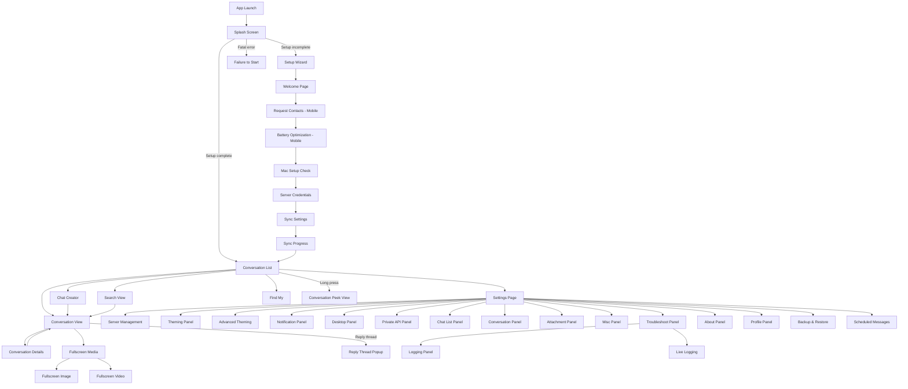

# 00 - UI Overview

> Complete screen inventory, navigation flows, component hierarchy, responsive breakpoints, and design token references for the BlueBubbles Tauri rewrite.

---

## 1. Complete Screen Inventory

### Startup Screens
| Screen | Purpose | Notes |
|--------|---------|-------|
| Splash Screen | Animated BlueBubbles icon loading | Navigates to SetupView if setup incomplete |
| Failure to Start | Fatal error display | Shows error message and stack trace |

### Setup Wizard (7 pages max)
| Screen | Platform | Purpose |
|--------|----------|---------|
| Welcome Page | All | Branding and getting-started |
| Request Contacts | Mobile only | Contacts permission request |
| Battery Optimization | Mobile only | Battery optimization exemption prompt |
| Mac Setup Check | All | Verify macOS server configuration |
| Server Credentials | All | Server URL + password entry, QR scan |
| Sync Settings | Non-web | Message count and sync options |
| Sync Progress | All | Progress bar during initial sync |

### Core Screens
| Screen | Purpose | Notes |
|--------|---------|-------|
| Conversation List | Main chat list | 3 skin variants (iOS, Material, Samsung) |
| Conversation View | Message thread | Message list + input bar |
| Chat Creator | New conversation | Contact selection, iMessage/SMS toggle |
| Conversation Details | Chat info | Participants, media gallery, links, options |
| Search View | Full message search | Local + network modes, filters |

### Media Screens
| Screen | Purpose | Notes |
|--------|---------|-------|
| Fullscreen Holder | Media PageView | Swipe through media gallery |
| Fullscreen Image | Image viewer | Zoom, pan, metadata |
| Fullscreen Video | Video player | Playback controls |

### Selector Screens
| Screen | Purpose |
|--------|---------|
| Chat Selector View | Pick existing chat (search filters) |
| Contact Selector View | Pick a contact |
| Handle Selector View | Pick a handle/address |

### Settings Screens (20+)
| Screen | Purpose |
|--------|---------|
| Settings Page | Main settings hub |
| Server Management | Connection, URL, password, sync |
| Scheduled Messages | View/manage scheduled messages |
| Create Scheduled | Create new scheduled message |
| Message Reminders | Manage reminder notifications (Android) |
| Theming Panel | Skin, colors, fonts, Monet |
| Advanced Theming | Per-element color overrides |
| Custom Avatar Panel | Custom contact avatars |
| Custom Avatar Color | Per-contact avatar color |
| Avatar Crop | Image cropping for avatars |
| Attachment Panel | Media/attachment settings |
| Conversation Panel | Message view settings |
| Message Options Order | Reorder long-press menu items |
| Chat List Panel | Chat list sorting/filtering |
| Pinned Order Panel | Reorder pinned chats |
| Notification Panel | Notification settings |
| Desktop Panel | Window effects, titlebar, tray |
| Private API Panel | Private API features |
| Redacted Mode Panel | Privacy/screenshot redaction |
| Tasker Panel | Tasker integration (Android) |
| Notification Providers | FCM, WebSocket, UnifiedPush |
| Firebase Panel | Firebase/FCM credentials |
| Unified Push | UnifiedPush distributor |
| Misc Panel | Miscellaneous settings |
| Troubleshoot Panel | Developer tools, logs, re-sync |
| Logging Panel | Log level config |
| Live Logging | Real-time log stream |
| About Panel | Version, changelog, links |
| Profile Panel | User name, avatar, profile |
| Backup & Restore | Backup/restore settings/themes |
| OAuth Panel | OAuth/Google auth config |

### Utility Screens
| Screen | Purpose |
|--------|---------|
| Find My | Find My Friends/Devices map |
| Conversation Peek View | 3D Touch / long-press preview |

---

## 2. Navigation Flow Diagram



---

## 3. Component Hierarchy

```
App Root
├── TitleBarWrapper (desktop: custom titlebar with min/max/close)
│   ├── TitleBar
│   │   ├── MoveWindow (drag area)
│   │   └── WindowButtons (minimize, maximize, close)
│   └── ConnectionIndicator (optional overlay)
├── TabletModeWrapper (split-view on wide screens)
│   ├── Left Panel (Navigator key 1)
│   │   └── ThemeSwitcher
│   │       ├── CupertinoConversationList (iOS skin)
│   │       ├── MaterialConversationList (Material skin)
│   │       └── SamsungConversationList (Samsung skin)
│   ├── Draggable Divider
│   └── Right Panel (Navigator key 2)
│       └── ConversationView / InitialWidgetRight
├── ConversationView
│   ├── AppBar (skin-dependent header)
│   ├── ScreenEffectsWidget (fullscreen animations)
│   ├── GradientBackground (optional animated gradient)
│   ├── MessagesView (scrollable message list)
│   │   ├── Smart Replies Row
│   │   ├── Typing Indicator
│   │   └── MessageHolder (per message)
│   │       ├── TimestampSeparator
│   │       ├── MessageSender (group chats)
│   │       ├── Avatar
│   │       ├── TailClipper (bubble shape)
│   │       ├── TextBubble / AttachmentHolder / InteractiveHolder
│   │       ├── StickerHolder
│   │       ├── ReactionHolder
│   │       ├── ReplyBubble
│   │       ├── MessageProperties
│   │       └── DeliveredIndicator
│   ├── Scroll-to-bottom FAB
│   └── ConversationTextField
│       ├── Camera Button
│       ├── Attachment Picker Button
│       ├── GIF Picker Button
│       ├── Emoji Picker Button
│       ├── TextFieldComponent
│       │   ├── ReplyHolder
│       │   ├── PickedAttachmentsHolder
│       │   └── Subject Line (optional)
│       ├── TextFieldSuffix (send/voice/schedule)
│       ├── AttachmentPicker (expanded panel)
│       └── EmojiPicker (desktop/web)
└── SettingsPage
    ├── TabletModeWrapper (settings list + detail panel)
    ├── SettingsScaffold
    │   ├── SettingsSection
    │   │   ├── SettingsHeader
    │   │   ├── SettingsTile
    │   │   ├── SettingsSwitch
    │   │   ├── SettingsSlider
    │   │   └── SettingsDropdown
    │   └── SettingsDivider
    └── Detail Panels (Navigator key 3)
```

---

## 4. Responsive Breakpoints

| Breakpoint | Width | Layout Mode | Behavior |
|-----------|-------|-------------|----------|
| Phone | < 600px | Single column | Full-width screens, push navigation |
| Tablet | >= 600px | Split view | Left panel (chat list) + right panel (conversation) |
| Avatar-only | Left panel < 300px | Compact list | Only avatars shown, no names or previews |

### Tablet Mode Activation Conditions
All three must be true:
1. Screen width > 600 logical pixels
2. `tabletMode` setting is enabled by user
3. Device is NOT a phone, OR aspect ratio > 0.8

### Split View Configuration
- Default split ratio: 0.5 (50/50)
- Divider width: 7.0px
- Split ratio is persisted to SharedPreferences
- Divider is draggable with `resizeLeftRight` cursor
- Min/max ratio constraints configurable per wrapper instance

---

## 5. Design Tokens Reference

All design tokens are detailed in `01-design-tokens.md`. Quick reference:

### Color Tokens
- 27 Material 3 ColorScheme tokens
- 6 BubbleColors extension tokens
- 7 avatar gradient palettes
- 13+ built-in theme definitions

### Typography Tokens
- 7 text style slots (titleLarge, bodyLarge, bodyMedium, bodySmall, labelLarge, labelSmall, bubbleText)
- Google Fonts support with runtime switching
- Letter spacing: 0 (zeroed out globally)

### Spacing Tokens
- Message bubble max width: 75% of screen width minus 40px padding
- Bubble internal padding: 10px vertical, 15px horizontal
- Bubble corner radius: 20.0px (standard), 5.0px (connected)
- Avatar border: 2.0px

### Animation Tokens
- Send animation: 450ms
- Gradient cycle: 3000ms
- Page transition forward: 500ms (easeInOut)
- Page transition back: 300ms (easeIn)
- Search debounce: 250ms
- List item animation: 150ms

### Platform Tokens
- 3 UI skins: iOS, Material, Samsung
- 6 window effects: Tabbed, Mica, Aero, Acrylic, Transparent, Disabled
- 3 theme modes: Light, Dark, System

---

## 6. Skin System Overview

The application supports three distinct visual skins that affect layout, transitions, scroll physics, icons, and component styling:

| Aspect | iOS Skin | Material Skin | Samsung Skin |
|--------|----------|---------------|--------------|
| Scroll physics | Bouncing (overscroll) | Clamping | Clamping |
| Page transition | Slide from right + parallax | Slide up | Slide up |
| Bubble tail | Curved iMessage-style arc | No tail, rounded rect | No tail, rounded rect |
| App bar title | Center-aligned | Left-aligned | Large collapsible header |
| Icon set | CupertinoIcons | Material Icons | Material Icons |
| Splash effect | None | InkSparkle | InkSparkle |
| Chat list header | Cupertino sliver header | Material AppBar | Samsung expanding header |
| Bottom bar | None | None | Samsung footer |
| Pinned chats | Grid with page dots | Inline in list | Inline in list |
| Swipe actions | Archive, delete, pin, mute | Via multi-select | Via multi-select + footer |
| Subtitle style | w300, muted color | Bold, primary color | Bold, primary color |

---

## 7. File Mapping

Each UI spec document maps to these source documentation sections:

| Spec File | Source Sections |
|-----------|----------------|
| `00-ui-overview.md` | Doc 05 sections 1-3, 10; Doc 06 overview |
| `01-design-tokens.md` | Doc 06 (all sections) |
| `02-conversation-list.md` | Doc 05 section 4 |
| `03-conversation-view.md` | Doc 05 sections 5.1-5.12 |
| `04-settings-screens.md` | Doc 05 section 6 |
| `05-setup-wizard.md` | Doc 05 section 7 |
| `06-other-screens.md` | Doc 05 sections for chat creator, findmy, details, fullscreen, selectors |
| `07-shared-components.md` | Doc 05 sections 8-9 |
| `08-animations-and-effects.md` | Doc 05 section 5.9; Doc 06 animation patterns |
